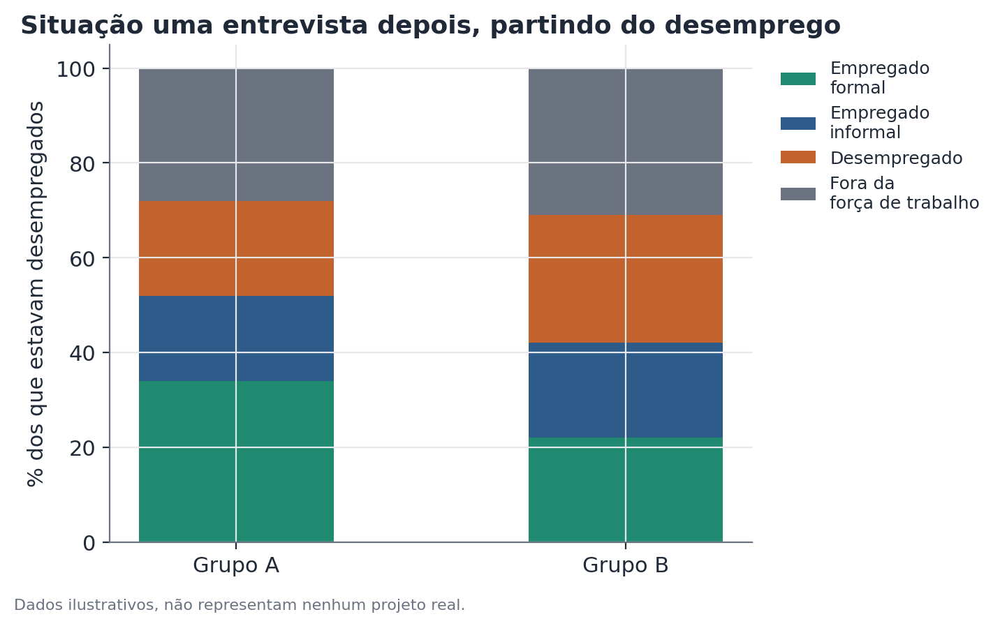

# Análise de transições em painel rotativo

## Conceito

Um painel rotativo é um desenho amostral usado em várias pesquisas
domiciliares contínuas, no qual uma fração da amostra é substituída a cada
rodada de entrevista, enquanto outra fração permanece por um número limitado
de rodadas consecutivas antes de também ser substituída. Esse desenho
combina duas vantagens: permite estimativas de corte transversal
representativas em cada rodada isolada (a amostra completa continua
representativa da população em cada momento) e, ao mesmo tempo, permite
acompanhar uma fração dos mesmos indivíduos ao longo de algumas rodadas
consecutivas, o suficiente para estudar transições individuais entre
estados.

A análise de transições explora essa segunda vantagem: em vez de comparar
estimativas agregadas de dois momentos diferentes — o que mistura mudança
real de estado individual com simples substituição de quem está na amostra
— ela pareia registros da mesma pessoa entre entrevistas consecutivas e
constrói uma matriz de transição, que descreve diretamente a probabilidade
condicional de mudar (ou permanecer) em um determinado estado de um período
para o outro.

## Formulação matemática

Seja $S = \{s_1, s_2, \dots, s_K\}$ o conjunto de estados possíveis (por
exemplo, $\{$empregado formal, empregado informal, desempregado, fora da
força de trabalho$\}$). Para um indivíduo $i$ pareado com sucesso entre a
entrevista no período $t$ e a entrevista no período $t+h$ (onde $h$ é o
intervalo entre entrevistas, tipicamente um trimestre), sejam $S_{i,t}$ e
$S_{i,t+h}$ os estados observados em cada momento.

A **matriz de transição** para um grupo $g$ é definida por suas entradas:

$$P_{jk}^{(g)} = \Pr(S_{t+h} = s_k \mid S_t = s_j, \, \text{grupo} = g) \approx \frac{\sum_{i \in g} \mathbb{1}[S_{i,t} = s_j] \cdot \mathbb{1}[S_{i,t+h} = s_k]}{\sum_{i \in g} \mathbb{1}[S_{i,t} = s_j]}$$

Onde:

- $P_{jk}^{(g)}$ é a probabilidade estimada de transição do estado $s_j$ para
  o estado $s_k$, dentro do grupo $g$, entre os dois momentos de entrevista;
- o numerador conta quantos indivíduos do grupo $g$ estavam no estado
  $s_j$ em $t$ e no estado $s_k$ em $t+h$;
- o denominador conta o total de indivíduos do grupo $g$ que estavam no
  estado $s_j$ em $t$ (e que puderam ser pareados até $t+h$).

Cada linha $j$ da matriz $P^{(g)}$ soma 1, já que todo indivíduo que estava
no estado $s_j$ termina em algum estado $s_k$ (incluindo $s_k = s_j$, ou
seja, permanecer no mesmo estado).

Quando pesos amostrais estão disponíveis (essencial em pesquisas domiciliares
complexas), a estimativa correta pondera cada indivíduo pelo seu peso
amostral longitudinal — que, em geral, é diferente do peso transversal de
cada rodada individual, e precisa ser calculado ou fornecido especificamente
para uso em análises de painel.

A comparação entre grupos foca tipicamente numa entrada específica de
interesse, por exemplo $P_{\text{desempregado}, \text{empregado}}^{(A)}$
versus $P_{\text{desempregado}, \text{empregado}}^{(B)}$, testada como uma
diferença de duas proporções:

$$z = \frac{\hat{P}^{(A)} - \hat{P}^{(B)}}{\sqrt{\hat{P}(1-\hat{P})\left(\frac{1}{n_A} + \frac{1}{n_B}\right)}}, \quad \hat{P} = \frac{x_A + x_B}{n_A + n_B}$$

onde $x_g$ é o número de transições de interesse no grupo $g$, $n_g$ é o
total de indivíduos do grupo $g$ que partiram do estado inicial, e $\hat{P}$
é a proporção combinada sob a hipótese nula de que as duas taxas são iguais.

## Suposições

- **Pareamento correto entre entrevistas.** A validade de toda a análise
  depende de identificar corretamente que o mesmo indivíduo, e não outra
  pessoa que passou a morar no mesmo domicílio, está sendo comparado entre
  os dois momentos. A maioria das pesquisas fornece um identificador de
  domicílio mais uma posição do morador dentro do domicílio, e o pareamento
  correto exige confirmar também características demográficas estáveis
  (sexo, e idade dentro de uma tolerância compatível com o intervalo entre
  entrevistas).
- **Atrito amostral não sistematicamente diferente entre grupos.** Se a
  taxa de sucesso de pareamento (ou de permanência na amostra) difere entre
  os grupos comparados — por exemplo, se um grupo tem maior mobilidade
  residencial e por isso é sistematicamente mais difícil de acompanhar — a
  amostra pareada deixa de ser representativa da população de origem de
  forma diferente para cada grupo, introduzindo viés de seleção na
  comparação.
- **Estados de destino bem definidos e mutuamente exclusivos.** Ambiguidades
  na classificação de estado (por exemplo, definir precisamente o que conta
  como "fora da força de trabalho" versus "desempregado" segundo critérios
  de busca ativa) precisam ser tratadas de forma consistente nos dois
  momentos da comparação.
- **Intervalo entre entrevistas comparável entre indivíduos.** Se o
  intervalo $h$ varia (algumas pessoas pareadas com um trimestre de
  diferença, outras com dois), taxas de transição não são diretamente
  comparáveis sem ajuste, já que transições têm mais tempo para acontecer em
  intervalos maiores.

## Hipóteses

Para comparar uma taxa de transição específica entre dois grupos $A$ e $B$:

- $H_0$: $P^{(A)} = P^{(B)}$ — a probabilidade de transição é igual nos dois
  grupos.
- $H_1$: $P^{(A)} \neq P^{(B)}$ (ou unilateral, se houver uma direção
  esperada a priori).
- Estatística de teste: $z$, como definida acima (teste de duas proporções).
- Nível de significância convencional: $\alpha = 0{,}05$.
- Quando há múltiplos estados de destino sendo comparados simultaneamente
  (a matriz de transição inteira, não só uma célula), um teste de
  qui-quadrado de homogeneidade entre as duas matrizes é mais apropriado que
  testes separados célula a célula, que não corrigem para comparações
  múltiplas.

## Interpretação

A matriz de transição descreve mobilidade **observada entre os pareados**,
não necessariamente da população inteira. Três pontos de interpretação
merecem atenção:

- **Composição versus mobilidade real.** Uma taxa agregada estável ao longo
  do tempo pode esconder alta rotatividade individual (muita gente saindo e
  entrando do estado, num fluxo compensado) ou baixa rotatividade (as
  mesmas pessoas permanecendo). Só a análise de transições distingue esses
  dois cenários — uma diferença crucial para decisões de política, já que
  as intervenções adequadas para cada cenário são diferentes.
- **Representatividade da subamostra pareada.** Se o pareamento tiver
  sucesso em, digamos, 85% dos casos elegíveis, os resultados descrevem
  diretamente esses 85% — a extrapolação para os 15% não pareados exige a
  suposição adicional de que o pareamento falha de forma aleatória em
  relação ao próprio estado sendo estudado, o que raramente é garantido
  (pessoas que mudam de domicílio, por exemplo, podem ser sistematicamente
  mais propensas a também estar mudando de situação de emprego).
- **Transições não implicam causalidade.** Uma taxa de saída do desemprego
  maior num grupo é uma diferença observada de mobilidade, não uma
  explicação de por que essa mobilidade é maior — fatores de composição
  (idade, escolaridade, região, tipo de ocupação anterior) podem explicar
  parte ou toda a diferença, e isolar esses fatores exigiria uma análise
  adicional (por exemplo, um modelo de risco proporcional ajustando por
  covariáveis).

## Limitações

- **Painel rotativo não é painel longitudinal completo.** A diferença é
  fundamental: num painel longitudinal, a mesma amostra (ou uma amostra
  fixa) é seguida por anos. Num painel rotativo, cada indivíduo é observado
  apenas durante a janela em que está na amostra (tipicamente algumas
  rodadas consecutivas) antes de ser substituído — análises de transição só
  são possíveis dentro dessa janela limitada, e a maior parte dos dados de
  uma pesquisa de painel rotativo, fora dessa janela de sobreposição, é na
  prática repeated cross-section (corte transversal repetido): cada rodada é
  representativa da população, mas os indivíduos entrevistados em rodadas
  não sobrepostas não são os mesmos.
- **Pareamento pode falhar de forma não aleatória.** Além de mudança de
  domicílio, o pareamento pode falhar por erro de registro, mudança na
  composição do domicílio (nascimento, morte, separação), ou recusa em
  entrevistas subsequentes — cada um desses mecanismos pode estar
  correlacionado com o próprio estado sendo estudado, criando viés de
  atrito diferencial entre grupos.
- **Poucas rodadas de sobreposição limitam o horizonte de análise.** Se o
  desenho do painel permite acompanhar cada indivíduo por, digamos, no
  máximo cinco entrevistas, só é possível medir transições dentro dessa
  janela — tendências de mais longo prazo exigem encadear várias coortes de
  painel, uma abordagem mais complexa e sujeita a mais fontes de ruído.
- **Erros de classificação de estado se acumulam em duas medições.** Como a
  análise depende da classificação correta do estado em dois momentos
  (não um), qualquer erro de medição ou ambiguidade de classificação em
  qualquer um dos dois momentos contamina a transição estimada.

## Exemplo

Considere um estudo hipotético de mobilidade no mercado de trabalho de dois
grupos de trabalhadores, A e B, usando uma pesquisa domiciliar com desenho de
painel rotativo em que cada domicílio é entrevistado por até quatro
trimestres consecutivos.

Do total de 500 pessoas desempregadas do Grupo A na primeira entrevista, 420
(84%) puderam ser pareadas com uma entrevista um trimestre depois. Do Grupo
B, de 480 pessoas desempregadas, 390 (81%) foram pareadas. As taxas de
pareamento são parecidas, o que reduz (mas não elimina) a preocupação com
atrito diferencial.

Dentro da amostra pareada, a matriz de transição de um trimestre é:

**Grupo A** (partindo de desempregado, n=420):

| Destino | % |
|---|---|
| Empregado formal | 14,0% |
| Empregado informal | 7,9% |
| Desempregado | 55,7% |
| Fora da força de trabalho | 22,4% |

**Grupo B** (partindo de desempregado, n=390):

| Destino | % |
|---|---|
| Empregado formal | 9,2% |
| Empregado informal | 8,5% |
| Desempregado | 58,7% |
| Fora da força de trabalho | 23,6% |

A taxa de transição para emprego formal é de 14,0% no Grupo A contra 9,2% no
Grupo B — uma diferença de 4,8 pontos percentuais. O teste de duas
proporções para essa diferença específica produz $z \approx 2{,}17$,
correspondente a um valor-p de aproximadamente 0,030 — estatisticamente
significativo ao nível convencional de 5%.

Interpretação cuidadosa: essa diferença descreve a experiência dos
indivíduos pareados com sucesso em cada grupo — 84% e 81% das amostras
originais, respectivamente. Se, por exemplo, pessoas do Grupo B que mudaram
de domicílio (e por isso não foram pareadas) tiverem taxas de emprego
sistematicamente diferentes das que permaneceram no mesmo domicílio, a taxa
estimada de 9,2% pode não representar corretamente o grupo B como um todo. A
diferença de 4,8 pontos percentuais também não isola, sozinha, por que a
transição é mais rápida no Grupo A — características observáveis como
escolaridade média e tipo de ocupação anterior precisariam ser controladas
separadamente para avançar nessa questão.

```python
import pandas as pd
import numpy as np
from statsmodels.stats.proportion import proportions_ztest

# base_pareada: uma linha por indivíduo pareado com sucesso
# colunas: grupo, estado_t0, estado_t1

def matriz_transicao(df, grupo):
    sub = df[df["grupo"] == grupo]
    return pd.crosstab(sub["estado_t0"], sub["estado_t1"], normalize="index") * 100

matriz_a = matriz_transicao(base_pareada, "A")
matriz_b = matriz_transicao(base_pareada, "B")

desemp_a = base_pareada[(base_pareada["grupo"] == "A") & (base_pareada["estado_t0"] == "desempregado")]
desemp_b = base_pareada[(base_pareada["grupo"] == "B") & (base_pareada["estado_t0"] == "desempregado")]

x = [(desemp_a["estado_t1"] == "empregado_formal").sum(),
     (desemp_b["estado_t1"] == "empregado_formal").sum()]
n = [len(desemp_a), len(desemp_b)]
estat, p_valor = proportions_ztest(x, n)
print(estat, p_valor)
```


