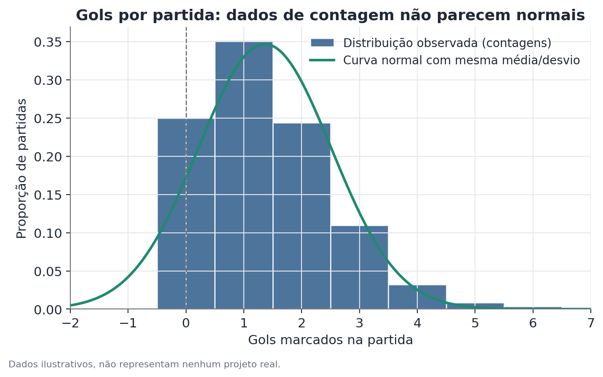
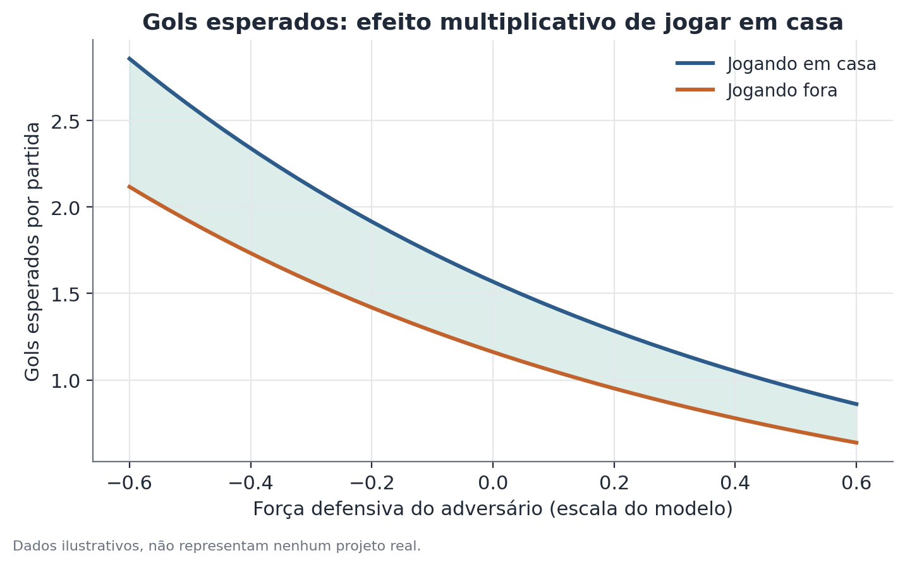

# Regressão de Poisson com efeitos fixos

## Conceito

A regressão de Poisson é um modelo linear generalizado (GLM) desenhado para variáveis de resposta que são contagens de eventos: números inteiros não negativos representando quantas vezes algo aconteceu em um intervalo fixo (uma partida, uma hora, um mês). É o modelo natural quando a variável de interesse viola as duas suposições centrais de uma regressão linear comum: (1) contagens não podem ser negativas, mas uma reta ajustada por mínimos quadrados pode prever valores negativos sem qualquer restrição; e (2) a distribuição de contagens é tipicamente assimétrica à direita, com massa de probabilidade concentrada em valores baixos (0, 1, 2) e uma cauda longa, muito diferente da simetria de uma normal.

A ideia central é modelar o **logaritmo** da taxa esperada de eventos, $\log(\lambda)$, como uma combinação linear das variáveis explicativas — e não a taxa em si. Essa escolha de "link function" logarítmica garante que, ao desfazer a transformação (exponenciando), a previsão $\lambda$ resultante seja sempre positiva, qualquer que seja o valor dos coeficientes ou das variáveis.

Efeitos fixos por unidade (indivíduo, time, loja, período) adicionam ao modelo uma dummy para cada unidade, permitindo que cada uma tenha seu próprio intercepto — sua própria taxa-base de eventos — antes de estimar o efeito da variável de interesse. Isso é fundamentalmente diferente de simplesmente incluir a unidade como um controle de "nível médio": o efeito fixo absorve toda característica não observada, mas constante ao longo do tempo, daquela unidade (um time historicamente mais ofensivo, uma loja em um bairro mais movimentado), isolando melhor o efeito da variável de interesse (mandar o jogo em casa, ser sexta-feira) das diferenças estruturais entre unidades.

## Formulação matemática

**Distribuição de Poisson.** Uma variável de contagem $Y$ segue distribuição de Poisson com parâmetro $\lambda > 0$ se

$$
P(Y = y) = \frac{e^{-\lambda}\lambda^y}{y!}, \quad y = 0, 1, 2, \dots
$$

onde $\lambda = E[Y] = \mathrm{Var}(Y)$ — a média e a variância são iguais (equidispersão), uma propriedade específica dessa distribuição que se torna uma suposição testável do modelo.

**Modelo log-linear.** Para a observação $i$ (por exemplo, o time $t$ na partida $m$), a taxa esperada é

$$
\lambda_i = \exp\big(\beta_0 + \beta_1 x_{1i} + \beta_2 x_{2i} + \dots + \beta_k x_{ki} + \alpha_{u(i)}\big)
$$

onde:
- $x_{1i}, \dots, x_{ki}$ são as variáveis explicativas (força ofensiva, força defensiva do adversário, indicador de mando de campo);
- $\beta_1, \dots, \beta_k$ são os coeficientes a estimar, na escala logarítmica;
- $\alpha_{u(i)}$ é o efeito fixo da unidade $u$ à qual a observação $i$ pertence (o time, por exemplo) — funciona como um intercepto específico daquela unidade;
- $\beta_0$ é o intercepto geral (absorvido, na prática, pelos $\alpha_u$ quando há efeitos fixos completos por unidade).

Equivalentemente, na escala log:

$$
\log(\lambda_i) = \beta_0 + \beta_1 x_{1i} + \dots + \beta_k x_{ki} + \alpha_{u(i)}
$$

Isso é o que dá nome ao modelo: "log-linear" — linear na escala do log da média, não na escala original.

**Interpretação multiplicativa do coeficiente.** Considere duas observações idênticas exceto pela variável $x_1$ (por exemplo, mando de campo: $x_1=1$ vs. $x_1=0$). A razão entre as taxas esperadas é

$$
\frac{\lambda_i \,|\, x_1=1}{\lambda_i \,|\, x_1=0} = \frac{\exp(\beta_0 + \beta_1 \cdot 1 + \dots)}{\exp(\beta_0 + \beta_1 \cdot 0 + \dots)} = e^{\beta_1}
$$

Todos os outros termos se cancelam porque são idênticos nas duas observações — é por isso que $e^{\beta_1}$ é interpretado como um **fator multiplicativo**: quantas vezes a taxa esperada muda quando $x_1$ aumenta em uma unidade, mantendo tudo o mais constante.

**Estimação.** Os coeficientes são estimados por máxima verossimilhança. A log-verossimilhança do modelo, para $n$ observações, é

$$
\ell(\beta, \alpha) = \sum_{i=1}^n \Big[y_i \log(\lambda_i) - \lambda_i - \log(y_i!)\Big]
$$

Não existe forma fechada para o vetor de coeficientes que maximiza $\ell$; a estimação usa métodos numéricos iterativos (tipicamente Newton-Raphson ou variantes de mínimos quadrados reponderados iterativamente, IRLS).

## Suposições

- **Equidispersão** ($\mathrm{Var}(Y) = E[Y] = \lambda$): a suposição mais frequentemente violada na prática. Quando a variância observada excede claramente a média — **sobredispersão** — os erros-padrão de máxima verossimilhança da Poisson pura ficam viesados para baixo, produzindo estatísticas de teste infladas e valores-p artificialmente pequenos. Diagnóstico: comparar a estatística de deviance (ou de Pearson qui-quadrado) do modelo pelos graus de liberdade residuais — uma razão muito maior que 1 sugere sobredispersão.
- **Independência condicional dos eventos**: dado o vetor de variáveis explicativas e os efeitos fixos, as contagens devem ser independentes entre observações. Sequências temporais com dependência forte (uma vitória aumentando a probabilidade de gols na partida seguinte por efeito de confiança) violam isso.
- **Forma funcional log-linear correta**: assume-se que o efeito das variáveis é multiplicativo na escala original, não aditivo. Se a relação verdadeira for de outra forma (por exemplo, saturação em altos valores da variável explicativa), o modelo mal especificado pode produzir previsões enviesadas nas extremidades.
- **Efeitos fixos exigem variação suficiente dentro de cada unidade**: se uma unidade (time) nunca joga em casa nem fora dentro da amostra (situação rara, mas ilustrativa), o efeito fixo daquela unidade absorve toda variação e o coeficiente de interesse não pode ser identificado a partir dela.

## Hipóteses

Para cada coeficiente $\beta_j$, o teste usual é:

- $H_0: \beta_j = 0$ (a variável $x_j$ não tem efeito sobre a taxa esperada de eventos, controlando pelas demais)
- $H_1: \beta_j \neq 0$

A estatística de teste (teste de Wald) é $z = \hat\beta_j / \mathrm{SE}(\hat\beta_j)$, comparada a uma distribuição normal padrão. Um intervalo de confiança de 95% para $\beta_j$ é $\hat\beta_j \pm 1,96 \times \mathrm{SE}(\hat\beta_j)$; exponenciando os limites, obtém-se o intervalo de confiança para o fator multiplicativo $e^{\beta_j}$. Quando o modelo sofre sobredispersão, é recomendável recalcular os erros-padrão de forma robusta (sandwich estimator) ou reajustar via binomial negativa antes de interpretar esses testes.

## Interpretação

O coeficiente exponenciado informa quanto a taxa esperada de eventos muda multiplicativamente por unidade de mudança na variável explicativa, controlando pelas demais variáveis e pelos efeitos fixos incluídos. Isso é uma afirmação sobre associação condicional dentro do modelo especificado — não uma afirmação causal automática. Em um contexto observacional (como estimar o efeito de mando de campo usando dados históricos de partidas já ocorridas, sem experimento controlado), o coeficiente reflete a associação estimada dado o conjunto de controles incluído; se houver fatores relevantes omitidos que se correlacionam tanto com a variável de interesse quanto com a taxa de eventos, a estimativa pode estar enviesada.

Significância estatística (um $\beta_j$ distinguível de zero) não equivale a relevância prática: um fator multiplicativo de 1,02 (2% de aumento) pode ser estatisticamente significativo em uma amostra grande sem ser operacionalmente importante.

## Limitações

- **Sobredispersão é comum e não é automaticamente diagnosticada pelo ajuste do modelo** — é preciso verificar explicitamente. Ignorá-la leva a intervalos de confiança artificialmente estreitos e conclusões de significância que não se sustentam.
- **Excesso de zeros** (mais observações com contagem zero do que a Poisson prevê) é outra forma comum de má especificação, distinta de sobredispersão geral, que pode exigir modelos específicos (zero-inflated Poisson).
- **Efeitos fixos por unidade com muitas categorias e poucas observações por categoria** (problema de parâmetros incidentais) podem gerar estimativas instáveis, especialmente combinados com contagens baixas.
- **A interpretação multiplicativa assume que o efeito de $x_j$ é constante na escala log em toda a faixa de valores observada** — extrapolar previsões para combinações de variáveis muito fora do intervalo observado nos dados de treino é arriscado.

## Exemplo

Considere um exemplo fictício de um campeonato de um esporte genérico com cinco equipes (A a E), em que se quer estimar o efeito de mandar o jogo em casa sobre o número de gols marcados, controlando por efeitos fixos de time.

Um modelo simplificado, ajustado sobre dados sintéticos de uma temporada hipotética, estima:

- Coeficiente de mando de campo: $\hat\beta_{\text{casa}} = 0,300$, erro-padrão $= 0,085$
- Estatística de Wald: $z = 0,300/0,085 \approx 3,53$, valor-p $< 0,001$
- Intervalo de confiança 95% para $\beta_{\text{casa}}$: $[0,133;\, 0,467]$

Exponenciando o coeficiente e os limites do intervalo: fator multiplicativo estimado $e^{0,300}\approx 1,35$, com IC 95% aproximado $[e^{0,133}, e^{0,467}] \approx [1,14,\, 1,60]$.

**Leitura:** controlando pela força relativa de cada equipe (via efeito fixo por time), jogar em casa está associado a um aumento estimado de 35% no número esperado de gols marcados (IC 95%: aumento entre 14% e 60%), efeito estatisticamente significativo ($p<0,001$). Essa é uma leitura sobre a associação dentro dos dados observados dessa temporada hipotética — generalizar para outras temporadas ou competições exigiria reestimar o modelo com dados daquele contexto, e checar se a suposição de equidispersão se sustenta antes de confiar nos intervalos de confiança reportados.

