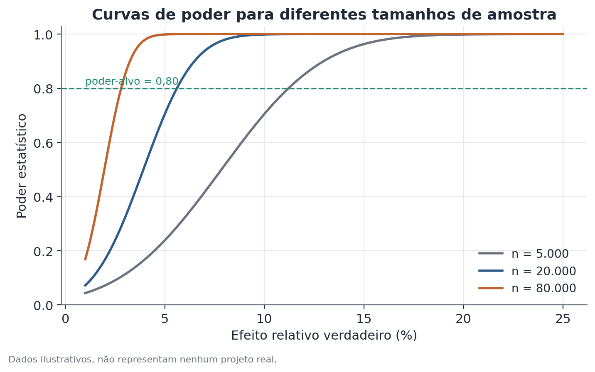

# Poder estatístico e efeito mínimo detectável (MDE)

## Conceito

Poder estatístico e efeito mínimo detectável (MDE, do inglês *minimum
detectable effect*) são duas faces da mesma relação matemática entre quatro
grandezas de um teste de hipótese: tamanho de amostra, variância da métrica,
nível de significância e poder. Dadas três delas, a quarta fica determinada.

O **poder** de um teste é a probabilidade de rejeitar corretamente a hipótese
nula quando ela é de fato falsa — ou seja, a probabilidade de detectar um
efeito real de um tamanho específico, dado o desenho do experimento. É o
complemento do erro tipo II (β): poder = 1 − β.

O **MDE** inverte a pergunta: em vez de fixar um efeito hipotético e perguntar
qual é o poder, fixa-se o poder desejado (convencionalmente 80%) e pergunta-se
qual é o menor efeito real que o desenho consegue detectar com essa
probabilidade. Na prática, calcular o MDE antes de rodar um experimento é a
forma mais direta de responder à pergunta "esse desenho tem alguma chance de
funcionar?" antes de gastar tempo e recursos nele.

A utilidade central do conceito é evitar dois erros simétricos: (1) rodar um
experimento subdimensionado, que nunca teria força para detectar o efeito que
realmente importa para a decisão de negócio, produzindo um resultado "sem
significância" que não significa "sem efeito" — apenas "sem poder para ver"; e
(2) superdimensionar um experimento além do necessário, consumindo tráfego e
tempo que poderiam ir para outros testes.

## Formulação matemática

Para uma comparação de duas proporções (o caso mais comum em testes de
produto), com tamanhos de amostra iguais em cada braço, a relação entre as
quatro grandezas pode ser escrita, numa aproximação normal, como:

```
MDE = (z_(1-α/2) + z_(1-β)) · sqrt(2 · p · (1 - p) / n)
```

onde:

- `MDE` é o efeito mínimo detectável, em pontos percentuais (a versão
  relativa é `MDE / p`).
- `z_(1-α/2)` é o quantil da distribuição normal padrão correspondente ao
  nível de significância bicaudal escolhido — por exemplo, 1,96 para
  α = 0,05.
- `z_(1-β)` é o quantil da normal padrão correspondente ao poder desejado —
  por exemplo, 0,84 para poder = 80%.
- `p` é a taxa de conversão (ou proporção) de base esperada no grupo controle.
- `n` é o tamanho de amostra por grupo.

Para uma métrica contínua (por exemplo, tempo de uso, valor de compra), a
forma equivalente usa o desvio-padrão da métrica (`σ`) no lugar do termo
`p(1-p)`:

```
MDE = (z_(1-α/2) + z_(1-β)) · σ · sqrt(2 / n)
```

Isolando `n`, obtém-se o tamanho de amostra necessário para um MDE-alvo:

```
n = 2 · σ² · (z_(1-α/2) + z_(1-β))² / MDE²
```

O ponto estrutural importante nessas equações é a dependência de `n` em
`1/MDE²`: para reduzir o MDE pela metade, a amostra precisa quadruplicar — daí
o efeito de retornos decrescentes ao aumentar o tráfego de um experimento.



## Suposições

- **Aproximação normal para a distribuição da diferença de médias/proporções**:
  válida em amostras razoavelmente grandes pelo teorema central do limite; em
  amostras muito pequenas ou métricas muito assimétricas, a aproximação
  normal se degrada e formas exatas (por exemplo, baseadas na distribuição
  binomial) são preferíveis.
- **Variância corretamente estimada**: o cálculo do MDE depende de uma
  estimativa prévia da variância (ou da taxa de conversão de base) da
  métrica. Se essa estimativa vier de um período atípico ou de uma amostra
  pequena, o MDE calculado herda esse erro.
- **Observações independentes**: o cálculo padrão assume que cada unidade
  experimental contribui de forma independente. Quando há estrutura de
  cluster (por exemplo, a mesma loja gerando múltiplas observações ao longo
  do tempo), a variância efetiva é maior do que a fórmula simples sugere, e
  o MDE real é maior do que o calculado sem esse ajuste.
- **Alocação e nível de significância fixados de antemão**: o cálculo assume
  uma única checagem de significância, no fim do experimento, com α fixo. Se
  o experimento for monitorado repetidamente e encerrado assim que um
  resultado "significativo" aparece, a taxa de falso positivo efetiva sobe
  acima do α nominal — um problema separado, mas relacionado, tratado por
  métodos de checagem sequencial.

## Hipóteses

O poder e o MDE não são, em si, um teste de hipótese — são propriedades de
um teste de hipótese planejado. O teste subjacente, tipicamente, é:

- **H0**: não há diferença entre o grupo tratamento e o grupo controle na
  métrica de interesse (diferença de médias, ou de proporções, igual a zero).
- **H1**: existe uma diferença diferente de zero.
- **Nível de significância (α)**: probabilidade aceita de rejeitar H0
  incorretamente (erro tipo I), tipicamente 5%.
- **Poder-alvo (1 − β)**: probabilidade desejada de rejeitar H0 corretamente,
  dado que um efeito de tamanho igual ao MDE exista de fato, tipicamente 80%.

O MDE é o menor efeito verdadeiro para o qual essa probabilidade de rejeição
correta atinge o poder-alvo, dado o `n`, `α` e a variância assumidos.

## Interpretação

O MDE calculado antes do experimento é uma propriedade do **desenho**, não
uma previsão do efeito real. Interpretações incorretas comuns incluem tratar
um MDE de 3% como "esperamos um efeito de 3%" (errado — é o piso de
detecção, não uma previsão) ou concluir, ao final de um experimento sem
significância estatística, que "não há efeito" sem verificar se o desenho
sequer tinha poder para detectar um efeito do tamanho que seria relevante
para a decisão.

Recalcular o poder no meio de um experimento é útil e legítimo quando o
tamanho de amostra disponível muda por razões externas ao resultado do teste
em si — por exemplo, um prazo de negócio reduz a janela do experimento, ou
o tráfego observado ficou abaixo do planejado. Nesse caso, recalcula-se o MDE
(ou o poder para um efeito específico) usando o `n` efetivamente alcançado, e
comunica-se essa mudança de forma transparente: "o desenho original previa
detectar efeitos de X%; com a amostra reduzida disponível, o piso de detecção
subiu para Y%". Isso é diferente — e válido — de olhar repetidamente para o
p-valor do próprio experimento e decidir parar assim que ele cruza 0,05, o
que infla a taxa de falso positivo.

## Limitações

- O cálculo depende de uma estimativa de variância que só é conhecida com
  precisão depois que dados são coletados — antes disso, usa-se uma
  aproximação (de um histórico similar, um piloto, ou uma faixa
  conservadora), que carrega sua própria incerteza.
- MDE e poder assumem um teste bicaudal único no fim do experimento; testes
  com múltiplas métricas secundárias, múltiplos cortes de subgrupo, ou
  monitoramento contínuo do p-valor não são cobertos pelo cálculo simples
  sem ajuste adicional (correção para múltiplas comparações, ou métodos
  sequenciais).
- Um desenho com poder adequado para a métrica primária pode não ter poder
  nenhum para métricas secundárias com variância muito maior ou taxa de base
  muito menor — vale calcular o MDE separadamente para cada métrica que
  importa na decisão.
- Poder alto não implica que o efeito, se detectado, será relevante para o
  negócio — um MDE muito pequeno pode detectar efeitos estatisticamente
  significativos mas irrelevantes na prática. O MDE deve ser comparado
  contra um efeito mínimo que faria sentido agir, não apenas calculado e
  esquecido.

## Exemplo

Um serviço de streaming fictício quer testar se recomendar conteúdo por meio
de um novo algoritmo de personalização aumenta o tempo médio diário de uso,
hoje em 42 minutos, com desvio-padrão histórico de 35 minutos (a métrica é
bastante variável, pois inclui tanto usuários esporádicos quanto usuários
muito engajados).

A equipe de produto estima, com base em testes anteriores de mudanças de
recomendação, que um ganho realista estaria entre 2 e 4 minutos por dia. Antes
de comprometer o experimento a quatro semanas de tráfego, calcula-se o MDE
para diferentes durações:

| Duração | n por grupo (aprox.) | MDE (minutos) |
|---|---|---|
| 1 semana | 8.000 | 2,2 |
| 2 semanas | 16.000 | 1,5 |
| 4 semanas | 32.000 | 1,1 |

Com apenas uma semana, o MDE de 2,2 minutos já cobriria a extremidade
inferior do efeito esperado (2 minutos) — mas com margem pequena, o que
tornaria o resultado sensível a ruído. A equipe opta por duas semanas, com
MDE de 1,5 minuto, confortavelmente abaixo do menor efeito que consideram
relevante.

No meio do experimento, um problema técnico reduz o tráfego elegível em 40%
durante três dias. Ao final das duas semanas planejadas, o `n` efetivo por
grupo ficou em 11.200, não 16.000. Recalculando o MDE com o `n` real:

```
MDE_efetivo = (1,96 + 0,84) · 35 · sqrt(2 / 11.200) ≈ 1,85 minutos
```

O MDE efetivo (1,85 min) ainda está abaixo do efeito mínimo relevante
(2 minutos), então o experimento, mesmo reduzido, mantém poder suficiente
para a decisão que importa — mas a equipe registra essa mudança na
documentação do experimento, em vez de assumir silenciosamente que o desenho
original (com n=16.000) ainda estava valendo.

## Exemplo de código

```python
import numpy as np
from statsmodels.stats.power import TTestIndPower

analise = TTestIndPower()

sigma = 35.0          # desvio-padrão histórico da métrica, em minutos
alpha = 0.05
poder_alvo = 0.80

# MDE (em minutos) para diferentes tamanhos de amostra por grupo
for n in [8_000, 16_000, 32_000, 11_200]:
    effect_size = analise.solve_power(nobs1=n, alpha=alpha, power=poder_alvo)
    mde_minutos = effect_size * sigma
    print(f"n={n:>6}: MDE ≈ {mde_minutos:.2f} min")
```

O `effect_size` retornado pelo `statsmodels` é padronizado (unidades de
desvio-padrão); multiplicar por `sigma` converte de volta para a unidade
original da métrica — minutos, neste exemplo.
