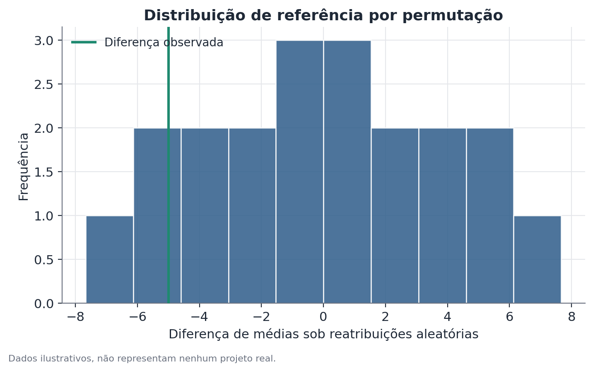

# Inferência por randomização (teste de permutação)

## Conceito

A inferência por randomização (também chamada de teste de permutação, ou
"Fisher randomization test", em referência a Ronald Fisher) constrói a
distribuição de referência de um teste de hipótese diretamente a partir da
aleatoriedade real do desenho experimental, em vez de recorrer a uma
aproximação teórica (como a distribuição normal ou t) que só é válida
assintoticamente, em amostras grandes.

A ideia central é a hipótese nula "forte" ou "nítida" (*sharp null*): sob
$H_0$, o resultado de cada unidade seria exatamente o mesmo,
independentemente de ela ter sido designada para tratamento ou controle.
Se isso for verdade, a única fonte de variação na estatística observada é a
própria aleatoriedade de quem foi sorteado para cada grupo — e essa fonte de
variação pode ser enumerada exatamente, porque o pesquisador conhece o
mecanismo de sorteio usado.

## Formulação matemática

Sejam $N$ unidades experimentais, das quais $N_1$ são designadas para
tratamento e $N_0 = N - N_1$ para controle, segundo um mecanismo de sorteio
conhecido. Seja $Y_i$ o resultado observado da unidade $i$ e $W_i \in
\{0,1\}$ o indicador de tratamento efetivamente sorteado.

A estatística de teste observada é tipicamente a diferença de médias:

$$
\hat\tau_{\text{obs}} = \frac{1}{N_1}\sum_{i: W_i=1} Y_i \; - \; \frac{1}{N_0}\sum_{i: W_i=0} Y_i
$$

Sob a hipótese nula nítida $H_0: Y_i(1) = Y_i(0)$ para toda unidade $i$
(o resultado de cada unidade seria idêntico em qualquer dos dois grupos), os
valores observados $Y_i$ não dependem de $W_i$. Isso permite calcular a
mesma estatística sob **qualquer** outra atribuição possível $W'$, mantendo
os valores $Y_i$ fixos:

$$
\hat\tau(W') = \frac{1}{N_1}\sum_{i: W_i'=1} Y_i \; - \; \frac{1}{N_0}\sum_{i: W_i'=0} Y_i
$$

O conjunto de todas as atribuições possíveis, dado o mecanismo de sorteio
(por exemplo, todas as formas de escolher $N_1$ entre $N$ unidades, sem
reposição), tem $\binom{N}{N_1}$ elementos quando o desenho é uma
randomização completa simples. O valor-p bilateral é:

$$
p = \frac{1}{\binom{N}{N_1}} \sum_{W'} \mathbb{1}\left[ \, |\hat\tau(W')| \geq |\hat\tau_{\text{obs}}| \, \right]
$$

onde $\mathbb{1}[\cdot]$ é a função indicadora (1 se a condição é
verdadeira, 0 caso contrário). Quando $\binom{N}{N_1}$ é grande demais para
enumerar exaustivamente, aproxima-se essa soma por Monte Carlo: sorteia-se
um número grande $M$ (tipicamente 10.000 ou mais) de reatribuições
aleatórias $W'$ e calcula-se a mesma proporção sobre essa amostra, o que
converge para o valor-p exato conforme $M$ cresce.

## Suposições

- **Aleatoriedade real da atribuição ao tratamento.** É a única suposição
  fundamental do método — sem ela, a distribuição de referência construída
  não corresponde a nenhum processo real que gerou os dados.
- **Hipótese nula nítida.** A forma clássica do teste (a de Fisher) testa a
  hipótese de que o tratamento não teve efeito absolutamente nenhum sobre
  nenhuma unidade — mais forte do que a hipótese usual de "efeito médio
  igual a zero" (a de Neyman). Rejeitar $H_0$ sob esse desenho é evidência
  de que o tratamento afetou pelo menos alguma unidade, não necessariamente
  todas igualmente.
- **Exclusão de interferência entre unidades (SUTVA).** O resultado de uma
  unidade não pode depender de qual tratamento outras unidades receberam
  (sem efeitos de transbordamento ou equilíbrio geral) — do contrário, a
  reatribuição hipotética de $W'$ deixa de corresponder a um cenário
  contrafactual coerente.

## Hipóteses

- $H_0$: efeito nulo nítido — o resultado de cada unidade seria idêntico
  independentemente do grupo ao qual foi designada.
- $H_1$: o tratamento afeta o resultado de pelo menos algumas unidades.
- Estatística de teste: geralmente a diferença de médias entre grupos, mas
  o método aceita qualquer estatística de interesse (diferença de medianas,
  coeficiente de um modelo, razão de proporções) — a lógica de
  reatribuição é a mesma, qualquer que seja a estatística escolhida.
- Valor-p: proporção das reatribuições possíveis (ou amostradas) que produz
  uma estatística tão extrema quanto, ou mais extrema que, a observada.
- Nível de significância: convencional, 5%, mas sujeito à granularidade
  discreta do número de reatribuições possíveis (ver limitações).

## Interpretação

Um valor-p baixo obtido por randomização é evidência de que a atribuição
real produziu um resultado incomum entre todas as formas possíveis do
sorteio — uma leitura causal diretamente ligada à aleatorização do próprio
experimento, sem depender de suposições sobre a distribuição populacional
dos dados. Essa é uma vantagem importante sobre testes paramétricos: a
validade não depende de normalidade, nem de amostra grande, nem de uma
forma funcional específica para os erros.

O que o método não faz é generalizar automaticamente o efeito estimado para
além das unidades observadas — a inferência é sobre a atribuição
observada versus as demais atribuições possíveis dentro do experimento, não
sobre uma população maior da qual as unidades foram amostradas (essa seria
uma questão de inferência amostral, separada da inferência sobre a
atribuição).

## Limitações

- **Granularidade do valor-p em amostras pequenas.** Com poucas unidades, o
  número de reatribuições possíveis é pequeno, limitando o menor valor-p
  alcançável — com $\binom{4}{2} = 6$ reatribuições, o menor valor-p possível
  é 1/6 ≈ 0,167, mesmo diante de um efeito grande. Isso é uma limitação
  estrutural, não uma falha de cálculo.
- **Depende de randomização genuína.** Se a atribuição ao tratamento não foi
  realmente aleatória (por exemplo, unidades "voluntárias" se
  auto-selecionaram para o tratamento), a distribuição de referência
  construída não representa nenhum mecanismo real — o método perde
  validade.
- **Custo computacional em desenhos grandes.** Com muitas unidades, a
  enumeração exaustiva se torna inviável (o número de combinações cresce
  rapidamente), exigindo aproximação por Monte Carlo — que, por sua vez,
  introduz uma pequena margem de erro amostral no próprio cálculo do
  valor-p, controlável aumentando o número de reatribuições sorteadas.

### Comparação com outros métodos de inferência com poucos clusters

Inferência por randomização, erros-padrão robustos a cluster e bootstrap
wild-cluster respondem ao mesmo problema geral: inferência confiável quando
as observações não são independentes, frequentemente por causa de poucos
clusters ou poucas unidades de aleatorização.

- **Erros-padrão robustos a cluster** são o ponto de partida padrão, mas se
  tornam pouco confiáveis justamente no cenário de poucos clusters, porque
  dependem de uma aproximação assintótica.
- **Inferência por randomização** é a alternativa mais direta quando o
  próprio mecanismo de sorteio do experimento é conhecido e o número de
  reatribuições possíveis é enumerável (ou amostrável) — não depende de
  nenhuma suposição distribucional, apenas da aleatoriedade real da
  atribuição. É especialmente atraente quando o desenho experimental é
  simples (por exemplo, sorteio completo entre um pequeno número de
  unidades).
- **Bootstrap wild-cluster** é preferível quando o efeito de interesse vem
  de um modelo de regressão mais complexo (com controles, por exemplo), ou
  quando não há um mecanismo de sorteio simples e conhecido para reproduzir
  exatamente via reatribuição — o bootstrap wild-cluster reamostra os
  resíduos do modelo ajustado, em vez de reatribuir tratamento diretamente.

Na prática, quando ambos são aplicáveis, é comum rodar os dois como checagem
cruzada: conclusões que concordam entre inferência por randomização e
bootstrap wild-cluster dão mais confiança na robustez do resultado do que
qualquer um dos dois isoladamente.

## Exemplo

Uma rede de restaurantes testa um novo cardápio sazonal em 6 unidades
(sorteio simples: 3 tratamento, 3 controle), medindo o gasto médio por mesa
na semana do teste, em reais: unidades tratadas registram 12, 15 e 9; as de
controle registram 22, 18 e 11.

A diferença de médias observada é 12,0 − 17,0 = −5,0. Existem
$\binom{6}{3} = 20$ formas possíveis de escolher as 3 unidades tratadas.
Calculando a diferença de médias para cada uma dessas 20 combinações,
obtém-se a distribuição de referência completa — sem qualquer suposição
sobre a forma da distribuição do gasto por mesa.

Das 20 combinações, 6 produzem uma diferença tão extrema quanto (ou mais
extrema que) −5,0 em valor absoluto, dando um valor-p bilateral de
6/20 = 0,30. Com apenas 6 unidades no experimento, esse resultado não é
incomum o suficiente para ser evidência de que o novo cardápio de fato
mudou o gasto médio por mesa — mesmo que a diferença observada, isoladamente,
pareça grande em termos percentuais. O exemplo ilustra bem a limitação de
granularidade: com poucas unidades, é preciso um efeito muito grande para
que a atribuição observada seja de fato incomum entre as poucas
reatribuições possíveis.
