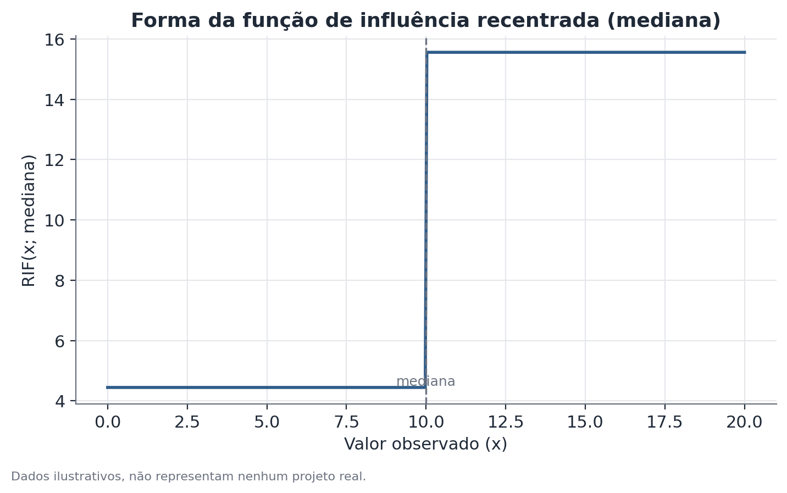

# Decomposição por RIF (Recentered Influence Function)

## Conceito

A decomposição por RIF, proposta por Firpo, Fortin e Lemieux (2009),
generaliza a decomposição de Oaxaca-Blinder para estatísticas distribucionais
além da média — quantis, o índice de Gini, a variância, ou qualquer outra
funcional da distribuição que possa ser escrita como uma expectativa de sua
função de influência recentrada.

Antes de formalizar, vale entender o que é uma função de influência. Em
estatística robusta, a função de influência de um estimador $\nu(F)$
(uma funcional aplicada à distribuição $F$ da variável) mede, de forma
matemática precisa, quanto o valor de $\nu$ mudaria se a distribuição $F$
fosse levemente perturbada por uma massa de probabilidade extra concentrada
num único ponto $y$. Formalmente:

$$
IF(y; \nu, F) = \lim_{\epsilon \to 0} \frac{\nu\big((1-\epsilon)F + \epsilon \delta_y\big) - \nu(F)}{\epsilon}
$$

onde $\delta_y$ é uma distribuição degenerada que concentra toda a massa em
$y$. Intuitivamente, a função de influência diz "se eu adicionasse uma
observação a mais no valor $y$, com peso infinitesimal, o quanto isso puxaria
$\nu$ para cima ou para baixo?" — pontos com influência alta são aqueles cuja
presença ou ausência mais afeta a estatística.

A função de influência **recentrada** (RIF) é definida como:

$$
RIF(y; \nu, F) = \nu(F) + IF(y; \nu, F)
$$

A propriedade chave — e o motivo de o método funcionar — é que a expectativa
da RIF sobre a distribuição recupera exatamente a funcional original:

$$
\mathbb{E}[RIF(Y; \nu, F)] = \nu(F)
$$

Isso significa que $\nu(F)$ (a mediana, um percentil, o Gini) pode ser
tratado, para fins de regressão, como se fosse a média de uma variável
transformada — a RIF avaliada em cada observação. É essa equivalência que
permite reaproveitar toda a maquinaria de regressão e decomposição de
Oaxaca-Blinder, agora aplicada sobre $RIF(y)$ em vez de sobre $y$ diretamente.

É importante deixar claro: a decomposição por RIF **não é o mesmo método**
que Oaxaca-Blinder — é uma extensão que usa Oaxaca-Blinder como uma etapa
interna, depois de transformar os dados via RIF. Oaxaca-Blinder decompõe
médias diretamente; RIF decompõe qualquer estatística distribucional
expressável como expectativa de uma função de influência, usando a mesma
lógica contrafactual por baixo dos panos.

## Formulação matemática

**RIF para um quantil.** Para o quantil de ordem $q$ (por exemplo, $q=0{,}5$
para a mediana), com valor $Q_q$ e densidade $f_Y(Q_q)$ da variável $Y$
avaliada em $Q_q$:

$$
RIF(y; Q_q) = Q_q + \frac{q - \mathbb{1}\{y \leq Q_q\}}{f_Y(Q_q)}
$$

Aqui, $\mathbb{1}\{y \leq Q_q\}$ é um indicador que vale 1 se a observação
está abaixo do quantil e 0 caso contrário. Observações logo abaixo do
quantil recebem um valor de RIF ligeiramente acima de $Q_q$; observações logo
acima recebem um valor ligeiramente abaixo — a densidade no denominador
controla a magnitude desse ajuste (quanto menor a densidade ali, mais
sensível o quantil é a mudanças, e maior a magnitude da RIF).

**Regressão e decomposição.** Uma vez calculada $RIF_i = RIF(y_i; \nu)$ para
cada observação $i$ de cada grupo, ajusta-se:

$$
RIF_i = X_i \gamma_g + u_i, \quad g \in \{A, B\}
$$

e aplica-se a decomposição de Oaxaca-Blinder exatamente como na versão para
médias, mas usando $\gamma_g$ no lugar de $\beta_g$:

$$
\nu_A - \nu_B \approx \underbrace{(\bar{X}_A - \bar{X}_B)\hat\gamma_A}_{\text{explicado, no ponto }\nu} +
\underbrace{\bar{X}_B(\hat\gamma_A - \hat\gamma_B)}_{\text{não explicado, no ponto }\nu}
$$

O til de aproximação existe porque essa é uma aproximação de primeira ordem
(via função de influência) — válida localmente, não uma decomposição exata
como no caso da média.

## Suposições

1. **Estimação consistente da densidade**: para quantis, o denominador da
   RIF depende da densidade $f_Y$ avaliada no quantil, que precisa ser
   estimada (tipicamente via kernel). A escolha da largura de banda do kernel
   afeta a estimativa, especialmente em regiões com poucos dados.
2. **Todas as suposições de Oaxaca-Blinder se aplicam** à etapa de regressão
   e decomposição sobre a variável transformada: especificação correta,
   ausência de viés de variável omitida relevante, e sobreposição real de
   características entre os grupos.
3. **Validade da aproximação linear**: a decomposição por RIF é
   fundamentalmente uma aproximação de primeira ordem — ela é exata para
   mudanças pequenas na distribuição, mas pode perder precisão para
   comparações com diferenças muito grandes entre os grupos. Isso é
   particularmente relevante ao interpretar mudanças ao longo de períodos
   longos de tempo, não só entre dois grupos num único momento.

## Hipóteses

Como em Oaxaca-Blinder, cada componente da decomposição (explicado e não
explicado, em cada ponto da distribuição escolhido) pode ser testado
individualmente:

- $H_0$: o componente é igual a zero naquele ponto específico da
  distribuição.
- Erros-padrão: o processo de duas etapas (estimar a RIF, depois estimar a
  regressão) introduz incerteza adicional que precisa ser propagada
  corretamente — bootstrap (reamostrando os dados originais e refazendo as
  duas etapas em cada reamostragem, incluindo a reestimação da densidade) é
  a abordagem padrão, já que fórmulas analíticas fechadas para o
  erro-padrão são complexas.
- Ao reportar vários pontos da distribuição simultaneamente (um perfil de
  gap por percentil, por exemplo), a comparação múltipla entre pontos merece
  a mesma cautela que qualquer teste múltiplo — um único ponto isolado
  "significativo" em meio a vários outros não significativos pede
  interpretação cuidadosa.

## Interpretação

A decomposição por RIF permite uma leitura muito mais rica do que a média:
ela mostra se um gap entre grupos é uniforme ao longo da distribuição ou se
se concentra em certas regiões — um padrão de "piso pegajoso" (gap maior na
base) indica que, mesmo entre quem ganha pouco em ambos os grupos, a
disparidade é grande; um padrão de "teto de vidro" (gap maior no topo)
indica que a disparidade cresce justamente entre quem está no topo da
distribuição de renda, típico de barreiras ao acesso a posições mais altas.

As mesmas ressalvas de Oaxaca-Blinder sobre causalidade e viés de variável
omitida se aplicam, ponto a ponto: o componente não explicado em qualquer
percentil não pode ser automaticamente atribuído a discriminação. Além
disso, cada ponto tem sua própria margem de erro, geralmente maior nas
pontas da distribuição — um perfil de gap que parece dramaticamente
diferente entre dois percentis adjacentes pode, na verdade, estar dentro da
margem de erro combinada.

## Limitações

- **Estimativas menos precisas nas pontas**: a densidade $f_Y$ tende a ser
  menor nos extremos da distribuição (há menos observações ali), o que
  amplia o denominador na fórmula da RIF e, por consequência, a variância da
  estimativa.
- **Aproximação de primeira ordem**: para diferenças muito grandes entre os
  grupos, ou para reponderações muito distantes da distribuição observada,
  a aproximação linear da RIF pode não capturar bem mudanças não lineares
  na estatística de interesse. Métodos de reponderação completa (como o de
  DiNardo-Fortin-Lemieux) são alternativas que evitam essa aproximação, ao
  custo de maior complexidade computacional.
- **Escolha da grade de percentis**: reportar um número limitado de pontos
  (P10, P25, P50, P75, P90, por exemplo) pode não capturar comportamento
  ainda mais extremo (P1, P99) — a escolha da grade deve refletir a pergunta
  de pesquisa, não conveniência.
- **Herda todas as limitações causais de Oaxaca-Blinder**, ponto a ponto: é
  uma decomposição contábil, não um método de inferência causal.

## Exemplo

Considere um cenário hipotético: uma pesquisa salarial anual coleta dados de
renda de duas regiões, Região Norte e Região Sul, junto com anos de
escolaridade. Uma decomposição de Oaxaca-Blinder na média mostra um gap não
explicado de 15%. A decomposição por RIF é aplicada em cinco percentis para
investigar se esse gap é uniforme:

| Percentil | Gap total | Gap explicado | Gap não explicado |
|-----------|-----------|----------------|---------------------|
| P10       | 34%       | 6 p.p.         | 28%                  |
| P25       | 27%       | 8 p.p.         | 19%                  |
| P50       | 22%       | 7 p.p.         | 15%                  |
| P75       | 25%       | 7 p.p.         | 18%                  |
| P90       | 33%       | 7 p.p.         | 26%                  |

O componente explicado (atribuível à diferença de escolaridade entre as
regiões) fica relativamente estável, entre 6 e 8 pontos percentuais, ao
longo da distribuição. O componente não explicado, porém, segue um padrão
em "U": 28% no P10, cai para 15% no P50, e sobe de novo para 26% no P90. Isso
sugere que a diferença de escolaridade explica uma fatia parecida do gap em
todos os níveis de renda, mas o que sobra — a parte não explicada — é
consideravelmente maior tanto entre quem ganha menos quanto entre quem ganha
mais, e menor no meio da distribuição.

Um resultado como esse é editorialmente relevante: contar só o número da
média (15%) esconderia que a experiência de quem está na base ou no topo da
distribuição de renda é bem diferente da experiência de quem está no meio.

A figura seguinte ilustra a forma da própria função de influência recentrada
para a mediana — o "degrau" característico em torno do valor mediano, que
justifica por que observações logo abaixo e logo acima da mediana recebem
pesos opostos na regressão:

