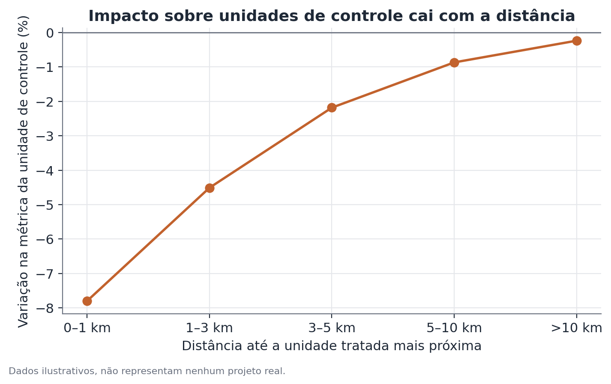

# Análise de transbordamento espacial e canibalização

## Conceito

Em experimentos com unidades geograficamente localizadas — lojas, zonas de
entrega, praças de atendimento — um dos pressupostos mais frequentemente
violados, e menos verificados, é o de **isolamento entre unidades** (SUTVA,
*stable unit treatment value assumption*): a ideia de que o resultado de uma
unidade de controle depende apenas de ela mesma não ter sido tratada, e não
do que acontece nas unidades tratadas próximas a ela.

Quando unidades tratadas e de controle competem pelo mesmo público — o mesmo
raio de entrega, a mesma vizinhança comercial — essa suposição falha por um
mecanismo específico chamado **transbordamento espacial** (*spatial
spillover*), do qual a **canibalização** é o caso mais comum em contextos de
negócio: parte da atividade que aparece como "ganho" na unidade tratada é, na
verdade, atividade deslocada de uma unidade de controle vizinha, não
atividade nova. Quando isso acontece e não é detectado, o efeito estimado do
experimento superestima sistematicamente o ganho líquido real, porque a
unidade de controle usada como referência também foi afetada pelo
tratamento — só que na direção oposta.

A análise de transbordamento espacial usa a própria geografia do desenho
experimental como instrumento de diagnóstico: comparando o efeito estimado
contra controles a diferentes distâncias da unidade tratada mais próxima, é
possível separar, ainda que de forma aproximada, quanto do efeito aparente é
deslocamento versus criação líquida.

## Formulação matemática

Seja `Y_i` a métrica de interesse (vendas, pedidos, receita) da unidade `i`,
medida antes (`Y_i^pre`) e depois (`Y_i^post`) do início do tratamento, e seja
`d_i` a distância entre a unidade de controle `i` e a unidade tratada mais
próxima.

Define-se dois subgrupos de controle a partir de um limiar de distância `τ`:

```
Controle próximo:   C_perto = { i : tratada_i = 0, d_i ≤ τ }
Controle distante:  C_longe = { i : tratada_i = 0, d_i > τ }
```

O efeito estimado contra cada grupo, numa forma de diferença-em-diferenças
simples, é:

```
δ_perto = ( ȳ_T^post − ȳ_T^pre ) − ( ȳ_perto^post − ȳ_perto^pre )
δ_longe = ( ȳ_T^post − ȳ_T^pre ) − ( ȳ_longe^post − ȳ_longe^pre )
```

onde `ȳ_T`, `ȳ_perto` e `ȳ_longe` são as médias da métrica no grupo tratado,
no controle próximo e no controle distante, respectivamente.

A diferença entre os dois efeitos estimados é um indicador direto de
contaminação por transbordamento:

```
Indicador de canibalização = δ_perto − δ_longe
```

Um valor positivo e relevante indica que o controle próximo está, em média,
performando pior do que o controle distante durante o período de tratamento
— consistente com a hipótese de que ele está perdendo atividade para as
unidades tratadas. Formalmente, sob o pressuposto de que o controle distante
está livre de contaminação, `δ_longe` é o estimador do **efeito líquido
real** do tratamento, e `δ_perto − δ_longe` estima o tamanho do efeito de
deslocamento absorvido pelo controle próximo.

Uma extensão contínua do mesmo raciocínio modela o efeito sobre o controle
como uma função da distância `d_i` até a unidade tratada mais próxima —
tipicamente com um decaimento suave, por exemplo por meio de uma regressão
local (kernel) ou de uma especificação paramétrica simples como:

```
Δy_i = β₀ + β₁ · exp(−d_i / λ) + ε_i
```

onde `Δy_i` é a variação percentual da métrica na unidade de controle `i`,
`λ` é um parâmetro de escala que captura a velocidade de decaimento do efeito
com a distância, e `β₁` mede a magnitude do efeito de transbordamento no
limite `d_i → 0`.



## Suposições

- **O controle distante está de fato livre de contaminação**: essa é a
  suposição central de identificação. Se o raio real de competição for maior
  do que o limiar `τ` assumido para "distante", mesmo esse grupo carrega
  algum viés, e o indicador de canibalização subestima a contaminação
  verdadeira.
- **A alocação de quais unidades foram tratadas não foi correlacionada com
  características locais que também afetam a tendência da métrica** (por
  exemplo, tratar preferencialmente lojas em bairros já em crescimento) —
  caso contrário, a comparação com qualquer controle, próximo ou distante,
  fica confundida por essa característica local, não só por transbordamento.
- **Estabilidade da fronteira de mercado durante o experimento**: a análise
  assume que o padrão espacial de competição (quem compete com quem) não
  muda substancialmente durante a janela do experimento.
- **Distância como proxy razoável de competição**: distância geográfica em
  linha reta (ou em tempo de deslocamento) precisa ser uma proxy razoável do
  overlap real de clientela — em contextos digitais, "distância" pode
  precisar ser redefinida (por exemplo, sobreposição de área de cobertura,
  ou similaridade de base de usuários), não necessariamente geográfica.

## Hipóteses

Quando formalizado como teste de hipótese sobre o indicador de
canibalização:

- **H0**: δ_perto = δ_longe (não há diferença sistemática entre o efeito
  medido contra controle próximo e contra controle distante — sem evidência
  de transbordamento).
- **H1**: δ_perto ≠ δ_longe (existe uma diferença sistemática, consistente
  com contaminação espacial).

O teste pode ser conduzido via um modelo de diferença-em-diferenças com um
termo de interação entre tratamento, período e uma indicadora de "controle
próximo", ou via inferência por permutação quando o número de unidades
tratadas e de controle for pequeno — comum neste tipo de desenho, já que
experimentos geográficos raramente têm dezenas de unidades tratadas.

## Interpretação

O resultado central da análise não é "há ou não canibalização" no sentido
binário, mas **quanto** do efeito aparente é deslocamento. Um indicador de
canibalização de, digamos, 4 pontos percentuais sobre um efeito total
aparente de 17% significa que aproximadamente um quarto do "ganho" medido
contra o controle próximo é, na verdade, perda desse controle — o efeito
líquido real está mais próximo de 13%.

É importante não interpretar um efeito líquido menor como "a mudança não
funcionou". Deslocamento de demanda entre unidades do mesmo negócio pode ser
um resultado desejável (por exemplo, migrar clientes para um canal mais
lucrativo) ou indesejável (uma expansão que na prática só realoca receita
existente), dependendo inteiramente do objetivo estratégico por trás da
mudança testada. A análise de transbordamento não decide isso — ela apenas
separa as duas componentes para que a decisão seja tomada com essa
informação.

## Limitações

- A escolha do limiar de distância `τ` é arbitrária até certo ponto, e
  resultados podem ser sensíveis a essa escolha — vale reportar o indicador
  de canibalização para mais de um limiar, ou usar a versão contínua
  (decaimento com a distância) quando os dados permitirem.
- Com poucas unidades tratadas e de controle, as estimativas de `δ_perto` e
  `δ_longe` têm incerteza considerável, e a diferença entre elas herda essa
  incerteza — um indicador de canibalização "positivo" em cima de amostras
  pequenas pode não ser distinguível de zero.
- O método assume que a única forma de contaminação relevante é geográfica.
  Outras formas de transbordamento (por exemplo, o mesmo cliente comprando
  em canais diferentes de uma mesma empresa, ou efeitos de rede social entre
  clientes) não são capturadas por distância física e exigem desenhos
  diferentes.
- Mesmo quando o controle distante está bem escolhido, ele estima o efeito
  líquido **agregado na região observada** — não diz nada sobre se o
  crescimento é sustentável fora dessa região, o que é uma limitação de
  qualquer extrapolação de resultado de piloto local para rollout nacional.

## Exemplo

Uma rede fictícia de academias testa um novo plano promocional de matrícula
em 10 unidades de uma capital, medindo o número de novas matrículas mensais.

Definição dos grupos de controle: 18 unidades a até 4 km de alguma unidade
tratada (controle próximo) e 22 unidades a mais de 15 km de qualquer unidade
tratada (controle distante), todas na mesma cidade.

Dados agregados (matrículas mensais médias por unidade):

| Grupo | Antes | Depois | Variação |
|---|---|---|---|
| Tratadas | 42 | 58 | +38,1% |
| Controle próximo | 40 | 36 | −10,0% |
| Controle distante | 41 | 43 | +4,9% |

Efeito estimado contra o controle próximo: 38,1% − (−10,0%) = **48,1 pontos
percentuais**.

Efeito estimado contra o controle distante: 38,1% − 4,9% = **33,2 pontos
percentuais**.

Indicador de canibalização: 48,1 − 33,2 = **14,9 pontos percentuais**.

A interpretação: das cerca de 48 pontos percentuais de "vantagem" aparente da
promoção quando comparada às unidades vizinhas, aproximadamente 15 pontos
refletem alunos que migraram de academias próximas, não crescimento líquido
do mercado. O efeito líquido real, mais próximo de 33 pontos percentuais, é
o número relevante para decidir se a promoção, aplicada em toda a rede (onde
não haveria mais "unidades vizinhas não tratadas" para canibalizar), geraria
crescimento comparável — hipótese que precisaria ser testada separadamente,
já que a canibalização desaparece quando todas as unidades são tratadas ao
mesmo tempo, mas o crescimento de mercado real pode ou não se manter na
mesma magnitude.

## Exemplo de código

```python
import numpy as np
import pandas as pd
from scipy import stats

rng = np.random.default_rng(11)

# dados ilustrativos: 10 unidades tratadas, 18 controle próximo, 22 controle distante
n_tratadas, n_perto, n_longe = 10, 18, 22

matriculas = pd.concat([
    pd.DataFrame({
        "grupo": "tratada",
        "antes": rng.normal(42, 4, n_tratadas),
        "depois": rng.normal(58, 5, n_tratadas),
    }),
    pd.DataFrame({
        "grupo": "controle_perto",
        "antes": rng.normal(40, 4, n_perto),
        "depois": rng.normal(36, 4, n_perto),
    }),
    pd.DataFrame({
        "grupo": "controle_longe",
        "antes": rng.normal(41, 4, n_longe),
        "depois": rng.normal(43, 4, n_longe),
    }),
])

def variacao_pct(df):
    return (df["depois"].mean() / df["antes"].mean() - 1) * 100

var_tratada = variacao_pct(matriculas[matriculas.grupo == "tratada"])
var_perto = variacao_pct(matriculas[matriculas.grupo == "controle_perto"])
var_longe = variacao_pct(matriculas[matriculas.grupo == "controle_longe"])

efeito_perto = var_tratada - var_perto
efeito_longe = var_tratada - var_longe
indicador_canibalizacao = efeito_perto - efeito_longe

print(f"Efeito vs. controle próximo:  {efeito_perto:.1f} pp")
print(f"Efeito vs. controle distante: {efeito_longe:.1f} pp")
print(f"Indicador de canibalização:   {indicador_canibalizacao:.1f} pp")

# teste de permutação simples para o indicador, dado o número pequeno de unidades
def diff_efeitos(dados_perto, dados_longe, dados_tratada):
    return (
        (dados_tratada["depois"].mean() / dados_tratada["antes"].mean() - 1)
        - (dados_perto["depois"].mean() / dados_perto["antes"].mean() - 1)
    ) - (
        (dados_tratada["depois"].mean() / dados_tratada["antes"].mean() - 1)
        - (dados_longe["depois"].mean() / dados_longe["antes"].mean() - 1)
    )
```
