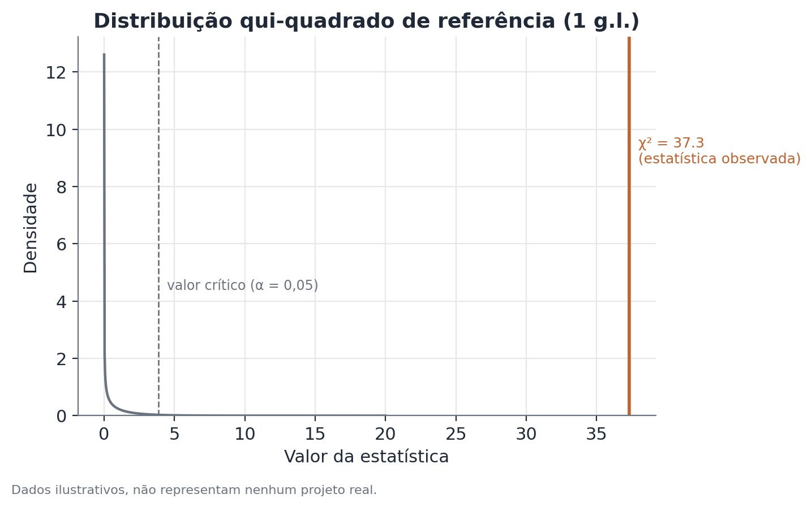

# Teste de Sample Ratio Mismatch (SRM)

*Pressupõe os fundamentos de teste A/B (aleatorização, grupos, métrica
primária, teste de hipótese) — veja
[Fundamentos de teste A/B](./ab-testing.md). Este documento cobre
especificamente a checagem de integridade da alocação, que deve preceder
qualquer leitura de efeito.*

## Conceito

Um teste de Sample Ratio Mismatch (SRM) verifica se a proporção observada de
unidades em cada braço de um experimento é compatível com a proporção
planejada na atribuição. Na essência, é um teste de aderência (goodness-of-
fit): comparam-se contagens observadas contra contagens esperadas sob a
proporção nominal do desenho experimental (50/50, 90/10, ou qualquer outra),
usando um teste qui-quadrado — ou, de forma equivalente para dois grupos, um
teste binomial exato.

A razão de ele existir como checagem separada, e não apenas como parte do
teste de efeito, é que ele responde a uma pergunta lógica anterior: "a
comparação entre os grupos que estou prestes a fazer é sequer válida?" Um
teste de efeito bem-sucedido não tem significado nenhum se os próprios grupos
comparados não foram formados da maneira que a análise assume.

## Formulação matemática

Sejam $k$ braços do experimento, com proporções planejadas
$\pi_1, \pi_2, \ldots, \pi_k$ (somando 1) e contagens observadas
$o_1, o_2, \ldots, o_k$, com total $N = \sum_i o_i$. A contagem esperada em
cada braço sob a proporção planejada é:

$$
e_i = \pi_i \cdot N
$$

A estatística de teste qui-quadrado de aderência é:

$$
\chi^2 = \sum_{i=1}^{k} \frac{(o_i - e_i)^2}{e_i}
$$

Sob $H_0$ (a proporção real é a planejada), $\chi^2$ segue aproximadamente
uma distribuição qui-quadrado com $k-1$ graus de liberdade. Para dois braços
($k=2$), isso se reduz a 1 grau de liberdade, e o teste é equivalente a um
teste binomial de duas pontas comparando $o_1/N$ contra $\pi_1$:

$$
z = \frac{\hat{p}_1 - \pi_1}{\sqrt{\pi_1(1-\pi_1)/N}}, \qquad z^2 = \chi^2 \text{ (com 1 g.l.)}
$$

onde $\hat{p}_1 = o_1/N$ é a proporção observada no primeiro braço.

## Suposições

- **A proporção planejada é conhecida e fixa** — precisa ser definida
  explicitamente antes do experimento, não inferida a posteriori.
- **As contagens são independentes entre si** — cada unidade contribui para
  exatamente um braço, sem dupla contagem nem unidades compartilhadas entre
  braços.
- **O teste qui-quadrado assume contagens esperadas razoavelmente grandes**
  (regra prática comum: esperado mínimo de 5 por célula) para a aproximação
  assintótica ser confiável; com contagens muito pequenas, um teste binomial
  exato é preferível.
- **A checagem deve cobrir a população elegível completa**, não uma amostra
  filtrada depois da atribuição — filtrar antes de checar pode mascarar
  exatamente o tipo de perda diferencial que o teste deveria detectar.

## Hipóteses

$$
H_0: \pi_i = \pi_i^{planejado} \text{ para todo } i
\qquad
H_1: \pi_i \neq \pi_i^{planejado} \text{ para pelo menos um } i
$$

O nível de significância usado na prática é tipicamente mais rígido que o
padrão de 0,05 usado em testes de efeito — valores como $\alpha = 0{,}001$
são comuns, refletindo uma assimetria de custos: um falso positivo aqui
(declarar SRM quando não há) custa uma investigação; um falso negativo
(não detectar um SRM real) contamina toda a leitura subsequente do
experimento.

## Interpretação

Um SRM significativo é evidência de que o mecanismo de atribuição, ou o
processo de contagem, não está produzindo a proporção pretendida — não é,
por si só, um diagnóstico da causa. As causas mais comuns incluem:

- diferenças de latência entre as versões testadas, fazendo com que uma
  delas descarte mais eventos por timeout antes do registro;
- filtros de bot, fraude ou qualidade de tráfego aplicados de forma
  assimétrica entre os braços;
- bugs no próprio código de hashing/atribuição de usuários a grupos;
- problemas de instrumentação que registram um braço de forma incompleta.

A implicação prática de um SRM detectado é direta: qualquer efeito estimado
no experimento não é interpretável até a causa ser identificada e corrigida
(ou até o experimento ser refeito). Isso vale mesmo que o efeito pareça
"razoável" ou alinhado com a expectativa prévia da equipe — um SRM
compromete a premissa fundamental de comparabilidade entre os grupos, que é
justamente o que dá ao teste de efeito sua interpretação causal.

## Limitações

- O teste detecta desvio na proporção agregada; ele não garante ausência de
  SRM em subgrupos específicos (por plataforma, por região, por canal de
  aquisição) — um SRM pode estar "escondido" na agregação total quando
  desvios em direções opostas se cancelam entre segmentos.
- Não localiza a causa — apenas sinaliza que existe um problema. A
  investigação subsequente (comparar logs de atribuição, taxas de perda por
  segmento, timing de carregamento) é um passo manual separado.
- Um SRM pode ser intermitente, presente só em parte do período do
  experimento; olhar a proporção observada ao longo do tempo, e não só o
  total acumulado ao final, ajuda a identificar isso.
- Com poucos braços e amostra muito pequena, a aproximação qui-quadrado pode
  não ser confiável — nesses casos, um teste binomial exato (ou exato de
  Fisher, para mais de dois braços) é mais apropriado.

## Exemplo

Um aplicativo de assinatura planeja testar uma nova tela de onboarding em
50% dos novos usuários, mantendo os demais 50% na tela atual. Ao final de
duas semanas, o time registra as seguintes contagens:

| Braço | Planejado | Observado |
|---|---|---|
| Controle (tela atual) | 50% | 10.432 |
| Tratamento (tela nova) | 50% | 9.568 |
| Total | 100% | 20.000 |

Sob $H_0$, o esperado em cada braço é $e = 0{,}5 \times 20.000 = 10.000$. A
estatística qui-quadrado:

$$
\chi^2 = \frac{(10.432 - 10.000)^2}{10.000} + \frac{(9.568 - 10.000)^2}{10.000}
= \frac{186.624}{10.000} + \frac{186.624}{10.000} \approx 37{,}3
$$

Com 1 grau de liberdade e $\chi^2 \approx 37{,}3$, o valor-p é
extremamente pequeno — muitas ordens de grandeza abaixo do limiar de 0,001
comumente usado. A equipe pausa a leitura de qualquer efeito e investiga.
Na investigação, descobre que a tela nova carrega um componente visual mais
pesado, e usuários com conexão lenta estão sendo contados como "não
elegíveis" com mais frequência no braço de tratamento por timeout no
carregamento do experimento — uma perda diferencial de amostra que gera
exatamente o padrão observado. Depois de corrigir o timeout, o experimento é
reiniciado do zero, e só então a leitura de efeito é considerada confiável.
