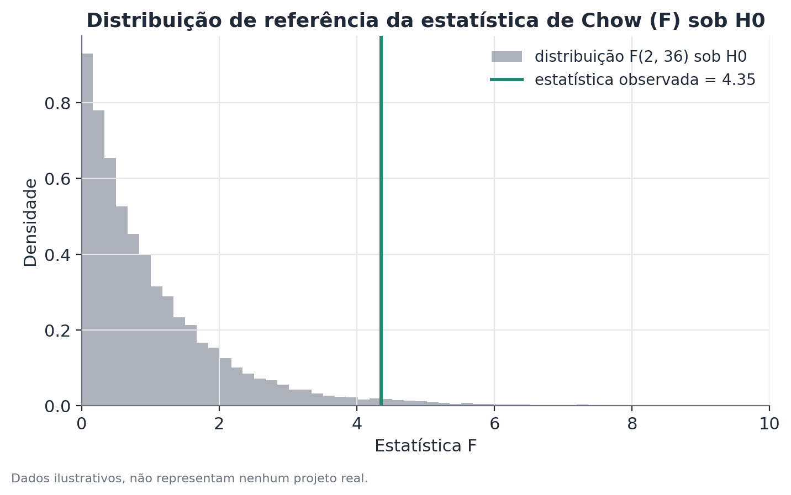

# Teste de quebra estrutural (tipo Chow)

## Conceito

O teste de Chow (Chow, 1960) verifica se um modelo estatístico — tipicamente
uma regressão linear — tem coeficientes estáveis ao longo de toda uma série
temporal, ou se esses coeficientes mudam num ponto específico, conhecido a
priori. É a ferramenta canônica para responder "algo estruturalmente
diferente aconteceu a partir desta data conhecida?", em contraste com métodos
de detecção de múltiplas quebras em datas desconhecidas (como Bai-Perron),
que resolvem um problema mais amplo e mais exigente em termos de dados.

A lógica é a de um teste F aninhado: um modelo "restrito", que impõe os
mesmos coeficientes antes e depois da data de corte, é comparado a um modelo
"irrestrito", que permite coeficientes diferentes em cada um dos dois
períodos. Se o modelo irrestrito reduz o erro de ajuste mais do que se
esperaria apenas pelo ganho mecânico de ter mais parâmetros livres, isso é
evidência contra a hipótese de estabilidade.

## Formulação matemática

Considere o modelo de regressão linear:

$$y_t = \beta_0 + \beta_1 x_t + \varepsilon_t, \quad t = 1, \dots, n$$

Onde $y_t$ é a variável de interesse no período $t$, $x_t$ são as variáveis
explicativas, $\beta_0$ e $\beta_1$ são os coeficientes a estimar, e
$\varepsilon_t$ é o erro aleatório.

Seja $t^*$ o ponto de quebra conhecido a priori, dividindo a amostra em dois
subperíodos de tamanhos $n_1$ (antes de $t^*$) e $n_2$ (a partir de $t^*$),
com $n_1 + n_2 = n$.

Defina:

- $RSS_p$ — soma dos quadrados dos resíduos ("residual sum of squares") do
  modelo ajustado ao conjunto **completo** (o modelo restrito, que assume
  coeficientes iguais nos dois períodos).
- $RSS_1$ — soma dos quadrados dos resíduos do modelo ajustado apenas ao
  primeiro subperíodo.
- $RSS_2$ — soma dos quadrados dos resíduos do modelo ajustado apenas ao
  segundo subperíodo.
- $k$ — número de parâmetros estimados em cada regressão (aqui, $k = 2$:
  intercepto e inclinação).

A estatística do teste de Chow é:

$$F = \frac{\left(RSS_p - (RSS_1 + RSS_2)\right) / k}{\left(RSS_1 + RSS_2\right) / (n - 2k)}$$

Onde:

- o numerador mede quanto o erro caiu ao permitir coeficientes diferentes
  nos dois períodos, ajustado pelo número de graus de liberdade adicionais
  usados ($k$);
- o denominador é o erro residual médio do modelo irrestrito, ajustado pelos
  graus de liberdade restantes ($n - 2k$).

Sob a hipótese nula de estabilidade dos coeficientes, $F$ segue
aproximadamente uma distribuição $F(k, \, n - 2k)$.

## Suposições

- **A data de quebra é conhecida antes de olhar os dados.** Esta é a
  suposição mais importante e mais frequentemente violada na prática. Se a
  data for escolhida por inspeção visual da série (procurando onde ela
  "parece" ter mudado), o valor-p resultante não tem mais a interpretação
  padrão — o procedimento correto nesse caso é outro (testes de quebra
  desconhecida, como o supF de Andrews, ou métodos de múltiplas quebras).
- **Erros homocedásticos e não autocorrelacionados dentro de cada
  subperíodo**, condição padrão de regressão linear por mínimos quadrados.
  Quando essa suposição falha — comum em séries temporais econômicas — os
  erros-padrão subjacentes ao teste F podem estar incorretos; formas
  robustas do teste (usando erros-padrão robustos a heterocedasticidade e
  autocorrelação, como Newey-West) são preferíveis nesses casos.
- **Amostra mínima em cada subperíodo.** Com $n_1$ ou $n_2$ pequenos em
  relação a $k$, a estimativa em cada segmento fica instável e o teste perde
  poder — a capacidade de detectar uma quebra real que de fato exista cai
  proporcionalmente.
- **Forma funcional correta do modelo em cada período.** O teste compara a
  estabilidade dos coeficientes de um modelo específico (por exemplo,
  linear); se a relação verdadeira mudar de forma não linear que o modelo
  linear não capture, o teste pode não detectar uma mudança real, ou
  detectar uma mudança que na verdade é só um problema de especificação.

## Hipóteses

- $H_0$: os coeficientes $\beta_0$ e $\beta_1$ são os mesmos antes e depois
  de $t^*$ — não há quebra estrutural na data testada.
- $H_1$: pelo menos um dos coeficientes difere entre os dois períodos.
- Estatística de teste: $F$, como definida acima.
- Distribuição de referência sob $H_0$: $F(k, \, n - 2k)$.
- Nível de significância convencional: $\alpha = 0{,}05$, embora o contexto
  (tamanho de amostra, número de testes realizados) deva informar essa
  escolha.
- Regra de decisão: rejeita-se $H_0$ (evidência de quebra) quando o valor-p
  associado a $F$ é menor que $\alpha$.

## Interpretação

Rejeitar $H_0$ é evidência de que o processo gerador dos dados mudou de
padrão na data testada — não necessariamente de que a data testada
**causou** a mudança. O teste de Chow avalia coincidência temporal com
precisão estatística, mas atribuição causal exige mais:

- **Isolamento de eventos concorrentes.** Se outro evento relevante ocorreu
  próximo à mesma data (uma crise cambial simultânea a uma mudança
  regulatória, por exemplo), o teste não distingue qual dos dois — ou se
  ambos, combinados — geraram a mudança observada.
- **Distinção entre mudança de nível e mudança de inclinação.** Uma quebra
  pode se manifestar como um salto discreto no nível da série (o intercepto
  muda, a inclinação permanece igual), como uma mudança na taxa de
  crescimento (a inclinação muda), ou como ambas simultaneamente. A
  especificação do teste (quais coeficientes são deixados livres antes/
  depois) determina que tipo de mudança pode ser detectado — vale sempre
  reportar não só a significância, mas a magnitude e a direção da mudança em
  cada coeficiente.
- **Significância estatística não é o mesmo que magnitude relevante.** Com
  amostras grandes, mudanças pequenas e sem relevância prática podem gerar
  valores-p muito baixos. Reportar o tamanho estimado da mudança — não só o
  valor-p — é essencial para uma interpretação honesta.

## Limitações

- **Não é um método de detecção de quebras desconhecidas.** O teste de Chow
  pressupõe que $t^*$ é dado externamente. Aplicá-lo repetidamente, testando
  várias datas candidatas e reportando só a mais significativa, infla
  seriamente a taxa de falso positivo (é, na prática, um problema de
  comparações múltiplas não corrigido) — para isso, o procedimento correto é
  um método desenhado para busca de ponto de quebra desconhecido.
- **Não controla por eventos concorrentes na mesma janela de tempo.** Um
  resultado significativo é compatível com múltiplas explicações causais
  simultâneas; o teste sozinho não separa uma da outra.
- **Sensível à especificação do modelo.** Uma forma funcional mal
  especificada pode gerar uma quebra "espúria" (o modelo linear se ajusta
  mal em ambos os períodos de forma diferente, mesmo sem mudança real no
  processo) ou mascarar uma quebra real.
- **Poder limitado com poucos dados em algum dos subperíodos.** Uma quebra
  perto do início ou do fim da série é particularmente difícil de detectar
  com confiança.

## Exemplo

Suponha um estudo hipotético sobre a taxa de participação de um grupo
demográfico específico em um programa de capacitação profissional, medida
mensalmente ao longo de 40 meses. Uma nova política de incentivo, com data de
início conhecida, entrou em vigor no mês 25.

Antes da política (meses 1 a 24), a taxa de participação cresce a um ritmo
médio estimado de 0,15 pontos percentuais por mês. Depois da política (meses
25 a 40), o ritmo estimado sobe para 0,55 pontos percentuais por mês, e o
nível médio da série também sobe de forma perceptível.

Ajustando os três modelos:

- Modelo restrito (toda a série, um único coeficiente de tendência):
  $RSS_p = 210{,}4$
- Modelo do primeiro subperíodo: $RSS_1 = 62{,}1$
- Modelo do segundo subperíodo: $RSS_2 = 58{,}7$

Com $k = 2$ e $n = 40$:

$$F = \frac{(210{,}4 - (62{,}1 + 58{,}7)) / 2}{(62{,}1 + 58{,}7) / (40 - 4)} = \frac{44{,}8}{3{,}36} \approx 4{,}35$$

Comparando com a distribuição $F(2, 36)$, essa estatística corresponde a um
valor-p de aproximadamente 0,021 — abaixo de 0,05. Rejeita-se $H_0$: há
evidência estatística de que o padrão da série mudou no mês 25.

Interpretação cuidadosa: esse resultado é consistente com a política de
incentivo tendo alterado o padrão da série, mas não a prova sozinho. Se, por
exemplo, uma campanha de divulgação em mídia de massa também começou por
volta do mês 25, por coincidência ou não, o teste de Chow, por si só, não
consegue separar o efeito de uma da outra — essa separação exigiria um
desenho adicional, como comparar a mesma série entre regiões que receberam a
política mas não a campanha, e vice-versa.

```python
import numpy as np
import statsmodels.api as sm
from scipy import stats

def teste_chow(y, x, indice_quebra):
    X = sm.add_constant(x)
    rss_p = sm.OLS(y, X).fit().ssr

    X1 = sm.add_constant(x[:indice_quebra])
    X2 = sm.add_constant(x[indice_quebra:])
    rss1 = sm.OLS(y[:indice_quebra], X1).fit().ssr
    rss2 = sm.OLS(y[indice_quebra:], X2).fit().ssr

    k = X.shape[1]
    n = len(y)
    f_stat = ((rss_p - (rss1 + rss2)) / k) / ((rss1 + rss2) / (n - 2 * k))
    p_valor = 1 - stats.f.cdf(f_stat, k, n - 2 * k)
    return f_stat, p_valor
```


