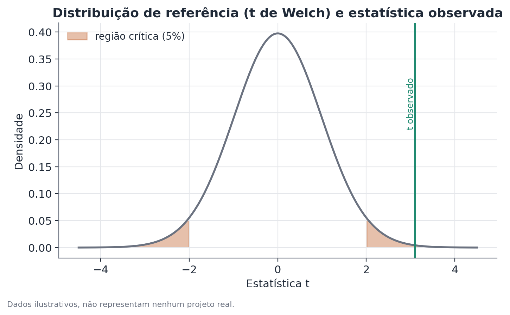

# Teste t de Welch

## Conceito

O teste t de Welch avalia se as médias de duas populações independentes são
estatisticamente diferentes, com base em duas amostras aleatórias, sem assumir
que as duas populações têm a mesma variância. É uma generalização do teste t
de duas amostras de Student, que resolve a chamada questão de
Behrens-Fisher: como testar diferença de médias entre duas populações normais
com variâncias possivelmente diferentes e desconhecidas.

A intuição estatística central é a seguinte: a incerteza sobre uma média
amostral depende de dois fatores — quanta variabilidade existe dentro do
grupo, e quantas observações foram usadas para estimar essa média. Quando os
dois grupos têm variâncias e tamanhos de amostra diferentes, o jeito correto
de combinar essa incerteza para testar a diferença das médias não é simétrico
entre os grupos, e é exatamente isso que Welch modela — sem forçar uma
suposição de igualdade de variância que raramente é justificável a priori.

## Formulação matemática

Sejam duas amostras independentes:

- Grupo 1: $n_1$ observações, média amostral $\bar{x}_1$, variância amostral
  $s_1^2$.
- Grupo 2: $n_2$ observações, média amostral $\bar{x}_2$, variância amostral
  $s_2^2$.

A estatística de teste de Welch é:

$$
t = \frac{\bar{x}_1 - \bar{x}_2}{\sqrt{\dfrac{s_1^2}{n_1} + \dfrac{s_2^2}{n_2}}}
$$

O numerador é a diferença observada entre as médias amostrais. O denominador
é o erro-padrão dessa diferença, calculado somando a variância de cada média
amostral ($s_i^2/n_i$) separadamente — sem combinar as duas variâncias numa
única variância "conjunta" (pooled), como faz o teste de Student.

Os graus de liberdade não são $n_1 + n_2 - 2$, como no teste de Student.
Em vez disso, usa-se a aproximação de Welch-Satterthwaite:

$$
\nu \approx \frac{\left(\dfrac{s_1^2}{n_1} + \dfrac{s_2^2}{n_2}\right)^2}
{\dfrac{(s_1^2/n_1)^2}{n_1 - 1} + \dfrac{(s_2^2/n_2)^2}{n_2 - 1}}
$$

O importante aqui não é decorar a fórmula, mas entender a ideia: $\nu$ é um
número de graus de liberdade *efetivo*, tipicamente não inteiro, que pondera
o quanto cada grupo contribui para a incerteza total do erro-padrão. Um grupo
pequeno com variância alta "puxa" $\nu$ para baixo — reduzindo a confiança do
teste — de um jeito mais fiel à realidade do que a contagem simples de graus
de liberdade do teste de Student.

## Suposições

1. **Independência**: as observações dentro de cada grupo, e entre os dois
   grupos, são independentes entre si. Quando há estrutura de dependência
   (por exemplo, várias observações vindas da mesma unidade amostral, ou
   medições repetidas na mesma pessoa), a suposição é violada e o
   erro-padrão calculado subestima a incerteza real — nesse caso, técnicas de
   erro-padrão robusto a cluster são mais apropriadas.
2. **Normalidade aproximada, ou amostra grande**: o teste assume que as
   médias amostrais são aproximadamente normalmente distribuídas. Isso vale
   exatamente se os dados originais forem normais, e aproximadamente para
   amostras grandes, pelo Teorema Central do Limite, mesmo que os dados
   originais não sejam normais. Com amostras pequenas e dados muito
   assimétricos, a aproximação pode falhar — vale inspecionar a distribuição
   dos dados ou considerar alternativas não paramétricas (como o teste de
   Mann-Whitney) nesses casos.
3. **Não exige variâncias iguais** — essa é justamente a suposição que Welch
   relaxa em relação ao teste t de Student. Não há necessidade de testar
   igualdade de variâncias antes de escolher Welch: como Welch se reduz ao
   teste de Student quando as variâncias realmente são iguais (a perda de
   eficiência nesse caso é pequena), é seguro usar Welch como padrão, mesmo
   quando não se sabe se as variâncias são iguais.

## Hipóteses

- $H_0$: $\mu_1 = \mu_2$ (as médias populacionais são iguais).
- $H_1$: $\mu_1 \neq \mu_2$ (teste bicaudal, o mais comum), ou $\mu_1 > \mu_2$
  / $\mu_1 < \mu_2$ para testes unicaudais, quando há uma direção específica
  de interesse definida antes de olhar os dados.
- Nível de significância ($\alpha$): tipicamente 0,05, mas deve ser escolhido
  de acordo com o contexto — em decisões de maior risco ou com múltiplas
  comparações simultâneas, um $\alpha$ mais conservador (por exemplo, 0,01) é
  mais apropriado.
- Estatística de teste: $t$, calculado como acima, comparado a uma
  distribuição $t$ de Student com $\nu$ graus de liberdade.
- Valor-p: a probabilidade de observar uma estatística $t$ tão ou mais
  extrema quanto a observada, assumindo que $H_0$ é verdadeira.
- Intervalo de confiança: um IC de 95% para a diferença $\mu_1 - \mu_2$ é
  dado por $(\bar{x}_1 - \bar{x}_2) \pm t_{\nu, 0.975} \cdot \text{EP}$, onde
  EP é o erro-padrão da diferença (o denominador da estatística $t$) e
  $t_{\nu, 0.975}$ é o quantil apropriado da distribuição de referência.

## Interpretação

Rejeitar $H_0$ com um valor-p baixo é evidência estatística de que as médias
populacionais diferem — não é prova, e não diz nada sobre a causa da
diferença. Um teste t (de Welch ou de Student) mede associação entre
pertencer a um grupo e o valor médio de uma variável; ele não isola por que
essa associação existe, a menos que os grupos tenham sido definidos por uma
atribuição aleatória controlada (como num experimento).

É essencial distinguir significância estatística de relevância prática. Com
amostras muito grandes, diferenças de médias irrelevantes no mundo real podem
ser estatisticamente significativas. Com amostras pequenas, diferenças
grandes podem não atingir significância simplesmente por falta de poder
estatístico. Sempre reportar o tamanho do efeito (a diferença de médias em
si, na unidade original, e idealmente também um IC) ao lado do valor-p.

## Limitações

- O teste compara apenas médias — duas distribuições podem ter médias iguais
  e formatos completamente diferentes (variância, assimetria). Se a pergunta
  for sobre a distribuição inteira, não só a média, métodos que olham outros
  pontos da distribuição (como decomposições por quantil) são mais
  informativos.
- Testes múltiplos: rodar Welch repetidamente sobre muitos subgrupos ou
  muitos períodos de tempo sem correção aumenta a chance de encontrar uma
  diferença "significativa" só por acaso. Em análises com muitas comparações
  simultâneas, vale considerar correção (por exemplo, Bonferroni ou
  controle de taxa de descoberta falsa).
- Amostras extremamente pequenas (por exemplo, menos de 10 observações por
  grupo) tornam a aproximação de Welch-Satterthwaite menos confiável — nesse
  regime, métodos exatos ou de permutação são preferíveis.
- O teste não lida, por si só, com dados de painel ou séries temporais
  correlacionadas — cada aplicação do teste assume amostras novas e
  independentes.

## Exemplo

Considere um cenário hipotético: uma equipe de operações quer saber se o
tempo médio de atendimento (em minutos) difere entre duas filiais de uma
rede de atendimento, filial A e filial B, que têm volumes de chamados e
processos internos diferentes.

Dados (inventados):

- Filial A: $n_1 = 40$, $\bar{x}_1 = 8{,}1$ min, $s_1 = 1{,}3$ min.
- Filial B: $n_2 = 95$, $\bar{x}_2 = 9{,}6$ min, $s_2 = 3{,}4$ min.

**Passo 1 — erro-padrão da diferença:**

$$
\text{EP} = \sqrt{\frac{1{,}3^2}{40} + \frac{3{,}4^2}{95}} = \sqrt{0{,}0423 + 0{,}1217} \approx 0{,}405
$$

**Passo 2 — estatística t:**

$$
t = \frac{9{,}6 - 8{,}1}{0{,}405} \approx \frac{1{,}5}{0{,}405} \approx 3{,}10
$$

**Passo 3 — graus de liberdade efetivos** (aplicando Welch-Satterthwaite aos
mesmos números): resulta em $\nu \approx 61{,}4$ — um número não inteiro,
puxado para baixo em relação a $n_1 + n_2 - 2 = 133$ porque a Filial B, apesar
de ter mais observações, também tem muito mais variabilidade, o que reduz a
confiança efetiva na comparação.

**Passo 4 — valor-p:** comparando $t \approx 3{,}10$ com $\nu \approx 61{,}4$
graus de liberdade produz um valor-p bicaudal bem abaixo de 0,01 — evidência
forte de que a diferença observada não é apenas ruído amostral.

**Passo 5 — intervalo de confiança:** o IC de 95% para a diferença de médias
fica aproximadamente entre 0,7 e 2,3 minutos — a Filial B provavelmente tem
tempo médio de atendimento maior, e o intervalo dá uma ideia de quão grande
essa diferença provavelmente é, não só de que ela existe.

A figura abaixo ilustra a distribuição de referência (a distribuição t com os
graus de liberdade de Welch) e onde a estatística observada cai em relação à
região crítica de 5%:

