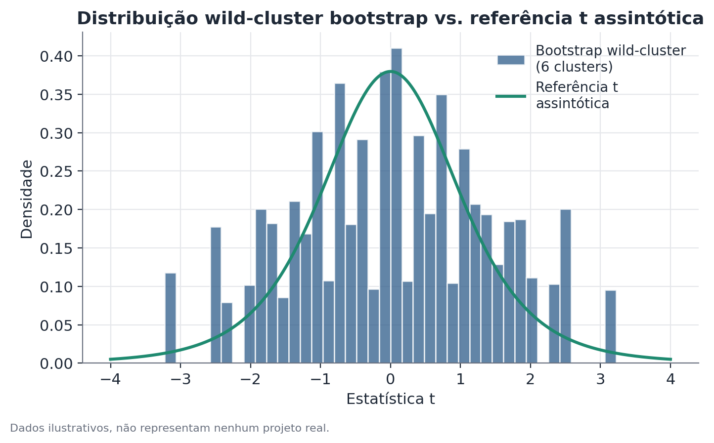

# Bootstrap wild-cluster

## Conceito

O bootstrap wild-cluster é um método de reamostragem desenvolvido
especificamente para inferência em modelos de regressão com dados
agrupados quando o número de clusters é pequeno — situação em que o
estimador de erro-padrão robusto a cluster (CRVE) perde suas garantias
assintóticas e, sistematicamente, subestima a incerteza real.

A ideia central se apoia em duas escolhas de desenho:

1. **Reamostrar resíduos, não observações ou clusters inteiros.** Um
   bootstrap de cluster convencional sorteia clusters inteiros com
   reposição — o que, com poucos clusters, produz réplicas com repetições
   grosseiras (por exemplo, um cluster aparecendo três vezes e outro
   nenhuma) e um espaço amostral efetivamente pequeno demais para formar uma
   boa distribuição de referência.
2. **Perturbar por sinal aleatório, preservando a estrutura de dependência
   dentro do cluster.** Em vez de reamostrar, o método mantém todas as
   observações originais e multiplica os resíduos de cada cluster por um
   único valor aleatório sorteado para aquele cluster (tipicamente +1 ou
   −1, a "distribuição de Rademacher") — preservando exatamente o padrão de
   correlação dentro de cada cluster, porque todas as observações daquele
   cluster são perturbadas em bloco, na mesma direção.

## Formulação matemática

Considere o modelo linear com $G$ clusters:

$$
Y_{ig} = X_{ig}'\beta + \varepsilon_{ig}, \quad g = 1, \dots, G
$$

O interesse é testar $H_0: \beta_j = \beta_j^0$ (frequentemente
$\beta_j^0 = 0$) para um coeficiente específico $\beta_j$.

**Passo 1 — ajuste restrito.** Estima-se o modelo impondo $H_0$ (o modelo
"restrito"), obtendo resíduos $\tilde u_{ig}$ e valores ajustados
$\tilde Y_{ig}$ sob a restrição.

**Passo 2 — perturbação por sinal.** Para cada réplica $b = 1, \dots, B$,
sorteia-se um sinal $v_g^{(b)} \in \{-1, +1\}$ **por cluster** (não por
observação), geralmente com probabilidade 1/2 para cada valor:

$$
v_g^{(b)} \sim \text{Rademacher}(0{,}5)
$$

**Passo 3 — dados sintéticos.** Constrói-se uma variável dependente
sintética:

$$
Y_{ig}^{*(b)} = \tilde Y_{ig} + v_g^{(b)} \, \tilde u_{ig}
$$

Note que $v_g^{(b)}$ não varia dentro do cluster $g$ — todas as observações
daquele cluster recebem o mesmo sinal naquela réplica, preservando a
correlação intra-cluster.

**Passo 4 — reajuste e estatística.** Reajusta-se o modelo (irrestrito) aos
dados sintéticos $Y^{*(b)}$, obtendo $\hat\beta_j^{*(b)}$ e seu erro-padrão
robusto a cluster $\widehat{SE}^{*(b)}(\hat\beta_j)$, formando a estatística
bootstrap:

$$
t^{*(b)} = \frac{\hat\beta_j^{*(b)} - \beta_j^0}{\widehat{SE}^{*(b)}(\hat\beta_j)}
$$

**Passo 5 — valor-p.** Repetindo os passos 2 a 4 para $B$ réplicas
(tipicamente $B = 999$), o valor-p bootstrap é:

$$
p^{*} = \frac{1}{B} \sum_{b=1}^{B} \mathbb{1}\left[ \, |t^{*(b)}| \geq |t_{\text{obs}}| \, \right]
$$

com $t_{\text{obs}}$ a estatística t calculada nos dados reais (sob o
modelo irrestrito), usando erro-padrão robusto a cluster convencional.

Com $G$ clusters, existem no máximo $2^G$ combinações distintas de sinais
— em $G=6$, por exemplo, 64 combinações, o que ainda deixa um valor-p com
granularidade razoável mesmo enumerando exaustivamente em vez de sortear.

## Suposições

- **Modelo corretamente especificado sob $H_0$.** O ajuste restrito, usado
  para gerar os resíduos perturbados, precisa refletir razoavelmente a
  relação real entre as variáveis — um modelo mal especificado produz
  resíduos que não representam bem a verdadeira estrutura de erro.
- **Independência entre clusters.** Como no CRVE, a validade do método
  depende de os clusters serem independentes entre si — dependência residual
  entre clusters não é corrigida pelo bootstrap wild-cluster.
- **Simetria da distribuição dos sinais.** A escolha padrão de sinais
  Rademacher (+1/−1 com igual probabilidade) funciona bem na maioria dos
  casos; distribuições alternativas de sinal existem na literatura, mas a
  Rademacher é a mais usada por robustez e simplicidade.
- **Número mínimo de clusters.** Com clusters extremamente poucos (2 ou 3),
  mesmo o espaço de $2^G$ sinais possíveis fica pequeno demais para formar
  uma distribuição de referência útil — o método continua superior ao CRVE
  assintótico nesse extremo, mas com garantias mais fracas.

## Hipóteses

- $H_0$: $\beta_j = \beta_j^0$ (comumente $\beta_j^0 = 0$, "o coeficiente é
  nulo").
- $H_1$: $\beta_j \neq \beta_j^0$.
- Estatística de teste: $t = (\hat\beta_j - \beta_j^0) / \widehat{SE}_{\text{cluster}}(\hat\beta_j)$,
  calculada nos dados reais e comparada à distribuição empírica de
  $t^{*(b)}$ gerada pelo bootstrap, em vez de a uma distribuição t teórica.
- Intervalo de confiança: pode ser obtido invertendo o teste (buscando o
  intervalo de valores de $\beta_j^0$ que não são rejeitados pelo teste
  bootstrap), abordagem mais trabalhosa computacionalmente, mas mais
  precisa que aproximar o intervalo a partir dos percentis diretos da
  distribuição de $\hat\beta_j^{*(b)}$.

## Interpretação

Um valor-p bootstrap wild-cluster baixo é evidência de que a estatística
observada seria incomum mesmo sob a variação simulada consistente com a
hipótese nula e com a estrutura de dependência real dos dados — uma leitura
mais confiável que a do CRVE assintótico justamente na faixa de poucos
clusters em que este último costuma falhar.

Como em qualquer método de correção de inferência, o bootstrap wild-cluster
não resolve problemas de identificação causal do desenho original (variável
omitida, seleção não aleatória) — ele apenas produz uma distribuição de
referência mais fiel para testar hipóteses sobre o coeficiente estimado,
dado que o modelo e o desenho já são válidos por outros motivos.

## Limitações

- **Ainda depende de um número mínimo de clusters úteis.** Com $G$ muito
  pequeno (2 ou 3), o espaço de $2^G$ sinais possíveis é pequeno demais para
  formar uma boa distribuição — nesse extremo, inferência por randomização,
  quando aplicável ao desenho, costuma ser preferível.
- **Sensibilidade à escolha do modelo restrito.** Resíduos de um modelo mal
  ajustado sob $H_0$ propagam esse erro de especificação para toda a
  distribuição bootstrap.
- **Custo computacional.** Cada réplica exige reajustar o modelo — com $B$
  na casa dos milhares e modelos complexos, o custo total pode ser
  significativo, embora seja tipicamente viável em problemas de escala
  aplicada usual.

### Comparação com outros métodos de inferência com poucos clusters

Bootstrap wild-cluster, erros-padrão robustos a cluster e inferência por
randomização respondem ao mesmo problema: inferência confiável quando
observações dentro de um cluster não são independentes e há poucos
clusters disponíveis.

- **Erros-padrão robustos a cluster (CRVE)** são a opção padrão, simples e
  rápida, mas perdem confiabilidade justamente quando há poucos clusters —
  o cenário em que o bootstrap wild-cluster e a inferência por randomização
  se tornam relevantes.
- **Inferência por randomização** é preferível quando o próprio mecanismo
  de sorteio do experimento é conhecido e simples o suficiente para
  enumerar (ou amostrar) diretamente as reatribuições possíveis — não exige
  ajustar nenhum modelo de regressão, apenas recalcular uma estatística sob
  reatribuições do tratamento. Funciona melhor quando o efeito de interesse
  vem de uma comparação direta entre grupos, sem controles adicionais.
- **Bootstrap wild-cluster** é a escolha mais natural quando o efeito de
  interesse vem de um modelo de regressão com controles ou estrutura mais
  rica (efeitos fixos, covariáveis), onde não há um mecanismo de sorteio
  simples para reatribuir diretamente — o bootstrap perturba os resíduos do
  modelo já ajustado, em vez de reatribuir tratamento a unidades.

Quando os dois métodos são aplicáveis ao mesmo problema, rodar ambos e
comparar as conclusões é uma checagem de robustez valiosa: concordância
entre inferência por randomização e bootstrap wild-cluster reforça a
confiança no resultado; discordância é um sinal de que vale a pena investigar
mais a fundo antes de reportar uma conclusão.

## Exemplo

Uma rede de clínicas testa um novo protocolo de agendamento em 8 unidades
(4 tratamento, 4 controle), medindo tempo médio de espera do paciente, com
controles adicionais no modelo (dia da semana, horário). O coeficiente
estimado do tratamento é −6,5 minutos, com erro-padrão robusto a cluster
convencional de 2,1, dando t ≈ −3,1 e um valor-p assintótico de
aproximadamente 0,003 (aparentemente muito significativo).

Rodando o bootstrap wild-cluster com $B = 999$ réplicas sobre os 8 clusters
(sorteando sinais Rademacher por clínica em cada réplica, reajustando o
modelo restrito e recalculando a estatística t a cada vez), a estatística
observada de −3,1 cai no percentil correspondente a um valor-p bootstrap de
aproximadamente 0,04 — ainda significativo a 5%, mas com margem bem mais
apertada do que o valor-p assintótico de 0,003 sugeria.

A diferença entre os dois valores-p (0,003 vs. 0,04) ilustra por que o CRVE
assintótico tende a ser excessivamente otimista com poucos clusters — a
conclusão qualitativa (efeito significativo) se mantém neste exemplo, mas a
margem de confiança real é bem mais estreita do que a primeira leitura
sugeria, e um resultado ligeiramente mais fraco poderia facilmente deixar
de ser significativo sob a correção wild-cluster.
