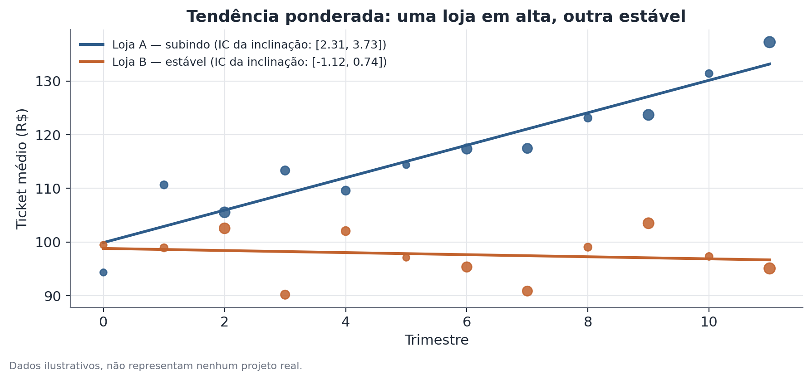
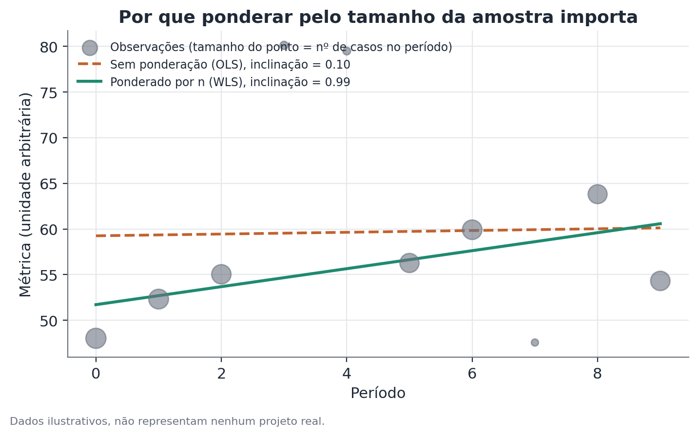

# Tendência por mínimos quadrados ponderados com classificação por intervalo de confiança

## Conceito

Mínimos quadrados ponderados (*Weighted Least Squares*, WLS) é uma extensão da regressão linear comum (OLS, *Ordinary Least Squares*) que permite atribuir pesos diferentes a cada observação ao ajustar uma reta. No contexto de análise de tendência ao longo do tempo, o uso mais comum é ponderar cada período pelo número de observações (tamanho de amostra) que sustentam a métrica medida naquele período — reconhecendo explicitamente que um ponto calculado a partir de 400 casos é uma estimativa mais precisa (tem menor variância) do que um ponto calculado a partir de 20 casos, e portanto deve ter mais influência sobre a reta ajustada.

A motivação estatística é a de heterocedasticidade conhecida: quando a variância do erro de medição de cada ponto não é constante, mas é aproximadamente proporcional ao inverso do tamanho de amostra daquele ponto (um resultado direto da lei dos grandes números — a variância de uma média amostral é $\sigma^2/n$), OLS ainda produz estimativas não-viesadas do coeficiente angular, mas deixa de ser o estimador de menor variância possível (deixa de ser BLUE — *Best Linear Unbiased Estimator*, segundo o teorema de Gauss-Markov generalizado). WLS, usando pesos proporcionais a $n$, restaura essa propriedade de eficiência.

A segunda parte do método — a **classificação da tendência** — converte a inclinação estimada e seu intervalo de confiança em um rótulo categórico (subindo / caindo / estável) usando uma regra simples e determinística: a posição do intervalo de confiança em relação a zero. Essa regra é equivalente, em termos formais, a um teste de hipótese bilateral sobre o coeficiente angular a um nível de significância correspondente ao IC escolhido.

## Formulação matemática

**Modelo.** Para uma unidade (loja, jogador, região) com observações em $T$ períodos, o modelo de tendência linear ponderada é

$$
y_t = \alpha + \beta t + \varepsilon_t, \qquad t = 1, \dots, T
$$

onde $y_t$ é a métrica observada no período $t$, $\alpha$ é o intercepto, $\beta$ é a inclinação (a quantidade de interesse — a tendência), e $\varepsilon_t$ é o erro, com $\mathrm{Var}(\varepsilon_t) = \sigma^2/w_t$, sendo $w_t$ o peso do período $t$ — tipicamente $w_t = n_t$, o número de observações que compõem $y_t$.

**Estimador WLS.** Os coeficientes que minimizam a soma ponderada dos quadrados dos resíduos,

$$
\hat\alpha, \hat\beta = \arg\min_{\alpha,\beta} \sum_{t=1}^T w_t \big(y_t - \alpha - \beta t\big)^2
$$

têm solução fechada análoga à de OLS, mas com as médias e produtos ponderados pelos pesos:

$$
\hat\beta = \frac{\sum_t w_t (t - \bar t_w)(y_t - \bar y_w)}{\sum_t w_t (t - \bar t_w)^2}, \qquad \hat\alpha = \bar y_w - \hat\beta \, \bar t_w
$$

onde $\bar t_w = \dfrac{\sum_t w_t t}{\sum_t w_t}$ e $\bar y_w = \dfrac{\sum_t w_t y_t}{\sum_t w_t}$ são as médias ponderadas de $t$ e $y$.

**Erro-padrão da inclinação.** Sob a suposição de que os pesos capturam corretamente a estrutura de variância, o erro-padrão de $\hat\beta$ é

$$
\mathrm{SE}(\hat\beta) = \sqrt{\dfrac{\hat\sigma^2}{\sum_t w_t (t-\bar t_w)^2}}, \qquad
\hat\sigma^2 = \dfrac{\sum_t w_t \big(y_t - \hat\alpha - \hat\beta t\big)^2}{T - 2}
$$

com $T-2$ graus de liberdade (dois parâmetros estimados: $\alpha$ e $\beta$).

**Intervalo de confiança e classificação.** O intervalo de confiança de $(1-\alpha_{\text{sig}})\times 100\%$ para $\beta$ é

$$
\hat\beta \pm t^*_{T-2,\, 1-\alpha_{\text{sig}}/2} \times \mathrm{SE}(\hat\beta)
$$

onde $t^*$ é o valor crítico da distribuição t de Student com $T-2$ graus de liberdade. A regra de classificação é:

$$
\text{Tendência} =
\begin{cases}
\text{subindo} & \text{se o limite inferior do IC} > 0 \\
\text{caindo} & \text{se o limite superior do IC} < 0 \\
\text{estável} & \text{se o IC contém zero}
\end{cases}
$$

Essa regra é matematicamente equivalente a rejeitar (ou não) $H_0: \beta=0$ em favor de $H_1: \beta \neq 0$ ao nível de significância $\alpha_{\text{sig}}$, e depois usar o sinal de $\hat\beta$ quando $H_0$ é rejeitada para decidir entre "subindo" e "caindo".

## Suposições

- **Os pesos refletem corretamente a precisão relativa de cada ponto.** Usar $n_t$ (número de observações) como peso pressupõe que a variância de $y_t$ é aproximadamente proporcional a $1/n_t$ — válido quando $y_t$ é, ela mesma, uma média ou proporção calculada sobre $n_t$ casos com variância individual razoavelmente constante entre períodos. Se a variabilidade individual dentro de cada período também mudar ao longo do tempo, os pesos ideais não são simplesmente $n_t$.
- **Linearidade.** A tendência subjacente é modelada como uma reta; tendências com curvatura relevante (aceleração, desaceleração, sazonalidade não removida) são mal capturadas por esse modelo simples, e a classificação subindo/caindo/estável pode não refletir o comportamento real da série.
- **Erros não correlacionados entre períodos, condicional aos pesos.** Se houver autocorrelação temporal residual (por exemplo, um trimestre bom tende a ser seguido por outro trimestre bom, além do que a tendência linear já captura), os erros-padrão calculados por WLS padrão subestimam a incerteza real — nesse caso, erros-padrão robustos a autocorrelação (Newey-West) são mais apropriados.
- **Ausência de outliers estruturais não relacionados à tendência.** Um único período com valor extremo (mesmo que baseado em muitas observações, e portanto com peso alto) pode distorcer a inclinação estimada mais do que seria razoável; vale inspecionar visualmente antes de confiar cegamente na classificação automática.

## Hipóteses

- $H_0: \beta = 0$ — não há tendência linear (a métrica não varia sistematicamente ao longo do tempo, dada a precisão ponderada dos dados disponíveis).
- $H_1: \beta \neq 0$ — existe tendência linear (positiva ou negativa).

Nível de significância tipicamente usado: 5% (correspondente a IC de 95%), embora a escolha do nível seja uma decisão editorial/operacional — um nível mais permissivo (10%) classifica mais séries como tendência definida (menos "estável"), ao custo de mais falsos positivos; um nível mais rígido (1%) faz o oposto.

## Interpretação

A inclinação $\hat\beta$ quantifica a mudança média estimada na métrica por unidade de tempo (por trimestre, por exemplo), sob a suposição de linearidade. A classificação subindo/caindo/estável é uma tradução operacional simplificada dessa inclinação e de sua incerteza — não uma afirmação sobre a causa da tendência. Uma tendência de alta estatisticamente confirmada não diz por que a métrica está subindo (mudança de mix, sazonalidade, ação deliberada, fator externo); apenas que a evidência estatística é suficiente para distinguir a inclinação de zero, dado o volume de dados disponível.

É importante comunicar "estável" corretamente: significa ausência de evidência suficiente para uma tendência definida, não prova de que a métrica realmente não mudou. Séries curtas (poucos períodos) ou com poucos dados por período tendem a produzir mais classificações "estável" simplesmente por falta de poder estatístico, mesmo quando existe uma tendência real subjacente.

## Limitações

- **Sensibilidade ao nível de confiança escolhido.** Diferentes escolhas de IC (90%, 95%, 99%) produzem diferentes classificações para os mesmos dados, especialmente em séries com inclinação próxima da fronteira de significância — vale relatar a inclinação e seu IC completo, não só o rótulo categórico.
- **Poder estatístico limitado com poucos períodos.** Com $T$ pequeno (três, quatro pontos), o intervalo de confiança tende a ser largo mesmo com pesos altos, dificultando distinguir uma tendência real e pequena de ruído.
- **Modelo linear pode ser inadequado para padrões não lineares.** Uma métrica que sobe e depois estabiliza (curva em S) pode ser classificada como "subindo" globalmente mesmo já tendo se estabilizado nos períodos mais recentes — vale complementar com inspeção visual ou um modelo de tendência local (ex.: regressão local, splines) quando o padrão for suspeito.
- **Multiplicidade de testes.** Classificar a tendência de muitas unidades simultaneamente (centenas de lojas, por exemplo) ao nível de significância de 5% cada gera, por acaso, um número esperado de classificações "subindo" ou "caindo" espúrias — se o objetivo for identificar as unidades verdadeiramente atípicas, vale considerar correção para comparações múltiplas.

## Exemplo

Considere duas lojas fictícias de uma rede de varejo, cada uma com doze trimestres de dados de ticket médio, com número de transações (peso) variando substancialmente entre trimestres — uma situação comum quando alguns trimestres coincidem com datas promocionais de alto volume e outros são períodos de baixa.

**Loja A** — ticket médio subindo de forma consistente, com peso amostral alto na maioria dos trimestres. Ajuste WLS:
- $\hat\beta = 2,40$ (reais por trimestre)
- $\mathrm{SE}(\hat\beta) = 0,58$
- $t^*_{10, 0.975} \approx 2,23$
- IC 95%: $2,40 \pm 2,23 \times 0,58 = [1,11;\, 3,69]$

Como o limite inferior (1,11) é maior que zero, a Loja A é classificada como **subindo**.

**Loja B** — ticket médio oscilando sem padrão claro, com vários trimestres de baixo peso amostral. Ajuste WLS:
- $\hat\beta = 0,05$
- $\mathrm{SE}(\hat\beta) = 0,56$
- IC 95%: $0,05 \pm 2,23 \times 0,56 = [-1,20;\, 1,30]$

Como o intervalo contém zero, a Loja B é classificada como **estável** — apesar de a inclinação pontual ser tecnicamente positiva, não há evidência estatística suficiente, dado o padrão de precisão amostral observado, para distingui-la de zero.

**Contraste com OLS não ponderado.** Se os mesmos dados da Loja B fossem ajustados sem ponderação (OLS simples), os poucos trimestres de baixo volume — que por acaso apresentam valores mais extremos — teriam peso igual aos trimestres de alto volume, potencialmente produzindo uma inclinação estimada bem diferente (e um erro-padrão que não reflete corretamente a precisão desigual dos pontos). É exatamente esse tipo de distorção que a ponderação por tamanho de amostra existe para corrigir.

