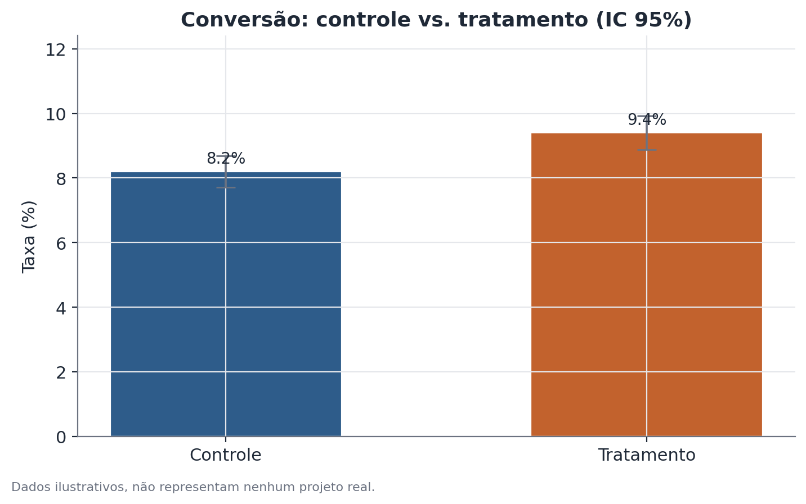

# Fundamentos de teste A/B

## 1. Que problema isso resolve?

Uma equipe de produto muda alguma coisa — o texto de um botão, a ordem de duas
etapas de cadastro, um novo algoritmo de recomendação — e quer saber se essa
mudança realmente melhora o resultado que importa, ou se qualquer variação
observada depois do lançamento é só ruído do dia a dia. Comparar "antes" com
"depois" não resolve isso sozinho, porque muita coisa além da mudança testada
também varia com o tempo (sazonalidade, uma campanha de marketing, um feriado).
O teste A/B resolve isso comparando duas versões ao mesmo tempo, em grupos de
usuários formados por sorteio.

## 2. Intuição

Se você dividir aleatoriamente um grupo grande de usuários em dois, os dois
subgrupos tendem a ser parecidos em tudo — idade, dispositivo, hábito de
compra, humor do dia — exceto na única coisa que você decidiu diferenciar
entre eles: qual versão do produto cada um viu. Se depois disso o resultado
médio dos dois grupos for diferente, a explicação mais simples é a própria
mudança testada, não uma diferença pré-existente entre os usuários. É essa
lógica — comparação simultânea com atribuição aleatória — que dá ao teste A/B
uma leitura mais confiável do que comparar períodos diferentes de tempo.

## 3. Explicação simples

Depois de rodar o experimento por tempo suficiente, calcula-se a diferença
entre a métrica média (ou proporção) do grupo tratamento e do grupo controle.
Essa diferença observada quase nunca será exatamente zero, mesmo que a
mudança não tenha efeito real nenhum — sempre existe variação de amostragem.
O teste de hipótese pergunta: essa diferença é grande o suficiente, dado o
tamanho dos grupos e a variabilidade da métrica, para não ser plausivelmente
explicada só por acaso? O intervalo de confiança de 95% em volta da diferença
mostra a faixa de valores plausíveis para o efeito real, não só um número
único.



## 4. Exemplo conceitual fácil

Imagine um site que testa uma nova cor de botão de "finalizar compra".
Metade dos visitantes, sorteados aleatoriamente, vê o botão azul de sempre;
a outra metade vê o botão verde novo. Depois de duas semanas, compara-se a
taxa de conversão dos dois grupos. Como a divisão foi aleatória, qualquer
diferença consistente e grande o suficiente entre os dois grupos tende a vir
da cor do botão — não de um grupo ter, por coincidência, mais usuários
propensos a comprar.

## 5. Como funciona, em linhas gerais

1. Define-se, antes de rodar o experimento, uma métrica primária (por
   exemplo, taxa de conversão) e o tamanho de amostra necessário.
2. Cada usuário elegível é designado aleatoriamente para controle ou
   tratamento, geralmente numa proporção fixa (50/50 é comum, mas não
   obrigatória).
3. O experimento roda por um período pré-definido, sem espiar o resultado
   repetidamente e tomar decisões no meio do caminho.
4. Calcula-se a diferença entre as médias (ou proporções) dos dois grupos, o
   erro-padrão dessa diferença, e a partir daí a estatística de teste, o
   valor-p e o intervalo de confiança de 95%.
5. Antes de confiar no resultado, checa-se se a randomização funcionou como
   planejado — é aqui que entram testes complementares como o de Sample
   Ratio Mismatch e a checagem de balanceamento de covariáveis.

## 6. O que o resultado significa

Um valor-p baixo (tipicamente abaixo de 0,05) indica que uma diferença desse
tamanho seria incomum se, na realidade, a mudança não tivesse efeito algum —
evidência a favor de um efeito real. O intervalo de confiança mostra a
magnitude plausível desse efeito: um IC estreito e distante de zero sugere um
efeito real e razoavelmente bem estimado; um IC largo, mesmo que não cruze o
zero, indica uma estimativa ainda incerta sobre o tamanho exato do efeito.

## 7. Como interpretar

Significância estatística não é o mesmo que importância prática: um efeito de
0,1 ponto percentual pode ser estatisticamente significativo com amostra
grande o suficiente, mas irrelevante para a decisão de negócio. E "não
significativo" não é o mesmo que "sem efeito" — pode simplesmente significar
que o experimento não teve amostra suficiente para detectar um efeito do
tamanho que de fato existe. Vale sempre olhar o tamanho do efeito e seu
intervalo de confiança junto com o valor-p, nunca o valor-p isolado.

## 8. Quando é útil

Sempre que for possível randomizar quem recebe cada versão de um produto,
processo ou comunicação, e existir uma métrica primária clara para julgar o
resultado — típico em testes de interface, algoritmos de recomendação,
políticas de preço, ou fluxos de cadastro. Esses fundamentos — efeito, erro-
padrão, IC 95%, teste de hipótese — são o ponto de partida para praticamente
qualquer leitura mais avançada de experimento, incluindo checagens de
integridade da randomização, ajuste por covariáveis e testes de
não-inferioridade.

## 9. Cuidados importantes

- A validade do teste depende da randomização ter funcionado de fato — nunca
  assuma isso sem checar (ver Sample Ratio Mismatch).
- Olhar o resultado repetidamente enquanto o experimento roda e parar assim
  que ele "fica significativo" infla a taxa de falso positivo — defina o
  tamanho de amostra e o período antes de começar.
- Testar muitas métricas secundárias ao mesmo tempo aumenta a chance de achar
  algo "significativo" por acaso; trate achados secundários como hipóteses
  para o próximo experimento, não como conclusões.
- Um efeito estatisticamente significativo em uma métrica pode vir
  acompanhado de piora em outra (uma métrica de guardrail) — é para isso que
  existe o teste de não-inferioridade.

## 10. Um exemplo pequeno com números

Um site testa um novo botão de finalização de compra contra o botão atual,
com 12.000 visitantes em cada grupo. O grupo controle converte a 8,2%; o
grupo tratamento converte a 9,4% — uma diferença de 1,2 ponto percentual, ou
um aumento relativo de aproximadamente 15%. O erro-padrão da diferença,
calculado a partir do tamanho de cada grupo e da variabilidade de uma taxa de
conversão, resulta numa estatística z de aproximadamente 3,0 e num valor-p
abaixo de 0,01. O intervalo de confiança de 95% para a diferença fica
aproximadamente entre 0,4 e 2,0 pontos percentuais — inteiramente acima de
zero, reforçando que o ganho é improvável de ser só ruído amostral.

## 11. Exemplo de código simples

```python
import numpy as np
from statsmodels.stats.proportion import proportions_ztest, confint_proportions_2indep

conversoes = np.array([984, 1128])      # ilustrativo: controle, tratamento
visitantes = np.array([12000, 12000])   # ilustrativo

estatistica, valor_p = proportions_ztest(conversoes, visitantes)
ic_baixo, ic_alto = confint_proportions_2indep(
    conversoes[1], visitantes[1], conversoes[0], visitantes[0], method="wald"
)

print(f"z = {estatistica:.2f}, valor-p = {valor_p:.4f}")
print(f"IC 95% da diferença: [{ic_baixo:.4f}, {ic_alto:.4f}]")
```

O teste de duas proporções resume, numa única estatística, se a diferença
observada entre as taxas de conversão dos dois grupos é grande demais para ser
explicada só por variação amostral.
