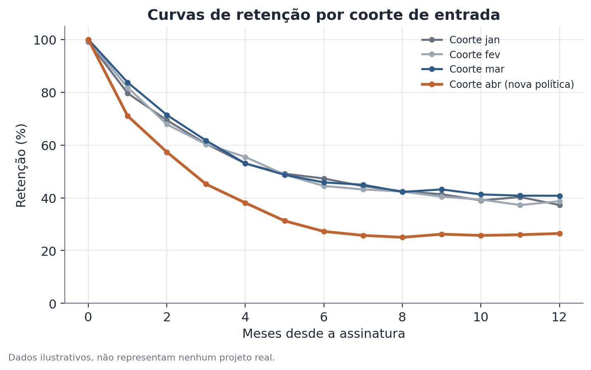

# Decomposição de coorte e retenção

## 1. Que problema isso resolve?

A taxa de retenção geral de um produto caiu neste trimestre. É tentador
procurar uma causa única — uma mudança de preço, um problema técnico, um
concorrente novo — mas essa queda agregada pode vir de lugares muito
diferentes: pode ser que os clientes que entraram recentemente estejam
saindo mais rápido que o normal, pode ser que todos os clientes, antigos e
novos, estejam saindo um pouco mais, ou pode até ser que ninguém individual
esteja se comportando diferente, e a queda seja só um efeito de composição —
mais gente nova entrando, e clientes novos naturalmente têm retenção mais
baixa que clientes antigos nos primeiros meses. Cada uma dessas causas pede
uma resposta completamente diferente.

## 2. Intuição

Uma "taxa de retenção" única, olhada mês a mês, mistura pessoas que entraram
em momentos muito diferentes — e cada uma dessas pessoas está numa fase
diferente da sua própria curva de vida como cliente. Uma **coorte** é o grupo
de clientes que entrou no mesmo período (por exemplo, todos que assinaram em
janeiro). Ao invés de olhar uma única curva de retenção agregada, olha-se uma
curva por coorte, alinhada pelo tempo desde a entrada (mês 0, mês 1, mês 2…),
não pelo calendário. Isso separa duas coisas que a métrica agregada mistura:
o comportamento de uma coorte específica ao longo da sua vida, e a mudança na
proporção de coortes recentes versus antigas na base total de clientes num
dado mês.

## 3. Explicação simples

Constrói-se uma curva de retenção para cada coorte de entrada: a proporção da
coorte original que ainda está ativa em cada mês seguinte à entrada. Coortes
diferentes podem ter curvas parecidas (sinal de que o comportamento do
cliente é estável ao longo do tempo) ou diferentes (sinal de que algo mudou
para quem entrou num período específico — uma mudança de produto, uma
campanha de aquisição que trouxe um público menos engajado, um problema
técnico que afetou desproporcionalmente quem estava em fase de onboarding).
Comparando essas curvas lado a lado, dá para identificar se uma queda
agregada vem de uma coorte específica, de todas as coortes igualmente, ou de
mudança na composição da base.



## 4. Exemplo conceitual fácil

Imagine um aplicativo de assinaturas que percebe uma queda na retenção média
do mês 3 (a fração de assinantes que ainda está ativa três meses depois de
assinar). Olhando a retenção agregada, parece que "os clientes estão saindo
mais". Mas ao separar por coorte de entrada, fica claro que as coortes de
janeiro, fevereiro e março têm curvas praticamente idênticas às de meses
anteriores — só a coorte de abril, que coincide com uma mudança no processo
de cobrança, tem uma queda visível na retenção do mês 3. A causa não é geral,
é específica de uma coorte e de um evento identificável.

## 5. Como funciona, em linhas gerais

1. Agrupam-se os clientes pela data (mês, semana) em que entraram — essa é a
   coorte.
2. Para cada coorte, calcula-se a fração ainda ativa em cada período
   seguinte à entrada (mês 0 = 100%, mês 1 = fração retida, e assim por
   diante).
3. Plotam-se as curvas de todas as coortes relevantes, alinhadas por tempo
   desde a entrada, não por data de calendário.
4. Compara-se visualmente e numericamente: coortes recentes estão pior do
   que coortes antigas no mesmo ponto da curva? Se sim, algo específico às
   coortes recentes está acontecendo.
5. Separa-se o efeito de composição: mesmo sem nenhuma coorte piorando
   individualmente, se a base atual tem uma proporção maior de coortes
   recentes (que estão numa fase de vida com retenção naturalmente mais
   baixa), a métrica agregada cai só por causa dessa mudança de mix.

## 6. O que o resultado significa

Se uma coorte específica tem retenção visivelmente pior do que as coortes
anteriores no mesmo ponto do tempo desde a entrada, isso aponta para uma
causa localizada — algo que aconteceu especificamente para quem entrou
naquele período. Se todas as coortes, incluindo as antigas, mostram queda a
partir de um certo mês de calendário, isso aponta para um evento que afetou
todo mundo ao mesmo tempo, independente de quando entraram. Se as curvas
individuais de cada coorte são estáveis, mas a métrica agregada ainda assim
caiu, a explicação está na composição — a base mudou de mix, não de
comportamento.

## 7. Como interpretar

É importante não pular direto para "a coorte X piorou, então algo quebrou
especificamente para eles" sem checar se a diferença é grande o suficiente
para não ser apenas ruído amostral — coortes menores (por exemplo, um mês com
poucas entradas) têm curvas naturalmente mais instáveis. Também vale
verificar se a composição da coorte mudou (por exemplo, um canal de aquisição
diferente trazendo um público diferente), porque isso pode explicar a
diferença sem que nada tenha "quebrado" no produto — só o público que entrou
mudou.

## 8. Quando é útil

Sempre que uma métrica agregada de retenção, churn, ou permanência muda de
forma inesperada e a causa não é óbvia. É especialmente útil para distinguir
um problema de produto ou operação (que normalmente aparece como uma queda
localizada numa coorte específica, coincidindo com uma mudança conhecida) de
um efeito estrutural de composição da base (que não exige uma correção
pontual, mas sim entender por que o mix de clientes está mudando).

## 9. Cuidados importantes

- Coortes muito pequenas produzem curvas instáveis — cuidado ao comparar
  coortes de tamanhos muito diferentes sem levar isso em conta.
- Retenção medida em janelas de calendário fixas (não alinhadas ao tempo
  desde a entrada) mistura coortes em fases diferentes da vida e esconde o
  próprio fenômeno que a decomposição por coorte tenta revelar.
- Uma coorte "pior" pode refletir mudança na fonte de aquisição, não um
  problema de produto — vale cruzar com dados de canal de aquisição antes de
  concluir causa.
- Comparações entre coortes são observacionais, não experimentais — mesmo
  quando uma coorte específica piora após uma mudança conhecida, a
  coincidência temporal sugere, mas não prova, causalidade; outros fatores
  que também mudaram naquele período podem estar por trás da diferença.

## 10. Um exemplo pequeno com números

Um serviço de streaming fictício acompanha a retenção do mês 3 (percentual
de assinantes ainda ativos três meses após a assinatura) para quatro coortes
mensais de entrada:

| Coorte | Retenção mês 3 |
|---|---|
| Janeiro | 39% |
| Fevereiro | 38% |
| Março | 40% |
| Abril | 26% |

A retenção agregada da base inteira, olhada só no mês corrente, caiu de 38%
para 34% em relação ao trimestre anterior. Isolando por coorte, fica claro
que janeiro, fevereiro e março estão dentro do padrão histórico (38–40%) — só
a coorte de abril, 12 a 14 pontos percentuais abaixo das demais, está puxando
a média agregada para baixo. A investigação, então, se concentra no que foi
diferente para quem assinou em abril — nesse caso hipotético, uma mudança na
política de cobrança de cartão que coincidiu exatamente com esse mês.

## 11. Exemplo de código simples

```python
import pandas as pd
import numpy as np

# dados ilustrativos: uma linha por assinante, com coorte de entrada e status por mês
rng = np.random.default_rng(5)

coortes = ["2026-01", "2026-02", "2026-03", "2026-04"]
retencao_base = {"2026-01": 0.39, "2026-02": 0.38, "2026-03": 0.40, "2026-04": 0.26}

registros = []
for coorte in coortes:
    n = rng.integers(800, 1200)
    ativos_mes3 = rng.binomial(n, retencao_base[coorte])
    registros.append({"coorte": coorte, "assinantes": n, "ativos_mes3": ativos_mes3})

resumo = pd.DataFrame(registros)
resumo["retencao_mes3"] = resumo["ativos_mes3"] / resumo["assinantes"]

media_historica = resumo.loc[resumo["coorte"] != "2026-04", "retencao_mes3"].mean()
print(resumo[["coorte", "retencao_mes3"]])
print(f"\nMédia histórica (excluindo abril): {media_historica:.1%}")
print(f"Retenção da coorte de abril: {resumo.loc[resumo.coorte == '2026-04', 'retencao_mes3'].iloc[0]:.1%}")
```
