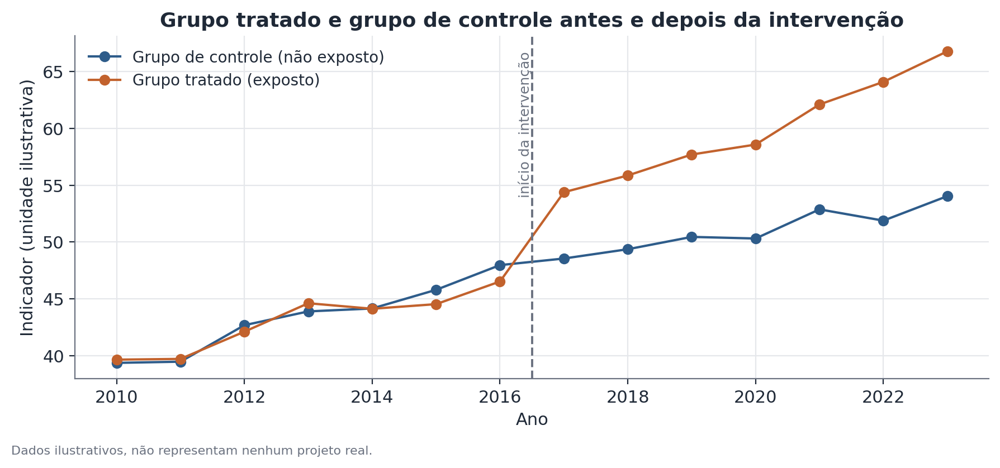

# Diferenças-em-diferenças (DiD)

## 1. Que problema isso resolve?

Uma política, uma lei ou um evento afetou um grupo específico, enquanto outro
grupo parecido ficou de fora. Como saber se a mudança observada no grupo
afetado depois do evento é resultado do próprio evento, e não só a
continuação de uma tendência que já estava acontecendo de qualquer forma? O
desenho de diferenças-em-diferenças (DiD) usa o grupo não afetado como
referência para responder essa pergunta com uma leitura mais próxima de
causal do que uma simples comparação de antes e depois.

## 2. Intuição

Comparar só o grupo afetado antes e depois do evento é enganoso, porque
muita coisa muda ao longo do tempo por razões que não têm nada a ver com o
evento. A solução é comparar a **mudança** no grupo afetado com a **mudança**
no grupo não afetado, no mesmo período. Se os dois grupos vinham seguindo
trajetórias parecidas antes do evento, a diferença entre as duas mudanças
pode ser atribuída, com mais segurança, ao próprio evento.

## 3. Explicação simples

O nome "diferença em diferenças" vem exatamente disso: primeiro você calcula
a diferença (mudança) dentro de cada grupo, depois calcula a diferença entre
essas duas diferenças. Esse desenho básico pode ser estendido de várias
formas: comparando **coortes** definidas por quando nasceram ou entraram em
algum sistema (desenho por coorte), acompanhando o efeito **período a
período** relativo ao momento do evento (event-study), e testando se o
resultado se sustenta em **datas falsas** (placebo) — um passo essencial de
verificação, não um detalhe opcional.

## 4. Exemplo conceitual fácil

Imagine uma cidade que introduziu um novo programa de transporte público
gratuito para estudantes, enquanto uma cidade vizinha parecida não introduziu
nada. Antes do programa, a frequência escolar nas duas cidades vinha subindo
de forma parecida. Depois do programa, a frequência na cidade que adotou o
programa subiu bem mais rápido do que na cidade vizinha. A diferença entre
essas duas mudanças é a estimativa do efeito do programa.

## 5. Como funciona, em linhas gerais

1. Defina claramente o grupo tratado (afetado pelo evento) e o grupo de
   controle (não afetado), e o momento do evento.
2. Verifique a suposição de **tendências paralelas**: os dois grupos
   seguiam trajetórias parecidas antes do evento? Isso é feito comparando
   visualmente e estatisticamente os períodos anteriores à intervenção.
3. Estime a diferença nas mudanças médias entre os dois grupos, do período
   pré para o período pós-evento.
4. Quando há vários períodos de dados, um **event-study** estima o efeito
   separadamente para cada período relativo ao evento, em vez de um único
   número agregado — isso revela se o efeito aparece de forma abrupta, se
   cresce com o tempo, ou se já existia uma diferença antes do evento
   (o que enfraqueceria a suposição de tendências paralelas).
5. Rode testes de **placebo**: aplique o mesmo desenho a uma data falsa, sem
   mudança real de política, e verifique se aparece um "efeito" mesmo assim.
   Se aparecer, isso é sinal de alerta sobre o desenho.



## 6. O que o resultado significa

O efeito estimado é a diferença entre a mudança do grupo tratado e a mudança
do grupo de controle, no mesmo período. Com boas tendências paralelas antes
do evento e ausência de efeito nos testes de placebo, essa diferença tem uma
leitura causal razoavelmente defensável — mais forte do que compará-la a uma
simples série de antes e depois de um único grupo.

## 7. Como interpretar

DiD dá uma leitura causal **mais forte** que comparar antes e depois de um
único grupo, mas ainda **depende** da suposição de tendências paralelas — ou
seja, de que, na ausência do evento, os dois grupos teriam continuado a
seguir trajetórias parecidas. Essa suposição não é diretamente testável para
o período pós-evento (é justamente o que não observamos); o que se pode
testar é se ela se sustentava no período pré-evento. "Tendências paralelas
sustentadas no pré-período" não é prova de que a suposição vale — é apenas
evidência de que os dados não contradizem essa suposição, o que é uma leitura
bem mais fraca.

## 8. Quando é útil

É útil sempre que existe uma política ou evento com um grupo claramente
afetado e outro claramente não afetado, com dados disponíveis antes e depois.
No Hub-Racial-Brasil, esse desenho é usado para explorar se uma lei — como
uma política de cotas raciais — teve efeito causal, comparando coortes
nascidas antes e depois de uma data de corte, ou setores afetados e não
afetados pela lei ao longo do tempo.

## 9. Cuidados importantes

- "Não encontrar efeito" não é o mesmo que "não há efeito" — um desenho com
  poucos grupos, poucos períodos, ou métrica muito ruidosa pode simplesmente
  não ter poder estatístico suficiente para detectar um efeito real.
- Escolha do grupo de controle importa muito: um grupo pouco comparável ao
  tratado enfraquece a suposição de tendências paralelas.
- Sempre reporte os resultados de placebo junto com o efeito principal —
  reportar só o resultado favorável é uma forma comum (e enganosa) de
  apresentar DiD.

## 10. Um exemplo pequeno com números

Antes do evento, o indicador do grupo tratado sobe de 40 para 47 (mudança de
+7); no grupo de controle, sobe de 40 para 46 (mudança de +6) — tendências
muito parecidas. Depois do evento, o grupo tratado sobe de 47 para 68
(mudança de +21); o grupo de controle sobe de 46 para 53 (mudança de +7). A
estimativa DiD é (21 − 7) = 14 unidades de efeito atribuível ao evento, acima
do que já era esperado pela tendência natural comum aos dois grupos.

## 11. Exemplo de código simples

```python
import pandas as pd
import statsmodels.formula.api as smf

# dados_painel: colunas [unidade, periodo, tratado, pos, resultado]
# tratado: 1 se pertence ao grupo tratado, 0 caso contrário
# pos: 1 se período é depois do evento, 0 caso contrário
modelo = smf.ols("resultado ~ tratado * pos", data=dados_painel).fit(
    cov_type="cluster", cov_kwds={"groups": dados_painel["unidade"]}
)
print(modelo.params["tratado:pos"])  # estimativa do efeito DiD
print(modelo.pvalues["tratado:pos"])
```
