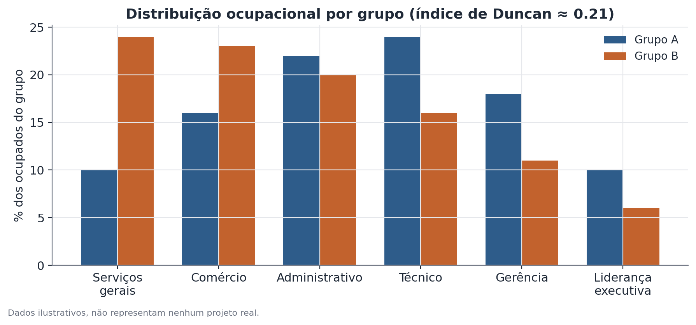

# Índice de dissimilaridade de Duncan

## 1. Que problema isso resolve?

Dois grupos trabalham nas mesmas categorias de ocupação — ou um grupo está
concentrado em certas funções enquanto o outro domina outras? Se você olhar
uma tabela com a distribuição percentual de cada grupo por categoria
ocupacional, é difícil dizer, só de bater o olho, o quão desigual é essa
distribuição. O índice de dissimilaridade de Duncan (também chamado de índice
de segregação) resume essa comparação em um único número entre 0 e 1.

## 2. Intuição

Imagine reorganizar fisicamente as pessoas de dois grupos entre um conjunto
de categorias, com o objetivo de fazer as duas distribuições percentuais
ficarem idênticas. O índice de Duncan mede, essencialmente, **qual fração de
um dos grupos precisaria mudar de categoria** para que isso acontecesse. Se
nenhuma realocação for necessária, os grupos já estão igualmente distribuídos.
Se quase todo mundo de um grupo precisasse trocar de categoria, a segregação
entre os grupos é praticamente total.

## 3. Explicação simples

Para cada categoria (por exemplo, cada ocupação), calcule a proporção do
Grupo A que está naquela categoria e a proporção do Grupo B que está na mesma
categoria. Subtraia uma da outra, ignore o sinal (pegue o valor absoluto) e
some essas diferenças em todas as categorias. Divida por dois. O resultado é
o índice de Duncan: 0 significa distribuições idênticas entre as categorias;
1 significa segregação completa, ou seja, nenhuma categoria é compartilhada
pelos dois grupos.

## 4. Exemplo conceitual fácil

Suponha duas equipes de vendas, A e B, distribuídas entre quatro filiais. Se
em cada filial a proporção de vendedores de A é igual à proporção de
vendedores de B, o índice é 0 — não existe segregação por filial. Se, ao
contrário, A está inteiramente na filial Norte e B está inteiramente na
filial Sul, o índice é 1 — segregação completa. Na prática, o valor quase
sempre fica em algum ponto intermediário.

## 5. Como funciona, em linhas gerais

1. Defina as categorias que importam (ocupação, filial, bairro, o que fizer
   sentido para a pergunta).
2. Calcule, dentro de cada grupo, a proporção de pessoas em cada categoria —
   não a contagem bruta, porque os grupos podem ter tamanhos diferentes.
3. Para cada categoria, calcule a diferença absoluta entre as duas proporções.
4. Some todas as diferenças e divida por dois.

O passo de dividir por dois evita contar a mesma "distância" duas vezes — sem
ele, o índice variaria de 0 a 2, não de 0 a 1.



## 6. O que o resultado significa

Um índice de 0,25, por exemplo, indica que cerca de 25% de um dos grupos
precisaria mudar de categoria para igualar as duas distribuições. Não existe
um limiar universal de "alto" ou "baixo" — o valor precisa ser comparado com
outros contextos (outro país, outro período, outro par de grupos) para ganhar
significado prático.

## 7. Como interpretar

O índice descreve **quão desigual é a distribuição entre categorias**, não
**por que** ela é desigual. Um valor alto é compatível com várias histórias
diferentes: diferenças reais de qualificação entre os grupos, barreiras de
acesso a certas categorias, escolhas voluntárias de carreira, ou uma
combinação de tudo isso. O índice, sozinho, não separa essas explicações.

## 8. Quando é útil

É a ferramenta padrão para medir segregação ocupacional, residencial ou
educacional entre grupos demográficos — raça, gênero, região. No
Hub-Racial-Brasil, esse tipo de índice mede o quanto dois grupos raciais
estão distribuídos de forma desigual entre categorias ocupacionais, servindo
de complemento a análises de diferença de renda: parte do gap salarial pode
estar ligada à concentração de um grupo em ocupações piores remuneradas.

## 9. Cuidados importantes

- O valor do índice depende diretamente de como as categorias foram
  definidas. Agrupar ocupações de forma mais grossa ou mais fina muda o
  resultado — sempre compare índices calculados com a mesma classificação.
- Categorias com poucas observações tornam a proporção instável, inflando ou
  reduzindo o índice de forma artificial.
- O índice não tem sinal — ele não diz qual grupo está "por cima"; só mede a
  distância entre as duas distribuições.

## 10. Um exemplo pequeno com números

| Categoria | % do Grupo A | % do Grupo B | Diferença absoluta |
|---|---|---|---|
| Operacional | 15% | 30% | 15 |
| Administrativo | 25% | 25% | 0 |
| Técnico | 30% | 25% | 5 |
| Gerência | 30% | 20% | 10 |

Soma das diferenças absolutas: 15 + 0 + 5 + 10 = 30. Dividindo por dois:
índice de Duncan = 15, ou 0,15 em escala de 0 a 1. Isso significa que 15% de
um dos grupos precisaria mudar de categoria para igualar as duas
distribuições — uma segregação moderada, concentrada principalmente nas
categorias operacional e de gerência.

## 11. Exemplo de código simples

```python
import numpy as np
import pandas as pd

# proporções de cada grupo por categoria (devem somar 1 em cada coluna)
dados = pd.DataFrame({
    "categoria": ["operacional", "administrativo", "tecnico", "gerencia"],
    "grupo_a": [0.15, 0.25, 0.30, 0.30],
    "grupo_b": [0.30, 0.25, 0.25, 0.20],
})

indice_duncan = 0.5 * np.sum(np.abs(dados["grupo_a"] - dados["grupo_b"]))
print(f"Índice de dissimilaridade: {indice_duncan:.3f}")
```
