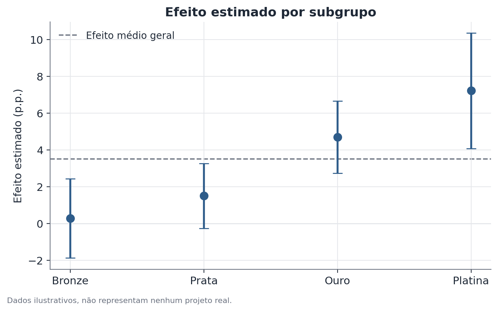

# Teste de heterogeneidade de efeito e decaimento de novidade

## 1. Que problema isso resolve?

Um experimento mostra que uma mudança teve efeito médio positivo. Mas será que
esse efeito é igual para todo mundo, ou existe um subgrupo puxando o resultado
para cima enquanto outros não sentem nada? E será que o efeito medido na
primeira semana ainda existe na oitava semana, ou já era só curiosidade
passageira em torno de algo novo?

Essas são duas perguntas diferentes, frequentemente confundidas: **heterogeneidade
de efeito** pergunta se o efeito muda entre grupos, num mesmo momento.
**Decaimento de efeito de novidade** pergunta se o efeito muda ao longo do
tempo, dentro do mesmo grupo. Este documento cobre as duas, porque costumam
aparecer juntas na leitura de um resultado de experimento.

## 2. Intuição

Uma média geral pode esconder histórias completamente diferentes. Um efeito
médio de +3% de conversão pode ser +12% para clientes novos e +0% para
clientes antigos — ou pode ser +3% distribuído igualmente por todo mundo.
Sem testar isso formalmente, as duas situações parecem idênticas no relatório
principal, mas pedem decisões de produto completamente diferentes.

O mesmo vale no tempo: um efeito de +5% medido só na primeira semana pode
refletir curiosidade genuína das pessoas com algo novo na tela — um "efeito
novidade" — que se dissolve assim que a novidade passa a ser rotina.

## 3. Explicação simples

Para heterogeneidade, o método formal não é simplesmente comparar o efeito
"visualmente" entre subgrupos (isso sempre vai parecer diferente por puro
acaso). Em vez disso, inclui-se um **termo de interação** num modelo
estatístico — algo como "tratamento × subgrupo" — e testa-se se esse termo é
estatisticamente diferente de zero. Isso responde: a diferença de efeito entre
subgrupos é maior do que se esperaria só por variação amostral?

Para o decaimento de novidade, observa-se o efeito estimado separadamente em
janelas de tempo sucessivas desde o lançamento (semana 1, semana 2, semana 3…)
e verifica-se se existe uma tendência de queda.

## 4. Exemplo conceitual fácil

Imagine um aplicativo de streaming que testa um novo layout de tela inicial.
O efeito médio sobre tempo de uso diário é positivo. Ao separar por tipo de
usuário, o efeito é grande entre quem assina há menos de um mês e quase nulo
entre assinantes antigos — plausível, já que quem já tem hábitos formados
reage menos a uma mudança visual. Ao olhar semana a semana, o efeito começa
alto e cai pela metade em um mês — também plausível, porque parte da reação
inicial é só curiosidade com a tela nova.

## 5. Como funciona, em linhas gerais

**Heterogeneidade:** ajusta-se um modelo com o efeito do tratamento, um
indicador de subgrupo, e a interação entre os dois. O coeficiente da
interação mede o quanto o efeito difere entre o subgrupo em questão e o
subgrupo de referência; seu erro-padrão e valor-p dizem se essa diferença é
estatisticamente confiável.

**Decaimento de novidade:** estima-se o efeito (e seu intervalo de confiança)
separadamente para cada janela de tempo desde o lançamento, e observa-se a
trajetória dessas estimativas — idealmente com um teste formal de tendência,
não só inspeção visual.

## 6. O que o resultado significa

Um termo de interação estatisticamente significativo é evidência de que o
efeito realmente difere entre os subgrupos testados — não é apenas ruído de
amostragem. Uma trajetória de decaimento consistente, com o efeito das
semanas finais claramente menor que o das primeiras, é evidência de que parte
do efeito medido no início era temporário.

## 7. Como interpretar

Heterogeneidade real muda a decisão de lançamento: pode fazer sentido lançar
só para o subgrupo que respondeu, em vez de para todos. Decaimento de
novidade muda o horizonte de avaliação: decidir com base só na primeira
semana pode superestimar o ganho de longo prazo. As duas leituras são
independentes uma da outra — um efeito pode ser homogêneo entre subgrupos e
ainda assim decair no tempo, ou heterogêneo e estável.

## 8. Quando é útil

Comum na leitura de experimentos de produto: testar se o efeito de uma
mudança varia por camada de fidelidade, canal de aquisição, tipo de
dispositivo ou outro corte relevante, e se o efeito observado logo após o
lançamento se sustenta nas semanas seguintes.

## 9. Cuidados importantes

Testar muitos subgrupos aumenta a chance de encontrar uma diferença
"significativa" só por acaso — esse é o problema de **comparações múltiplas**.
Se você testar 10 subgrupos ao nível de 5% de significância, espera-se por
puro acaso quase meio subgrupo "significativo" mesmo sem heterogeneidade real.
Por isso, um resultado de heterogeneidade isolado, especialmente vindo de um
subgrupo escolhido depois de olhar os dados, merece bem mais cautela do que um
subgrupo definido antes do experimento e confirmado de forma consistente.

## 10. Um exemplo pequeno com números

Um teste A/B mede efeito de +4,0 pontos percentuais em conversão no grupo
"clientes novos" (erro-padrão 1,1) e +0,4 pontos no grupo "clientes antigos"
(erro-padrão 0,9). A diferença entre os dois efeitos é 3,6 pontos, com
erro-padrão combinado de aproximadamente 1,45 — resultando numa estatística
z de cerca de 2,5, acima do limiar usual de significância. Isso é evidência de
heterogeneidade real, não apenas coincidência de amostra.

Separadamente, o efeito medido semana a semana desde o lançamento foi de
+8,5 pontos na semana 1, +5,2 na semana 4 e +1,8 na semana 8 — uma queda
consistente compatível com efeito de novidade.

## 11. Exemplo de código simples

```python
import statsmodels.formula.api as smf

# tratamento: 0/1; subgrupo: categórico; conversao: métrica contínua
modelo = smf.ols("conversao ~ tratamento * subgrupo", data=df).fit()
print(modelo.summary())
# o coeficiente de "tratamento:subgrupo[T.novo]" é o termo de interação

# decaimento de novidade: efeito por semana desde o lançamento
efeitos_semana = (
    df.groupby("semana_desde_lancamento")
      .apply(lambda g: smf.ols("conversao ~ tratamento", data=g).fit().params["tratamento"])
)
print(efeitos_semana)
```


