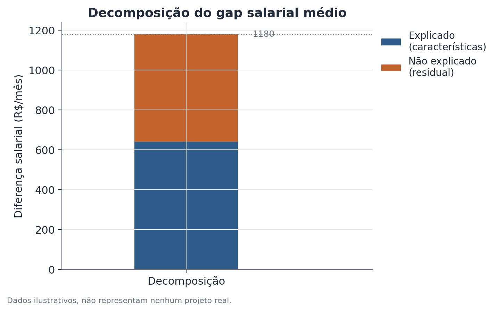

# Decomposição de Oaxaca-Blinder

## 1. Que problema isso resolve?

Dois grupos ganham salários diferentes, em média. Uma parte dessa diferença
pode vir do fato de os grupos terem, em média, características diferentes —
mais ou menos anos de estudo, por exemplo. Mas será que isso explica toda a
diferença, ou sobra alguma coisa mesmo depois de colocar essas
características na mesma régua?

## 2. Intuição

Imagine que você quer comparar o salário médio de dois grupos, mas sabe que
eles também diferem, em média, em escolaridade. Simplesmente comparar as
médias de salário mistura duas coisas: a diferença de escolaridade em si, e
qualquer diferença na forma como cada grupo é remunerado por unidade de
escolaridade. A decomposição de Oaxaca-Blinder separa essas duas fontes,
respondendo à pergunta: "se o Grupo B tivesse a mesma escolaridade média do
Grupo A, mas continuasse sendo remunerado do seu próprio jeito, qual seria o
salário médio esperado do Grupo B?"

## 3. Explicação simples

O método ajusta um modelo estatístico (tipicamente uma regressão linear)
relacionando salário às características observáveis, separadamente para cada
grupo. Depois, ele usa esses dois modelos para simular um cenário
contrafactual — "e se" — e decompõe a diferença total de médias em duas
partes:

- **Componente explicado**: a parte da diferença que vem de os grupos terem,
  em média, características diferentes.
- **Componente não explicado**: o que sobra — diferenças na forma como cada
  característica se traduz em salário para cada grupo, mais qualquer coisa
  não capturada pelas características medidas.



## 4. Exemplo conceitual fácil

Imagine duas equipes de vendas numa empresa. A Equipe A tem, em média, mais
anos de experiência que a Equipe B. Se a Equipe A também ganha mais em média,
parte dessa diferença pode simplesmente refletir a diferença de experiência
— mais experiência, mais salário, em ambas as equipes igualmente. A
decomposição separa quanto do gap vem dessa diferença de experiência, e
quanto sobra mesmo comparando pessoas com a mesma experiência nas duas
equipes.

## 5. Como funciona, em linhas gerais

1. Ajusta-se um modelo de regressão separado para cada grupo, relacionando a
   variável de interesse (salário, por exemplo) às características
   observáveis (escolaridade, idade, ocupação etc.).
2. Calcula-se a diferença total de médias entre os grupos.
3. Usando os coeficientes de um dos modelos (ou uma combinação ponderada dos
   dois, dependendo da variante do método), constrói-se o cenário
   contrafactual: qual seria o salário médio do Grupo B se ele tivesse as
   características médias do Grupo A, mas mantivesse sua própria estrutura de
   remuneração.
4. A diferença entre o salário observado do Grupo A e esse contrafactual é o
   componente explicado; a diferença entre o contrafactual e o salário
   observado do Grupo B é o componente não explicado.

## 6. O que o resultado significa

O componente explicado mostra quanto da diferença de médias pode ser
atribuído a diferenças médias nas características medidas. O componente não
explicado mostra o que sobra depois de colocar essas características na
mesma régua — ele é frequentemente interpretado como um possível sinal de
discriminação ou de outros fatores não observados, mas essa leitura exige
suposições muito mais fortes do que o método garante sozinho: pode haver
características relevantes para o salário que simplesmente não foram
medidas e que, se fossem incluídas, mudariam a divisão entre as duas partes.

## 7. Como interpretar

O método decompõe uma diferença observada — ele não prova causalidade nem
isola discriminação. Dizer "o componente não explicado é discriminação"
pressupõe que todas as características relevantes para o salário foram
medidas e incluídas no modelo, o que raramente é verdade na prática (viés de
variável omitida). O componente não explicado é melhor descrito como "o que
não pôde ser atribuído às características observadas" — uma diferença
importante entre não conseguir explicar algo e ter certeza da sua causa.

## 8. Quando é útil

Quando você quer entender a composição de um gap entre grupos — por exemplo,
comparar a diferença salarial média entre grupos demográficos, separando
quanto vem de diferenças de composição (escolaridade, idade, tipo de
ocupação) e quanto permanece mesmo controlando por essas variáveis.

## 9. Cuidados importantes

- **Viés de variável omitida**: se uma característica relevante não foi
  medida, ela acaba "escondida" dentro do componente não explicado.
- **Escolha do grupo de referência**: em algumas variantes do método, o
  resultado pode mudar dependendo de qual grupo é usado como referência para
  construir o contrafactual — vale checar a especificação usada.
- **A decomposição olha só a média**: se o gap for muito diferente em
  pontos diferentes da distribuição (por exemplo, maior no topo da renda),
  a decomposição de médias não captura isso — para essa pergunta, métodos
  como a decomposição por RIF são mais apropriados.
- **Causalidade**: o método é descritivo/contábil, não causal — ele não
  determina se as diferenças de características em si têm origem causal.

## 10. Um exemplo pequeno com números

Suponha um cenário hipotético: duas equipes numa empresa, com salário médio
mensal (em unidades monetárias fictícias) e anos médios de experiência:

- Equipe A: salário médio = 5.800, experiência média = 8 anos.
- Equipe B: salário médio = 4.620, experiência média = 5 anos.

O gap total é de 1.180. Suponha que o modelo estimado indique que, mantendo a
estrutura de remuneração da Equipe A, cada ano de experiência adicional
corresponde a um acréscimo médio de aproximadamente 210 unidades. Se a Equipe
B tivesse a experiência média da Equipe A (8 anos em vez de 5), o salário
contrafactual dela ficaria em torno de 4.620 + 3×210 = 5.250. Isso separa o
gap total em:

- **Componente explicado** (diferença de experiência): 5.250 − 4.620 = 630.
- **Componente não explicado**: 5.800 − 5.250 = 550.

Ou seja, aproximadamente metade do gap vem da diferença de experiência média
entre as equipes, e a outra metade permanece mesmo comparando pessoas com a
mesma experiência.

## 11. Exemplo de código simples

```python
import pandas as pd
import statsmodels.formula.api as smf

# dados ilustrativos, nível pessoa
df_a = pd.DataFrame({"salario": [...], "experiencia": [...]})  # Equipe A
df_b = pd.DataFrame({"salario": [...], "experiencia": [...]})  # Equipe B

modelo_a = smf.ols("salario ~ experiencia", data=df_a).fit()
modelo_b = smf.ols("salario ~ experiencia", data=df_b).fit()

exp_media_a = df_a["experiencia"].mean()
exp_media_b = df_b["experiencia"].mean()

# contrafactual: Equipe B com a experiência média da Equipe A,
# remunerada segundo a própria estrutura da Equipe B
salario_contrafactual = modelo_b.params["Intercept"] + modelo_b.params["experiencia"] * exp_media_a

explicado = salario_contrafactual - df_b["salario"].mean()
nao_explicado = df_a["salario"].mean() - salario_contrafactual
```

Bibliotecas dedicadas (como o pacote `oaxaca` em R, ou implementações em
Python construídas sobre `statsmodels`) automatizam esse cálculo e também
fornecem erros-padrão para cada componente da decomposição.
