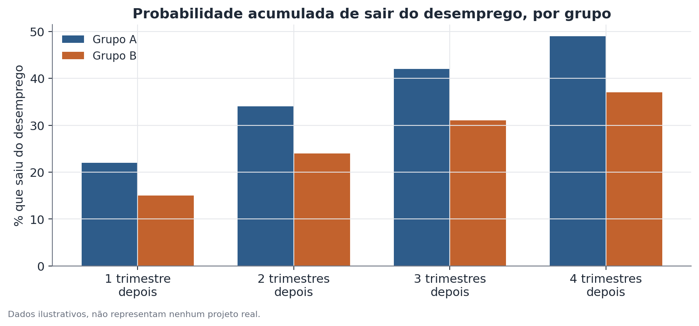

# Análise de transições em painel rotativo

## 1. Que problema isso resolve?

Comparar duas fotografias isoladas — a taxa de desemprego de um grupo neste
trimestre e a taxa de desemprego do mesmo grupo no trimestre seguinte — não
diz nada sobre o que aconteceu com as pessoas individualmente. Será que foram
as mesmas pessoas que continuaram desempregadas, ou uma leva saiu do
desemprego enquanto outra entrou, mantendo a taxa agregada parecida? Análise
de transições em painel rotativo responde a essa pergunta acompanhando
indivíduos ao longo de entrevistas sucessivas, não apenas comparando
retratos agregados.

## 2. Intuição

Algumas pesquisas domiciliares entrevistam o mesmo domicílio (e, na medida do
possível, os mesmos moradores) várias vezes ao longo de um período — esse é
o "painel rotativo": uma parte da amostra é substituída a cada rodada, mas
outra parte permanece, permitindo observar a mesma pessoa em entrevistas
consecutivas. Isso possibilita perguntar diretamente: de quem estava
desempregado na primeira entrevista, que fração estava empregada na
entrevista seguinte? E essa fração é diferente entre grupos?

## 3. Explicação simples

Depois de parear os registros da mesma pessoa entre entrevistas consecutivas,
constrói-se uma **matriz de transição**: linhas representam o estado inicial
(por exemplo, desempregado), colunas representam o estado seguinte (por
exemplo, empregado formal, empregado informal, desempregado, fora da força
de trabalho), e cada célula mostra a proporção de pessoas que fez aquela
transição específica. Comparar essa matriz entre grupos revela diferenças de
mobilidade que uma comparação de taxas agregadas não capturaria.

## 4. Exemplo conceitual fácil

Imagine dois grupos de clientes de um serviço de assinatura, ambos com a
mesma taxa de cancelamento agregada num mês. No Grupo A, quase todo mundo que
cancelou já vinha sinalizando insatisfação havia meses. No Grupo B, os
cancelamentos vêm de clientes recém-chegados que nunca chegaram a usar o
serviço de verdade. A taxa agregada é igual, mas a história por trás dela —
e a ação recomendada — é completamente diferente. Acompanhar transições
individuais é o que revela essa diferença.

## 5. Como funciona, em linhas gerais

1. Identifique, na base de dados, os registros que correspondem à mesma
   pessoa em entrevistas consecutivas — normalmente por um identificador de
   domicílio combinado com características que ajudam a confirmar que é a
   mesma pessoa (idade, sexo, relação com o responsável pelo domicílio).
2. Descarte ou trate separadamente os casos em que o pareamento falha —
   pessoas que mudaram de domicílio, domicílios com troca de morador, ou
   registros inconsistentes.
3. Para cada par de entrevistas consecutivas, classifique o estado da pessoa
   em cada momento (empregado, desempregado, fora da força de trabalho, por
   exemplo).
4. Construa a matriz de transição, separadamente para cada grupo de
   interesse.
5. Compare as taxas de transição específicas (por exemplo, a probabilidade
   de sair do desemprego) entre os grupos, com o devido teste de
   significância.



## 6. O que o resultado significa

Uma taxa de transição maior para um grupo — por exemplo, sair do desemprego
com mais frequência — indica maior mobilidade real observada para aquele
grupo nesse painel específico, algo que uma comparação de taxas agregadas
entre dois momentos isolados não conseguiria distinguir de simples
substituição de composição.

## 7. Como interpretar

A taxa de transição descreve o que aconteceu com as pessoas efetivamente
pareadas entre entrevistas — não com toda a população. Se o pareamento
falhar de forma sistematicamente diferente entre os grupos (por exemplo, se
um grupo tiver taxas de mudança de domicílio mais altas, e por isso for mais
difícil de acompanhar), as taxas de transição estimadas podem não
representar corretamente a experiência de todo o grupo, e sim apenas da
fração dele que permaneceu rastreável.

## 8. Quando é útil

É a ferramenta certa sempre que a pergunta é sobre mobilidade individual —
transições entre emprego e desemprego, entre formalidade e informalidade,
entre faixas de renda — e a pesquisa usada tem desenho de painel rotativo
(a mesma unidade entrevistada mais de uma vez). No Hub-Racial-Brasil, esse
tipo de análise usa o fato de a mesma pessoa aparecer em algumas entrevistas
consecutivas de uma pesquisa domiciliar para acompanhar transições
individuais e comparar taxas de mobilidade entre grupos raciais.

## 9. Cuidados importantes

- Painel rotativo **não é** o mesmo que um painel longitudinal completo, em
  que a mesma amostra inteira é seguida por muitos anos — no painel
  rotativo, cada pessoa só é observada por um número limitado de rodadas
  antes de sair da amostra.
- Boa parte dos dados de painéis rotativos é, na verdade, repeated
  cross-section (corte transversal repetido) fora da janela em que o
  pareamento é possível — é essencial saber exatamente quais rodadas
  permitem acompanhar a mesma pessoa.
- O pareamento entre entrevistas pode falhar por vários motivos: mudança de
  domicílio, substituição de morador, erros de digitação em identificadores,
  ou simples atrito amostral (a pessoa não é mais localizada). A taxa de
  sucesso do pareamento deve sempre ser reportada.
- Se a taxa de sucesso do pareamento for diferente entre os grupos
  comparados, isso pode introduzir viés de seleção nos resultados — vale
  testar isso explicitamente.

## 10. Um exemplo pequeno com números

De um total de 500 pessoas desempregadas do Grupo A na primeira entrevista,
foi possível parear 420 (84%) com uma segunda entrevista um trimestre depois;
dessas, 92 estavam empregadas — taxa de transição de 21,9%. Do Grupo B, de
480 pessoas desempregadas, 390 (81%) foram pareadas; dessas, 59 estavam
empregadas — taxa de 15,1%. A diferença de quase 7 pontos percentuais é
testada estatisticamente (por exemplo, com um teste de proporções) para
verificar se é grande demais para ser atribuída ao acaso.

## 11. Exemplo de código simples

```python
import pandas as pd
from statsmodels.stats.proportion import proportions_ztest

# base_pareada: uma linha por pessoa pareada com sucesso,
# colunas: grupo, estado_t0, estado_t1
desempregados_t0 = base_pareada[base_pareada["estado_t0"] == "desempregado"]

transicao_por_grupo = desempregados_t0.groupby("grupo")["estado_t1"].apply(
    lambda s: (s == "empregado").mean()
)
print(transicao_por_grupo)

contagens = desempregados_t0.groupby("grupo")["estado_t1"].apply(
    lambda s: (s == "empregado").sum()
)
totais = desempregados_t0.groupby("grupo").size()
estatistica, p_valor = proportions_ztest(contagens.values, totais.values)
print(estatistica, p_valor)
```
