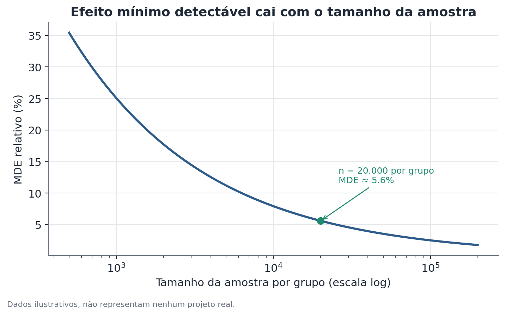

# Poder estatístico e efeito mínimo detectável (MDE)

## 1. Que problema isso resolve?

Você está desenhando um experimento — testar uma mudança num aplicativo, uma
nova campanha, um novo processo — e precisa decidir o tamanho da amostra antes
de começar. A pergunta raramente feita, mas essencial, é: **com o tamanho de
amostra que eu consigo rodar, existe alguma chance real de detectar o efeito
que eu espero, se ele de fato existir?** Rodar um experimento caro por semanas
para no final não conseguir concluir nada — porque o desenho nunca teve força
suficiente — é um dos desperdícios mais comuns e mais evitáveis em times de
produto e growth.

## 2. Intuição

Todo teste estatístico tem uma capacidade limitada de enxergar efeitos
pequenos. Quanto menor a amostra e quanto mais ruidosa (variável) a métrica,
mais "embaçada" é a visão do teste — efeitos pequenos se perdem no meio do
ruído amostral, mesmo que sejam reais. O **poder estatístico** é a
probabilidade de um teste detectar um efeito verdadeiro de um certo tamanho,
dado o desenho do experimento. O **efeito mínimo detectável (MDE)** é o
espelho dessa mesma ideia: em vez de perguntar "qual a chance de detectar um
efeito de X%?", pergunta-se "qual o menor efeito que esse desenho consegue
detectar com uma chance razoável (tipicamente 80%)?".

## 3. Explicação simples

Quatro ingredientes determinam o MDE de um experimento: o tamanho da amostra,
a variância (dispersão) da métrica, o nível de significância aceito (a
probabilidade de um falso positivo, geralmente 5%) e o poder desejado
(geralmente 80%). Aumentar a amostra ou reduzir a variância da métrica
diminui o MDE — o teste enxerga efeitos cada vez menores. Só que o ganho não é
linear: dobrar a amostra não divide o MDE por dois, divide por aproximadamente
1,4 (raiz de dois). Isso importa na prática: depois de um certo ponto, gastar
muito mais tempo de experimento para reduzir o MDE de 3% para 2,5% pode não
valer o custo.



## 4. Exemplo conceitual fácil

Imagine um aplicativo de assinaturas testando um novo fluxo de cadastro. A
equipe espera, de forma realista, um ganho de 2 pontos percentuais na taxa de
conversão. Antes de rodar o experimento, calcula-se o MDE para o tráfego
disponível em duas semanas. Se o MDE calculado for 5 pontos percentuais, o
experimento simplesmente não tem força para detectar um ganho de 2 pontos,
mesmo que ele exista de verdade — rodar do jeito que está seria gastar tempo
para aprender pouco. A solução é aumentar a duração, aumentar a proporção de
tráfego exposta, ou aceitar que só efeitos maiores serão detectáveis.

## 5. Como funciona, em linhas gerais

1. Define-se a métrica primária e estima-se sua variância (a partir de dados
   históricos, sempre que possível).
2. Define-se o nível de significância (geralmente α = 0,05) e o poder-alvo
   (geralmente 80%).
3. Define-se o tamanho de amostra disponível (ou, no sentido inverso, o
   efeito mínimo que se quer conseguir detectar).
4. Usa-se a relação entre essas quatro grandezas — amostra, variância,
   significância e poder — para calcular a que falta: o MDE (dado o tamanho
   de amostra) ou o tamanho de amostra necessário (dado um MDE-alvo).
5. Compara-se o MDE resultante com o efeito que faria sentido de negócio
   esperar. Se o MDE for maior que qualquer efeito plausível, o desenho
   precisa mudar antes de rodar o experimento — não depois.

## 6. O que o resultado significa

Um MDE de, digamos, 4% significa: "este desenho de experimento consegue
detectar, com 80% de chance, um efeito real de 4% ou mais — efeitos menores
que isso provavelmente passarão despercebidos, mesmo que existam." Não é uma
garantia de que o efeito real seja 4% — é uma característica do desenho do
experimento, calculada antes de qualquer dado ser coletado.

## 7. Como interpretar

Um MDE alto não é, por si, um problema — o problema é um MDE alto relativo ao
efeito que faria sentido esperar. Se a mudança testada só teria valor de
negócio caso o efeito fosse de pelo menos 5%, e o MDE calculado é 2%, o
desenho está sobredimensionado (bom para detectar até efeitos pequenos, mas
possivelmente caro demais). Se o MDE é 8% e o efeito plausível é 2%, o desenho
está subdimensionado — é preciso aumentar a amostra, simplificar a métrica, ou
aceitar que só efeitos grandes serão vistos.

## 8. Quando é útil

No planejamento de qualquer experimento controlado, antes de comprometer
tempo e tráfego a um desenho que talvez nunca tivesse chance de mostrar nada.
Também é útil no meio de um experimento já em andamento, quando a janela
disponível muda — por exemplo, um prazo de negócio força o encerramento
antes do previsto, ou o tráfego disponível caiu. Recalcular o MDE nesse
momento, com o tamanho de amostra efetivamente alcançado, evita duas
armadilhas: encerrar um experimento achando que "não deu efeito" quando na
verdade ele nunca teve força para detectar o efeito esperado, ou continuar
rodando por mais tempo do que o necessário.

## 9. Cuidados importantes

- O MDE depende da variância estimada da métrica — se essa estimativa for
  ruim (baseada em pouco histórico, ou em um período atípico), o MDE
  calculado também será impreciso.
- Poder e MDE não dizem nada sobre a probabilidade de o efeito verdadeiro ser
  do tamanho esperado — eles dizem apenas o que o desenho é capaz de
  detectar, caso o efeito exista.
- Calcular o MDE depois de olhar os dados do próprio experimento (e não antes,
  ou de forma independente com base em uma janela fixa) para decidir se
  "vale a pena continuar" pode introduzir viés — decisões de parada precisam
  de um plano definido com antecedência.
- Métricas com distribuição muito assimétrica (poucos valores extremos
  dominando a variância) inflam a variância estimada e, com isso, o MDE —
  vale investigar se a métrica ou uma transformação dela é mais estável.

## 10. Um exemplo pequeno com números

Uma rede de lojas de conveniência quer testar um novo layout de vitrine.
A métrica primária é a taxa de conversão de visitante em comprador,
atualmente em 20%. Com significância de 5% e poder-alvo de 80%, uma amostra
de 20.000 visitantes por grupo (tratamento e controle) produz um MDE relativo
de aproximadamente 8% — ou seja, o desenho consegue detectar, com confiança
razoável, uma conversão que suba de 20% para cerca de 21,6% ou mais. Se a
equipe espera um ganho realista de apenas 3%, esse desenho não tem força
suficiente: seria necessário um tamanho de amostra bem maior, algo em torno
de 140.000 visitantes por grupo, para alcançar um MDE compatível com um
efeito dessa magnitude.

## 11. Exemplo de código simples

```python
from statsmodels.stats.power import NormalIndPower
from statsmodels.stats.proportion import proportion_effectsize

analise = NormalIndPower()

# efeito mínimo detectável (em unidades de effect size) para n fixo por grupo
mde_effect_size = analise.solve_power(
    effect_size=None, nobs1=20_000, alpha=0.05, power=0.8, ratio=1.0
)

# tamanho de amostra necessário para detectar um efeito específico
effect_size_alvo = proportion_effectsize(0.23, 0.20)  # 20% -> 23%
n_necessario = analise.solve_power(
    effect_size=effect_size_alvo, nobs1=None, alpha=0.05, power=0.8, ratio=1.0
)

print(f"MDE (effect size) para n=20.000: {mde_effect_size:.4f}")
print(f"Amostra necessária por grupo para efeito de 20% -> 23%: {n_necessario:.0f}")
```

O mesmo raciocínio serve para recalcular o poder no meio de um experimento:
basta trocar `nobs1` pelo tamanho de amostra efetivamente coletado até o
momento e resolver para `power` em vez de para `nobs1` ou `effect_size`.
