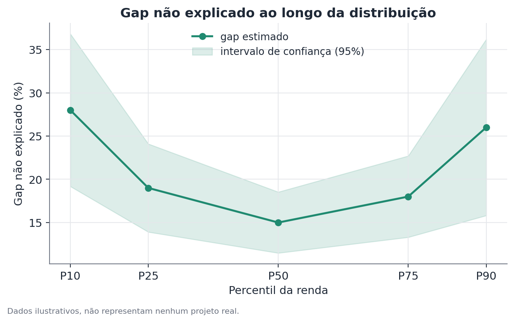

# Decomposição por RIF (Recentered Influence Function)

## 1. Que problema isso resolve?

A decomposição de Oaxaca-Blinder separa a diferença de médias entre dois
grupos em uma parte explicada e uma não explicada — mas e se a diferença
entre os grupos não for a mesma em todos os pontos da distribuição? E se o
gap for pequeno entre quem ganha pouco, mas grande entre quem ganha muito
(ou vice-versa)? A decomposição por RIF responde a essa pergunta, estendendo
a lógica de Oaxaca-Blinder para além da média.

## 2. Intuição

A média é só um resumo entre vários possíveis de uma distribuição. Outros
resumos — a mediana, o percentil 10, o percentil 90 — também podem ser
comparados entre grupos, e decompostos em "quanto vem de diferença de
características" e "quanto sobra". O desafio técnico é que esses outros
resumos (chamados de estatísticas distribucionais) não são médias simples de
variáveis observadas, então a maquinaria de regressão usada em
Oaxaca-Blinder não se aplica diretamente a eles. A função de influência
recentrada é o que resolve esse problema: ela transforma cada observação
numa medida de "o quanto ela influencia" aquele resumo específico da
distribuição, de um jeito que a média dessa medida transformada recupera o
próprio resumo — e, uma vez transformada, a lógica de Oaxaca-Blinder volta a
funcionar.

## 3. Explicação simples

Uma função de influência mede, para uma estatística de interesse (a
mediana, por exemplo), o quanto essa estatística mudaria se uma observação
específica fosse levemente perturbada. A versão "recentrada" é ajustada para
que a média da função de influência, calculada sobre toda a amostra, seja
exatamente igual ao valor original da estatística. Isso é o que permite
tratar essa medida transformada como se fosse uma variável comum, e aplicar
regressão e decomposição de Oaxaca-Blinder em cima dela — só que, em vez de
decompor a diferença nas médias da variável original, decompõe-se a
diferença na estatística de interesse (mediana, percentil 90 etc.).



## 4. Exemplo conceitual fácil

Imagine que a diferença salarial entre dois grupos, olhando só a média, seja
de 15%. A decomposição por RIF pode revelar que, no percentil 10 (entre quem
ganha menos), o gap é de 28%, enquanto no percentil 50 (a mediana) o gap cai
para 15%, e volta a subir para 26% no percentil 90 (entre quem ganha mais).
Esse padrão — gap maior nas pontas da distribuição do que no meio — é comum
o suficiente para ter nomes próprios na literatura: "sticky floor" (piso
pegajoso, quando o gap é maior na base) e "glass ceiling" (teto de vidro,
quando o gap é maior no topo).

## 5. Como funciona, em linhas gerais

1. Escolhe-se a estatística distribucional de interesse (mediana, um
   percentil específico, o índice de Gini etc.).
2. Calcula-se a função de influência recentrada dessa estatística para cada
   observação da amostra.
3. Usa-se essa medida transformada como variável de resultado numa regressão,
   separadamente para cada grupo — exatamente como no primeiro passo de
   Oaxaca-Blinder, mas com a variável transformada no lugar da variável
   original.
4. Aplica-se a mesma lógica de decomposição contrafactual de Oaxaca-Blinder
   sobre essa regressão, obtendo componentes explicado e não explicado para
   aquele ponto específico da distribuição.
5. Repete-se para vários pontos da distribuição (vários percentis, por
   exemplo) para construir um perfil completo do gap ao longo da
   distribuição.

## 6. O que o resultado significa

Para cada ponto da distribuição escolhido, o resultado mostra quanto do gap
naquele ponto vem de diferença de características e quanto sobra — igual a
Oaxaca-Blinder, mas ponto a ponto em vez de só na média. Olhando vários
pontos juntos, dá para enxergar se o gap é uniforme ao longo da distribuição
ou se se concentra em certas regiões.

## 7. Como interpretar

Assim como em Oaxaca-Blinder, o componente não explicado em cada ponto não
deve ser automaticamente lido como discriminação — a mesma ressalva sobre
variáveis omitidas se aplica, ponto a ponto. Além disso, a precisão da
estimativa costuma variar ao longo da distribuição: pontos nas pontas
(percentis muito baixos ou muito altos) geralmente têm menos observações
próximas e margens de erro maiores — resultados ali merecem leitura mais
cautelosa.

## 8. Quando é útil

Quando a pergunta não é só "existe um gap médio?", mas "esse gap é igual em
todos os níveis da distribuição, ou existe um padrão de concentração em
certas faixas?" Um caso típico: usar essa técnica para revelar que o gap
residual entre grupos raciais numa distribuição de renda é maior tanto entre
quem ganha pouco quanto entre quem ganha muito, e relativamente menor no
meio da distribuição.

## 9. Cuidados importantes

- Erros-padrão maiores nas pontas da distribuição exigem cautela redobrada
  ao interpretar diferenças ali.
- A escolha de quais pontos da distribuição reportar (só a mediana? uma
  grade de percentis?) afeta a narrativa — vale reportar um conjunto
  representativo, não só o ponto mais "conveniente" para a história.
- Assim como em Oaxaca-Blinder, a decomposição é contábil, não causal.

## 10. Um exemplo pequeno com números

Suponha, num cenário hipotético, o gap salarial não explicado (residual)
entre dois grupos, estimado em cinco percentis da distribuição:

| Percentil | Gap não explicado |
|-----------|---------------------|
| P10       | 28%                  |
| P25       | 19%                  |
| P50       | 15%                  |
| P75       | 18%                  |
| P90       | 26%                  |

O padrão em "U" — maior nas pontas, menor no meio — sugere que, mesmo
comparando pessoas com características parecidas, o gap não é constante ao
longo da distribuição: é mais acentuado tanto na base quanto no topo da
distribuição salarial do que na faixa intermediária.

## 11. Exemplo de código simples

```python
import numpy as np
import pandas as pd
import statsmodels.formula.api as smf
from scipy.stats import gaussian_kde

def rif_quantile(y, q):
    """Função de influência recentrada para o quantil q (0 a 1)."""
    valor_quantil = np.quantile(y, q)
    densidade = gaussian_kde(y)(valor_quantil)[0]
    indicador = (y <= valor_quantil).astype(float)
    return valor_quantil + (q - indicador) / densidade

df_a = pd.DataFrame({"salario": [...], "escolaridade": [...]})  # Grupo A
df_b = pd.DataFrame({"salario": [...], "escolaridade": [...]})  # Grupo B

df_a["rif_mediana"] = rif_quantile(df_a["salario"].values, 0.5)
df_b["rif_mediana"] = rif_quantile(df_b["salario"].values, 0.5)

modelo_a = smf.ols("rif_mediana ~ escolaridade", data=df_a).fit()
modelo_b = smf.ols("rif_mediana ~ escolaridade", data=df_b).fit()
# a partir daqui, a decomposição segue os mesmos passos de Oaxaca-Blinder
```

Na prática, pacotes dedicados (como `rifreg` em R/Stata) cuidam dos detalhes
de estimação da densidade e do cálculo de erros-padrão, que exigem mais
cuidado do que a versão simplificada acima.
