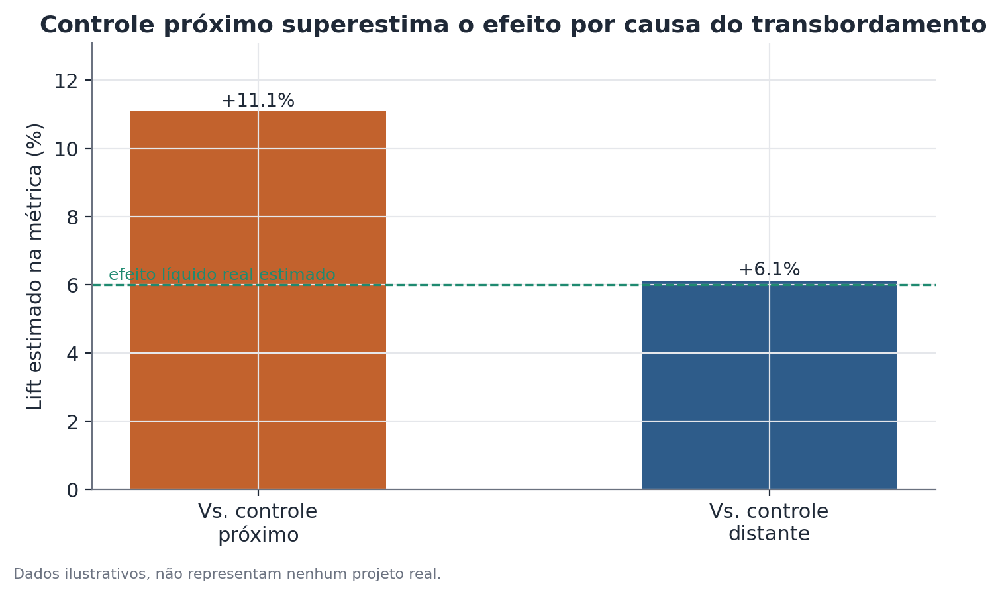

# Análise de transbordamento espacial e canibalização

## 1. Que problema isso resolve?

Você testou uma mudança em algumas lojas, cidades ou regiões — uma nova
campanha, um novo serviço, uma alteração de preço — e mediu um efeito
positivo comparando essas unidades tratadas com unidades de controle. Mas e
se parte desse "efeito" não for criação de valor nova, e sim clientes que
simplesmente migraram de uma loja de controle vizinha para a loja tratada?
Nesse caso, o experimento não está medindo ganho real — está medindo
deslocamento, e a unidade de controle mais próxima já não serve mais de
referência neutra, porque ela também foi afetada.

## 2. Intuição

Um experimento geograficamente espalhado assume, implicitamente, que as
unidades de controle continuam se comportando "normalmente", sem qualquer
influência do que está acontecendo nas unidades tratadas. Essa suposição
quebra quando tratamento e controle competem pelo mesmo público — a mesma
cidade, o mesmo raio de entrega, a mesma base de clientes. Se uma loja
tratada atrai clientes que antes compravam numa loja de controle a poucos
quilômetros de distância, essa loja de controle vai vender menos durante o
experimento — não porque nada mudou para ela, mas porque o tratamento
"roubou" parte do seu movimento. Comparar tratado contra esse controle
contaminado infla o efeito aparente.

## 3. Explicação simples

A lógica de diagnóstico central é comparar dois tipos de controle: unidades
de controle **próximas** às unidades tratadas (que podem estar sofrendo
transbordamento) e unidades de controle **distantes** (fora de qualquer raio
plausível de competição direta). Se o efeito estimado usando controles
próximos for bem maior do que o efeito estimado usando controles distantes, a
diferença é um sinal de canibalização: parte do "ganho" medido contra o
controle próximo é, na verdade, perda dele, não criação líquida em algum
outro lugar.



## 4. Exemplo conceitual fácil

Imagine uma rede de lojas de conveniência testando um novo programa de
fidelidade em algumas lojas de uma cidade. Comparando essas lojas com as
lojas de controle do mesmo bairro, o programa parece aumentar as vendas em
12%. Comparando as mesmas lojas tratadas com lojas de controle em bairros
distantes, sem nenhuma loja tratada por perto, o aumento medido cai para 6%.
A diferença entre 12% e 6% sugere que boa parte do "ganho" nas lojas próximas
veio de clientes que simplesmente trocaram de loja dentro do mesmo bairro —
não de novos clientes ou de aumento real de consumo.

## 5. Como funciona, em linhas gerais

1. Mapeia-se a localização de cada unidade experimental (tratada e controle)
   e calcula-se a distância entre cada controle e a unidade tratada mais
   próxima.
2. Definem-se faixas de distância — por exemplo, controles a menos de 3 km de
   distância ("próximos", possivelmente contaminados) e controles a mais de
   10 km ("distantes", improvável competição direta).
3. Estima-se o efeito do tratamento separadamente contra cada grupo de
   controle.
4. Compara-se a magnitude dos dois efeitos. Uma diferença grande entre eles é
   evidência de transbordamento; efeitos parecidos sugerem que a contaminação
   espacial, se existir, é pequena.
5. Quando possível, examina-se também como o efeito sobre o controle varia
   continuamente com a distância até a unidade tratada mais próxima — um
   efeito de canibalização real tende a diminuir suavemente com a distância,
   em vez de cair abruptamente.

## 6. O que o resultado significa

Se o efeito medido contra controles próximos for consistentemente maior do
que contra controles distantes, o "efeito líquido real" — aquele que reflete
criação de valor, não apenas realocação — está mais próximo da estimativa
com controle distante. O efeito com controle próximo mede algo diferente:
quanto a unidade tratada ganhou às custas da vizinhança imediata, mais o que
ela criou de novo.

## 7. Como interpretar

Nem toda canibalização é um problema — às vezes ela é exatamente o esperado e
aceitável (por exemplo, uma marca sabe que um novo produto vai roubar vendas
de um produto antigo da mesma linha, e isso é parte do plano). O que importa
é não confundir deslocamento com criação líquida na hora de decidir se vale a
pena expandir a mudança para todas as unidades. Se o objetivo é crescimento
de mercado, o efeito líquido (via controle distante) é a métrica relevante. Se
o objetivo é apenas entender o desempenho relativo da unidade tratada frente
à vizinhança imediata, o efeito com controle próximo também tem valor, mas
para uma pergunta diferente.

## 8. Quando é útil

Em qualquer experimento com unidades geograficamente próximas que competem
pelo mesmo público — lojas físicas, zonas de entrega, regiões de cobertura de
um serviço. É especialmente importante quando o resultado positivo do
experimento parece "bom demais" e vai embasar uma decisão de expansão em
larga escala, onde uma canibalização não detectada infla as expectativas de
ganho e pode levar a projeções de receita otimistas demais.

## 9. Cuidados importantes

- A escolha do ponto de corte entre "próximo" e "distante" é uma decisão de
  desenho que precisa de justificativa — baseada em raio real de competição
  (por exemplo, distância que clientes tipicamente percorrem), não em um
  número arbitrário.
- Controles "distantes" precisam realmente estar fora de qualquer influência
  do tratamento — se o raio de competição for maior do que o assumido, até
  os controles "distantes" podem estar parcialmente contaminados, subestimando
  a diferença entre os dois grupos.
- Um efeito líquido pequeno ou nulo (via controle distante) ao lado de um
  efeito grande via controle próximo não significa que a mudança "não
  funcionou" — significa que ela redistribuiu demanda em vez de criar
  demanda nova, o que pode ainda ser um resultado valioso dependendo do
  objetivo do negócio.
- Amostras pequenas de unidades tratadas e controladas (poucas lojas, poucas
  regiões) tornam as estimativas de efeito instáveis; nesse cenário, a
  incerteza em torno da comparação entre os dois efeitos precisa ser
  reportada, não só o ponto estimado.

## 10. Um exemplo pequeno com números

Uma rede de lojas testa um novo horário de funcionamento estendido em 15
lojas de uma região metropolitana. Vinte lojas de controle no mesmo bairro
ficam a menos de 3 km de alguma loja tratada; outras 25 lojas de controle,
usadas como grupo de comparação distante, ficam a mais de 12 km de qualquer
loja tratada.

- Vendas médias diárias, lojas tratadas: R$ 8.400 (antes) → R$ 9.660 (depois).
- Vendas médias diárias, controle próximo: R$ 8.100 (antes) → R$ 7.930
  (depois) — queda de 2,1%.
- Vendas médias diárias, controle distante: R$ 8.050 (antes) → R$ 8.170
  (depois) — alta de 1,5%.

O efeito estimado contra o controle próximo é de aproximadamente 17,3%
(porque o controle caiu enquanto o tratado subiu). O efeito estimado contra o
controle distante é de aproximadamente 13,5%. A diferença de cerca de 3,8
pontos percentuais é consistente com algum grau de canibalização das lojas
vizinhas — parte do aumento nas lojas tratadas veio de clientes que antes
compravam nas lojas de controle próximas, e não apenas de aumento de consumo
na região como um todo.

## 11. Exemplo de código simples

```python
import numpy as np
import pandas as pd

# dados ilustrativos: uma linha por loja, com distância até a loja tratada mais próxima
lojas = pd.DataFrame({
    "loja_id": range(1, 61),
    "tratada": [True] * 15 + [False] * 45,
    "distancia_km": [0] * 15 + list(np.random.default_rng(1).uniform(0.5, 20, 45)),
    "vendas_antes": np.random.default_rng(2).normal(8100, 400, 60),
    "vendas_depois": np.random.default_rng(3).normal(8300, 500, 60),
})

controle_proximo = lojas[(~lojas["tratada"]) & (lojas["distancia_km"] < 3)]
controle_distante = lojas[(~lojas["tratada"]) & (lojas["distancia_km"] > 10)]
tratadas = lojas[lojas["tratada"]]

def variacao_percentual(df):
    return (df["vendas_depois"].mean() / df["vendas_antes"].mean() - 1) * 100

var_tratado = variacao_percentual(tratadas)
var_proximo = variacao_percentual(controle_proximo)
var_distante = variacao_percentual(controle_distante)

efeito_vs_proximo = var_tratado - var_proximo
efeito_vs_distante = var_tratado - var_distante

print(f"Efeito vs. controle próximo:  {efeito_vs_proximo:.1f} pp")
print(f"Efeito vs. controle distante: {efeito_vs_distante:.1f} pp")
print(f"Diferença (sinal de canibalização): {efeito_vs_proximo - efeito_vs_distante:.1f} pp")
```
