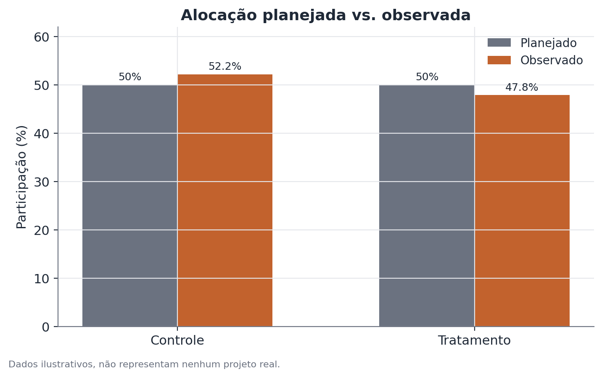

# Teste de Sample Ratio Mismatch (SRM)

*Pressupõe os fundamentos de teste A/B — veja [Fundamentos de teste A/B](./ab-testing.md) para o vocabulário de aleatorização, grupos e métrica primária usado aqui.*

## 1. Que problema isso resolve?

Um experimento foi planejado com uma divisão específica entre os grupos —
50/50 é a mais comum, mas pode ser 90/10, 70/30, ou qualquer outra proporção
definida de antemão. Depois de rodar, será que essa proporção realmente saiu
como planejado? Se o sistema de randomização tiver um bug, se algum tipo de
usuário estiver sendo perdido de forma diferente entre os grupos, ou se o
critério de elegibilidade interagir mal com a atribuição, a divisão real pode
sair torta — e, quando isso acontece, nada do que o experimento medir depois
pode ser interpretado com confiança.

## 2. Intuição

Se você jogar uma moeda honesta 20.000 vezes, não espera exatamente 10.000
caras e 10.000 coroas — mas espera algo bem próximo disso, com um desvio que
segue um padrão previsível. Um SRM (Sample Ratio Mismatch, ou "descompasso
na proporção de amostra") acontece quando o desvio da proporção planejada é
grande demais para ser explicado por esse acaso esperado. É basicamente
perguntar: "essa moeda ainda é honesta, ou tem algo quebrado nela?" — só que
a moeda, aqui, é o próprio mecanismo de randomização do experimento.

## 3. Explicação simples

O teste compara a contagem observada de usuários em cada braço do experimento
com a contagem que se esperaria sob a proporção planejada, usando um teste
qui-quadrado (ou, de forma equivalente para dois grupos, um teste binomial).
Quanto maior a distância entre observado e esperado, mais evidência de que a
randomização não está funcionando como deveria.



## 4. Exemplo conceitual fácil

Um app planeja testar uma nova tela de onboarding para 50% dos novos
usuários, mantendo os outros 50% na tela atual. Ao final do experimento, o
grupo da tela atual tem 10.432 usuários e o grupo da tela nova tem 9.568 —
uma diferença de quase 900 usuários. Isso pode ser só flutuação normal, ou
pode ser sinal de que, por algum motivo técnico, usuários de um certo tipo de
dispositivo estão sendo excluídos do grupo novo antes mesmo de serem
contados. O teste de SRM ajuda a decidir qual dos dois cenários é mais
plausível.

## 5. Como funciona, em linhas gerais

1. Define-se a proporção planejada de alocação entre os braços (por exemplo,
   50%/50%).
2. Conta-se quantos usuários efetivamente caíram em cada braço ao final do
   experimento (ou de um período de checagem).
3. Calcula-se a contagem esperada em cada braço, aplicando a proporção
   planejada ao total observado.
4. Aplica-se um teste qui-quadrado de aderência (goodness-of-fit) comparando
   contagens observadas e esperadas, produzindo um valor-p.
5. Um valor-p muito baixo (o critério comum é bem mais rígido que o de um
   teste de efeito, algo como 0,001, porque um falso alarme aqui pára o
   experimento inteiro) é o sinal de alerta.

## 6. O que o resultado significa

Um SRM não significativo não prova que a randomização está perfeita — apenas
que a proporção observada é compatível com a planejada, dentro do que se
espera de variação aleatória. Um SRM significativo é evidência de que a
proporção real dos grupos se desviou da planejada mais do que o esperado por
acaso — um sinal de que algo no mecanismo de atribuição, ou na forma como os
usuários são contados, não está funcionando como deveria.

## 7. Como interpretar

Um SRM significativo não diz, por si só, qual é a causa do desbalanceamento —
só que existe um problema a investigar antes de confiar em qualquer leitura
de efeito do experimento. Causas comuns incluem: bugs no código de
atribuição, diferenças na velocidade de carregamento entre as versões (fazendo
uma delas "perder" mais usuários por timeout), filtros de bot ou de qualidade
de tráfego aplicados de forma assimétrica, e problemas de log que registram
um grupo de forma mais completa que o outro.

## 8. Quando é útil

Em todo experimento randomizado, como checagem de rotina antes de interpretar
qualquer resultado de efeito — é o primeiro teste a rodar, não um extra
opcional. É especialmente importante em experimentos com muitos sistemas
técnicos envolvidos na atribuição (múltiplas plataformas, múltiplos pontos de
entrada, filtros de elegibilidade complexos), onde a chance de um bug sutil
quebrar a randomização é maior.

## 9. Cuidados importantes

- Um SRM significativo invalida a leitura de qualquer efeito medido até que a
  causa seja encontrada e corrigida — não adianta "olhar o efeito mesmo
  assim" ou tentar compensar o desbalanceamento estatisticamente depois.
- O critério de significância usado costuma ser mais rígido que o padrão
  0,05 (algo como 0,001 ou menor), porque o custo de ignorar um SRM real é
  alto e a checagem é barata de rodar.
- Ausência de SRM na alocação geral não garante ausência de SRM em subgrupos
  específicos (um tipo de dispositivo, uma região) — vale checar por
  segmento quando a causa suspeita for localizada.
- SRM pode aparecer só em parte do período do experimento (por exemplo, um
  bug corrigido no meio do caminho) — olhar a proporção ao longo do tempo,
  não só o total acumulado, ajuda a diagnosticar isso.

## 10. Um exemplo pequeno com números

Um experimento foi planejado com divisão 50/50. Ao final, o grupo controle
tem 10.432 usuários e o grupo tratamento tem 9.568, num total de 20.000. O
valor esperado em cada braço, sob a proporção planejada, é 10.000. A
estatística qui-quadrado é:

$$
\chi^2 = \frac{(10.432 - 10.000)^2}{10.000} + \frac{(9.568 - 10.000)^2}{10.000} \approx 37{,}3
$$

Com 1 grau de liberdade, esse valor corresponde a um valor-p extremamente
baixo (bem abaixo de 0,001) — evidência forte de que a proporção observada
não é compatível com uma divisão 50/50 aleatória. Antes de interpretar
qualquer efeito medido nesse experimento, a causa dessa discrepância precisa
ser encontrada.

## 11. Exemplo de código simples

```python
from scipy.stats import chisquare

observado = [10432, 9568]           # ilustrativo
proporcao_planejada = [0.5, 0.5]
total = sum(observado)
esperado = [p * total for p in proporcao_planejada]

resultado = chisquare(f_obs=observado, f_exp=esperado)
print(f"qui-quadrado = {resultado.statistic:.2f}, valor-p = {resultado.pvalue:.6f}")
```

Um valor-p abaixo do limiar rígido usado para SRM (por exemplo, 0,001) é o
sinal para parar e investigar antes de seguir com qualquer análise de efeito.
