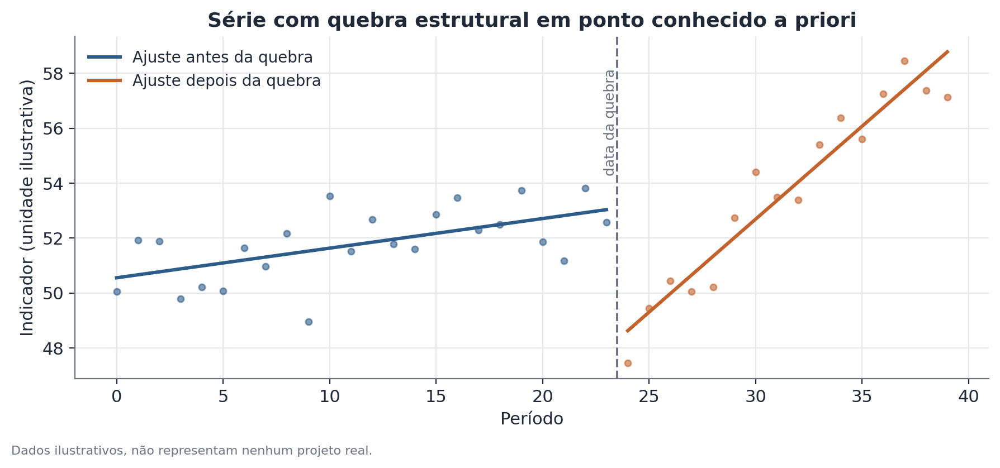

# Teste de quebra estrutural (tipo Chow)

## 1. Que problema isso resolve?

Uma série ao longo do tempo — uma taxa de participação, um preço médio, uma
proporção — parece ter mudado de comportamento num momento específico e
conhecido de antemão: o início de uma pandemia, a entrada em vigor de uma
lei, uma crise econômica documentada. Será que essa mudança é real, ou pode
ser apenas flutuação normal da série? O teste de quebra estrutural, na
tradição do teste de Chow, responde a essa pergunta especificamente quando
a data do possível evento já é conhecida antes de olhar os dados.

## 2. Intuição

Se nada de especial tivesse acontecido naquele momento, o comportamento da
série antes e depois da data escolhida deveria continuar seguindo,
aproximadamente, o mesmo padrão — mesma tendência, mesma relação com outras
variáveis. O teste ajusta um modelo separado para cada um dos dois pedaços da
série (antes e depois da data) e verifica se esses dois modelos são
estatisticamente diferentes o suficiente para rejeitar a ideia de que vêm de
um único processo contínuo.

## 3. Explicação simples

Existem três formas de ajustar o mesmo tipo de modelo: uma só para toda a
série (ignorando a possível quebra), uma separada para o período antes da
data e outra separada para o período depois. Se o ajuste "com quebra"
(dois modelos separados) explica os dados muito melhor do que o ajuste "sem
quebra" (um único modelo), isso é evidência de que algo mudou de fato na
data indicada.

## 4. Exemplo conceitual fácil

Imagine o número de pedidos diários de um restaurante ao longo de dois anos,
com uma data conhecida em que o cardápio mudou completamente. Antes da
mudança, os pedidos cresciam de forma lenta e estável. Depois, cresceram
muito mais rápido. Um teste de quebra estrutural nessa data específica
verifica se essa diferença de padrão é grande demais para ser só coincidência
de amostragem.

## 5. Como funciona, em linhas gerais

1. Escolha a data do evento **antes** de olhar os resultados — o teste perde
   validade se a data for escolhida depois de observar onde a série "parece"
   ter mudado.
2. Ajuste um único modelo (por exemplo, uma reta de tendência) usando toda a
   série.
3. Ajuste dois modelos separados: um só com os dados antes da data, outro só
   com os dados depois.
4. Compare o quanto os dois modelos separados reduzem o erro de ajuste em
   relação ao modelo único, usando uma estatística F.
5. Um valor-p baixo indica que a quebra melhora o ajuste mais do que seria
   esperado por acaso — evidência de mudança estrutural.



## 6. O que o resultado significa

Um teste significativo diz que o comportamento da série antes e depois da
data escolhida é estatisticamente diferente. Isso é consistente com "algo
relevante aconteceu naquele momento" — mas o teste, sozinho, não prova que
foi exatamente o evento que você tinha em mente.

## 7. Como interpretar

O resultado é evidência de correlação temporal com a data escolhida, não de
causalidade. Se outro evento relevante aconteceu perto da mesma data — uma
crise cambial perto de uma reforma trabalhista, por exemplo — o teste não
consegue, sozinho, atribuir a mudança a um ou outro. É preciso julgamento de
contexto, e idealmente outras fontes de evidência, para interpretar a causa.

## 8. Quando é útil

É útil sempre que existe uma data de interesse definida de antemão por
motivos externos aos dados — uma lei, uma política, um evento histórico. No
Hub-Racial-Brasil, esse teste é usado para verificar se a participação de um
grupo no mercado de trabalho mudou de padrão num momento específico
conhecido, como o início de uma crise ou a implementação de uma política.

## 9. Cuidados importantes

- Esse é um teste de **uma** quebra conhecida a priori — não uma busca por
  múltiplas quebras em datas desconhecidas (esse é um problema diferente,
  resolvido por métodos como o de Bai-Perron).
- Escolher a data depois de já ter visto onde a série "parece" quebrar
  invalida o teste — o valor-p deixa de ter a interpretação usual.
- O teste assume uma forma específica de modelo (geralmente linear) em cada
  pedaço da série; se a relação verdadeira for muito diferente disso, o
  resultado pode enganar.
- Séries curtas antes ou depois da data reduzem a capacidade do teste de
  detectar uma quebra real que de fato exista.

## 10. Um exemplo pequeno com números

Uma série de 40 observações tem, antes da data de corte, um coeficiente
angular estimado de 0,15 por período. Depois da data de corte, o coeficiente
estimado sobe para 0,55 por período, e o nível médio da série também sobe.
Ajustando o modelo único (sem quebra) versus os dois modelos separados, a
estatística F resultante é 4,35, com valor-p de 0,021 — abaixo do limiar
convencional de 0,05. Conclusão: há evidência de mudança de padrão na data
escolhida.

## 11. Exemplo de código simples

```python
import numpy as np
import statsmodels.api as sm

# serie: array com a variável de interesse ao longo do tempo
# indice_quebra: posição conhecida a priori onde a quebra é testada
def teste_chow(serie, tempo, indice_quebra):
    X_completo = sm.add_constant(tempo)
    modelo_completo = sm.OLS(serie, X_completo).fit()
    rss_completo = modelo_completo.ssr

    X1 = sm.add_constant(tempo[:indice_quebra])
    X2 = sm.add_constant(tempo[indice_quebra:])
    rss1 = sm.OLS(serie[:indice_quebra], X1).fit().ssr
    rss2 = sm.OLS(serie[indice_quebra:], X2).fit().ssr

    k = X_completo.shape[1]
    n = len(serie)
    f_stat = ((rss_completo - (rss1 + rss2)) / k) / ((rss1 + rss2) / (n - 2 * k))
    return f_stat
```
