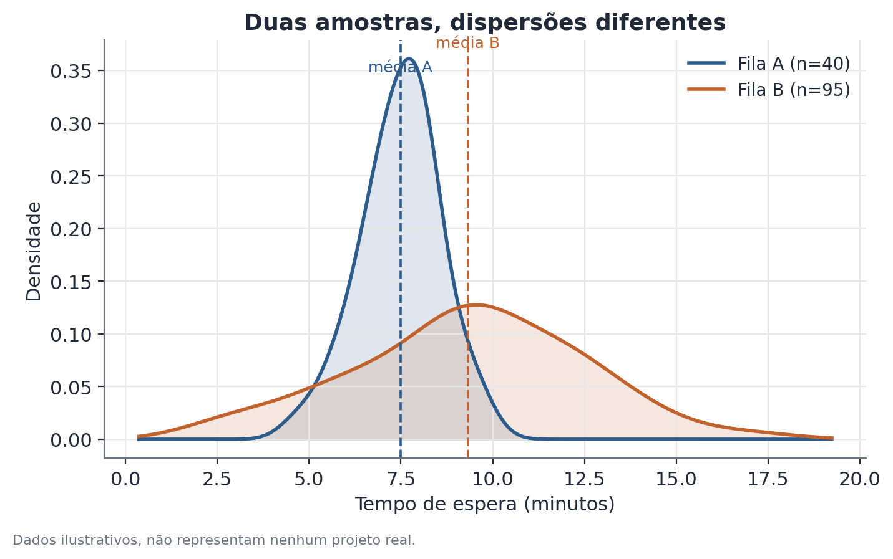

# Teste t de Welch

## 1. Que problema isso resolve?

Você tem dois grupos e observa que a média de alguma variável é diferente entre
eles — por exemplo, o tempo médio de espera numa fila é maior que na outra.
A pergunta que importa é: essa diferença é real, no sentido de refletir algo
que acontece na população, ou pode ter surgido só pelo acaso de quem calhou de
cair em cada amostra? E, mais especificamente: dá para responder isso de forma
confiável quando os dois grupos não têm o mesmo tamanho de amostra nem a mesma
variabilidade interna?

## 2. Intuição

Mesmo que duas populações tivessem exatamente a mesma média, amostras
aleatórias tiradas delas quase nunca produziriam médias amostrais idênticas —
sempre existe ruído de amostragem. O teste t de Welch mede o quão incomum é a
diferença observada entre as médias, levando em conta o tamanho de cada
amostra e a dispersão dentro de cada grupo, sem exigir que essa dispersão seja
igual nos dois grupos.

Essa última parte é o que diferencia Welch do teste t clássico de Student: o
Student assume que as duas populações têm a mesma variância, uma suposição
conveniente matematicamente, mas frequentemente irreal — grupos diferentes
costumam ter variabilidades diferentes, principalmente quando também diferem
em tamanho de amostra.

## 3. Explicação simples

O teste calcula uma estatística que resume "quantos erros-padrão de distância"
a diferença observada está de zero. Quanto maior essa distância (em valor
absoluto), mais incomum seria observar essa diferença se, na população, as
médias fossem realmente iguais. Essa estatística é comparada a uma
distribuição de referência (uma distribuição t, com graus de liberdade
calculados de um jeito específico) para produzir um valor-p.



## 4. Exemplo conceitual fácil

Imagine duas filas de atendimento num evento. A fila A tem poucos atendentes,
mas o tempo de espera é bem previsível. A fila B tem mais atendentes, mas o
tempo de espera varia muito — às vezes é rápido, às vezes trava bastante.
Mesmo com tamanhos de amostra e variabilidades bem diferentes entre as duas
filas, o teste de Welch ainda consegue comparar as médias de forma confiável.

## 5. Como funciona, em linhas gerais

1. Calcula-se a média e o desvio-padrão de cada grupo separadamente.
2. Calcula-se o erro-padrão da diferença entre as médias, combinando as duas
   variâncias sem assumir que são iguais.
3. Divide-se a diferença observada de médias por esse erro-padrão, obtendo a
   estatística t.
4. Os graus de liberdade não saem de uma fórmula simples como no teste de
   Student — eles são calculados de um jeito que pondera o quanto cada grupo
   contribui para a incerteza total (aproximação de Welch-Satterthwaite),
   resultando tipicamente num número não inteiro.
5. Compara-se a estatística t com a distribuição de referência para obter o
   valor-p.

## 6. O que o resultado significa

Um valor-p baixo (tipicamente abaixo de 0,05) indica que uma diferença desse
tamanho seria rara se, na população, as médias fossem realmente iguais — isso
é evidência a favor de uma diferença real. Um valor-p alto não prova que as
médias são iguais; apenas indica que os dados não trazem evidência forte de
diferença.

## 7. Como interpretar

O valor-p mede evidência contra a hipótese de médias iguais, não o tamanho ou
a importância prática da diferença. Um gap pequeno pode ser estatisticamente
significativo se a amostra for grande, e um gap grande pode não ser
significativo se a amostra for pequena ou muito variável. Vale sempre olhar o
tamanho do efeito junto com o valor-p — não só um dos dois.

## 8. Quando é útil

Quando você precisa comparar médias entre dois grupos que provavelmente têm
variabilidade diferente — o que é a regra, não a exceção, em dados do mundo
real. Um caso comum é acompanhar, ao longo de vários períodos de tempo, se a
diferença de renda média entre dois grupos populacionais permanece
estatisticamente significativa período a período, sem assumir de antemão que
os dois grupos têm a mesma dispersão de renda.

## 9. Cuidados importantes

- O teste assume amostras razoavelmente independentes; dados com estrutura de
  cluster (por exemplo, várias observações vindas do mesmo domicílio ou
  região) exigem ajuste separado no erro-padrão.
- Com amostras muito pequenas e distribuições muito assimétricas, a
  aproximação usada pelo teste fica menos confiável.
- Significância estatística não é o mesmo que relevância prática — sempre
  reporte o tamanho da diferença, não só o valor-p.

## 10. Um exemplo pequeno com números

Suponha duas filas de atendimento, com tempos de espera em minutos:

- Fila A: n = 40, média = 8,1 min, desvio-padrão = 1,3 min.
- Fila B: n = 95, média = 9,6 min, desvio-padrão = 3,4 min.

A diferença observada de médias é de 1,5 minuto. Como a Fila B tem uma
dispersão muito maior, o teste de Welch pondera essa incerteza extra ao
calcular o erro-padrão da diferença, produzindo uma estatística t de
aproximadamente 3,1, com graus de liberdade efetivos em torno de 61 (um número
não inteiro, resultado da ponderação entre as duas amostras). O valor-p
correspondente é bem abaixo de 0,01 — evidência forte de que a Fila B
realmente tem tempo médio de espera maior, não apenas por acaso da amostra.

## 11. Exemplo de código simples

```python
import numpy as np
from scipy import stats

fila_a = np.array([7.9, 8.4, 7.5, 9.0, 8.2, 7.8, 8.6, 7.7, 8.3, 8.0])  # ilustrativo
fila_b = np.array([9.1, 12.4, 6.8, 10.2, 9.9, 7.3, 15.0, 8.5, 9.7, 10.8])  # ilustrativo

resultado = stats.ttest_ind(fila_a, fila_b, equal_var=False)  # equal_var=False = Welch
print(f"t = {resultado.statistic:.2f}, valor-p = {resultado.pvalue:.4f}")
```

O parâmetro `equal_var=False` é o que diz ao SciPy para usar Welch em vez do
teste t clássico de Student — a diferença de uma linha de código evita uma
suposição que, na prática, raramente se sustenta.
